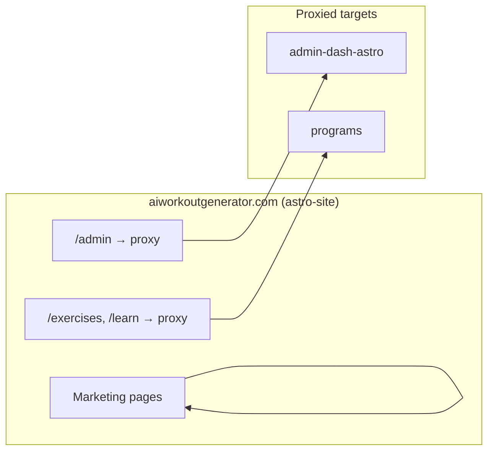

# Blueprint: Workout Generator Monorepo on Vercel

**Purpose:** Blueprint for the AI Workout Generator monorepo: marketing site, content app, admin dashboards, and shared packages—deploying to Vercel using native Turborepo configuration.

**Audience:** Use when setting up deployment, onboarding developers, or as a reference for how deployment should be structured.

**References:** [Vercel Monorepos](https://vercel.com/docs/monorepos), [Vercel Project Configuration](https://vercel.com/docs/projects/overview), [Turborepo Handbook](https://turbo.build/repo/docs). See also [DEPLOYMENT.md](./DEPLOYMENT.md) for troubleshooting.

---

## 1. Project Type

This blueprint targets:

- **Marketing site:** astro-site (Astro, static) — hero, blog, FAQ, equipment, reports, onboarding
- **Content app:** programs (Astro SSR) — exercises, learn, workouts, programs, challenges, WOD, interval timers
- **Admin dashboards:** admin-dash-astro (Astro SSR), admin-dash (Next.js)
- **App backend:** nextjs-backend (Next.js) — APIs, signup flow, app shell
- **Shared packages:** `design-system`, `ui` (no deploy)

---

## 2. Repository Structure

```
/
├── astro-site/           # Marketing site (NOT in workspaces)
├── apps/
│   ├── admin-dash/       # Legacy admin (blog, leads) — Next.js
│   ├── admin-dash-astro/ # Content admin (exercises, programs, WOD, etc.) — Astro SSR
│   ├── nextjs-backend/   # App APIs, signup (package name: main-web) — Next.js
│   └── programs/         # Public content app — Astro SSR
├── packages/
│   ├── design-system/
│   └── ui/
├── package.json          # Workspaces: apps/*, packages/*
├── turbo.json
└── .env.example
```

**Principles:**

- `astro-site` is at repo root and not in npm workspaces; it has its own `package.json` and uses `file:../packages/design-system`. **Prefer `apps/*` for new deployable apps** to align with workspace-based deployment.
- Each app under `apps/` is independently deployable and in workspaces.
- Shared code lives in `packages/`. Apps declare dependencies (e.g. `@workout-generator/design-system`).
- Turborepo handles orchestration, parallel execution, and caching. Minimize custom `installCommand` and `buildCommand` overrides where Vercel's native Turborepo detection works.

---

## 3. Vercel Projects & Deployment Strategy

**Rule:** One Vercel project per deployable app. Each project uses Root Directory to point at its app.

**Deployment strategy:** This project uses **Standalone** deployment (one Vercel project per app) plus **rewrites** from the marketing site to proxy `/admin`, `/exercises`, `/learn` to other deployments. Best for subdomains and single-domain UX via rewrites.

| Vercel Project | Root Directory | Framework | Output |
|----------------|----------------|-----------|--------|
| `astro-site` (marketing) | `astro-site` | Astro | `dist` (static) |
| `admin-dash` | `apps/admin-dash` | Next.js | `.next` |
| `admin-dash-astro` | `apps/admin-dash-astro` | Astro | Server |
| `nextjs-backend` | `apps/nextjs-backend` | Next.js | `.next` |
| `programs` | `apps/programs` | Astro | Server |

**Setup:**

1. Vercel Dashboard → Add New Project → Import Git repository.
2. For each app: set **Root Directory** to the path above (e.g. `astro-site`, `apps/programs`).
3. Do not use repo root as Root Directory for any project.
4. Let Vercel infer framework from `vercel.json` or auto-detect.

**Benefits:**

- Each app has its own URL (e.g. `*-xxx.vercel.app`).
- Vercel skips builds for unchanged projects.
- Independent deployments and rollbacks per app.

---

## 4. Domain Strategy

**Current setup:** Single primary domain with cross-project rewrites.

| App | Primary domain | Purpose |
|-----|----------------|---------|
| astro-site | `aiworkoutgenerator.com` | Marketing, blog, equipment, reports |
| admin-dash-astro | `aiworkoutgenerator-admin.vercel.app` | Content admin (proxied via `/admin`, `/api/admin`) |
| admin-dash | `admin.aiworkoutgenerator.com` (optional) | Legacy admin (blog, leads, analytics) — see §12 |
| programs | `programs.aiworkoutgenerator.com` | Exercises, learn, workouts (proxied via `/exercises`, `/learn`) |
| nextjs-backend | `app.aiworkoutgenerator.com` | App signup, APIs |

**astro-site `vercel.json` rewrites:**

The marketing site proxies selected paths to other deployments so `aiworkoutgenerator.com` can serve a unified experience:

- `/admin/*` → `aiworkoutgenerator-admin.vercel.app`
- `/api/admin/*` → `aiworkoutgenerator-admin.vercel.app`
- `/exercises`, `/exercises/*` → `programs.aiworkoutgenerator.com`
- `/learn`, `/learn/*` → `programs.aiworkoutgenerator.com`

**Alternative (subdomains only):** Users can access admin at `admin.aiworkoutgenerator.com` and programs at `programs.aiworkoutgenerator.com` directly without relying on rewrites. Rewrites provide a single-domain UX from the marketing site.

**Both admins live at separate URLs:**

| Admin | URL | Purpose |
|-------|-----|---------|
| Content admin (Astro) | `aiworkoutgenerator.com/admin` or `aiworkoutgenerator-admin.vercel.app` | Exercises, programs, workouts, challenges |
| Legacy admin (Next.js) | `admin.aiworkoutgenerator.com` | Blog, leads, analytics, deep-research |

Configure `admin.aiworkoutgenerator.com` in Vercel → admin-dash project → Domains. Configure `aiworkoutgenerator.com` → astro-site (which rewrites `/admin` to admin-dash-astro).

**Deployment flow diagram:**



**Rewrite dependency:** If `admin-dash-astro` or `programs` is down, `/admin` or `/exercises`/`/learn` will fail on the main domain. Update `astro-site/vercel.json` when proxy destination URLs change (e.g. new subdomain or Vercel project URL).

---

## 5. Workspace Configuration

**Root `package.json`:**

Define `packageManager` explicitly so Turborepo resolves workspaces correctly.

```json
{
  "private": true,
  "packageManager": "npm@10.8.2",
  "workspaces": ["apps/*", "packages/*"],
  "scripts": {
    "dev": "turbo run dev",
    "build": "turbo run build --concurrency=1",
    "dev:nextjs": "turbo run dev --filter=main-web",
    "dev:admin": "turbo run dev --filter=admin-dash",
    "dev:admin-astro": "turbo run dev --filter=admin-dash-astro",
    "dev:programs": "turbo run dev --filter=programs",
    "env:pull": "vercel env pull .env.local"
  }
}
```

**Root `turbo.json`:**

Use `globalEnv` and `env` so Turborepo invalidates cache when env vars change.

```json
{
  "$schema": "https://turbo.build/schema.json",
  "globalEnv": ["NODE_ENV", "CI"],
  "tasks": {
    "build": {
      "dependsOn": ["^build"],
      "outputs": [".next/**", "!.next/cache/**", "dist/**", ".vercel/output/**"],
      "env": ["VITE_*", "PUBLIC_*", "NEXT_PUBLIC_*", "SUPABASE_*", "GEMINI_*", "GOOGLE_*"]
    },
    "dev": {
      "cache": false,
      "persistent": true
    }
  }
}
```

`env` lists variables that affect build output; changing them invalidates the cache.

**Important — astro-site is not in workspaces:** The root `npm run dev` only starts workspace apps. To run the marketing site:
```bash
cd astro-site && npm install && npm run dev
```
Astro-site has its own `node_modules` and does not use Turbo. See §7.

**Per-app scripts:** Each app has `dev` and `build` in its own `package.json`. Root scripts use Turbo `--filter=<package-name>`.

---

## 6. Per-App `vercel.json`

**Philosophy:** Keep config minimal. Vercel detects Turborepo and runs `npm install` at the root when appropriate. Use custom `installCommand` only when Root Directory is inside `apps/` and workspace deps (e.g. `@workout-generator/design-system`) must resolve from repo root.

### 6.1 astro-site (marketing)

Root Directory: `astro-site`. No framework override needed; Vercel auto-detects Astro. Rewrites only (no build overrides).

```json
{
  "rewrites": [
    { "source": "/admin/:path*", "destination": "https://aiworkoutgenerator-admin.vercel.app/admin/:path*" },
    { "source": "/api/admin/:path*", "destination": "https://aiworkoutgenerator-admin.vercel.app/api/admin/:path*" },
    { "source": "/exercises", "destination": "https://programs.aiworkoutgenerator.com/exercises" },
    { "source": "/exercises/:path*", "destination": "https://programs.aiworkoutgenerator.com/exercises/:path*" },
    { "source": "/learn", "destination": "https://programs.aiworkoutgenerator.com/learn" },
    { "source": "/learn/:path*", "destination": "https://programs.aiworkoutgenerator.com/learn/:path*" }
  ]
}
```

### 6.2 Next.js apps (admin-dash, nextjs-backend)

Root Directory: `apps/admin-dash` or `apps/nextjs-backend`. Workspace deps require install from repo root.

```json
{
  "framework": "nextjs",
  "buildCommand": "cd ../.. && npx turbo run build --filter=admin-dash",
  "installCommand": "cd ../.. && npm ci"
}
```

Use `--filter=main-web` for nextjs-backend.

### 6.3 Astro apps (admin-dash-astro, programs)

Root Directory: `apps/admin-dash-astro` or `apps/programs`. Minimal config; workspace deps require install from root.

```json
{
  "framework": "astro",
  "installCommand": "cd ../.. && npm ci",
  "buildCommand": "npm run build"
}
```

Omit custom overrides only if Vercel's native detection installs workspace deps correctly (test first).

---

## 7. astro-site: Standalone but Shared

`astro-site` lives at repo root, outside `apps/`. It:

- Has its own `package.json` and `node_modules`.
- Uses `@workout-generator/design-system` via `file:../packages/design-system`.
- Is **not** in npm workspaces.
- Requires `cd astro-site && npm install` before build.

**Vercel:** Set Root Directory to `astro-site`. Use standard `npm run build`; Vercel runs install from that directory, which pulls `packages/design-system` via the file reference.

---

## 8. Shared Packages

- `packages/design-system`: Shared React components and design tokens.
- `packages/ui`: Shared UI primitives.

**In each app `package.json`:**

```json
{
  "dependencies": {
    "@workout-generator/design-system": "*"
  }
}
```

**Workspace install:** When Root Directory is `apps/<name>`, `installCommand` must run from repo root:

```json
"installCommand": "cd ../.. && npm ci"
```

Use `npm ci` in Vercel (Production/Preview) for reproducible installs; `npm install` is fine for local dev.

---

## 9. Authentication (Same-Origin & Cross-Domain)

**Current model:**

- **astro-site** (aiworkoutgenerator.com): Public marketing; no auth.
- **admin-dash-astro** (proxied at /admin): Supabase auth; `profiles.role === 'admin'`.
- **programs** (programs.aiworkoutgenerator.com or /exercises, /learn): Public content; optional auth for admin features.
- **nextjs-backend** (app.aiworkoutgenerator.com): Signup, app shell; Supabase.

**Cookie domain (Supabase SSR):**

Use `@supabase/ssr` for cookie-based sessions. Controlled by `PUBLIC_AUTH_COOKIE_DOMAIN` (Astro) and `VITE_AUTH_COOKIE_DOMAIN` (Vite) if applicable.

| Variable unset | Variable set (e.g. `.aiworkoutgenerator.com`) |
|----------------|-----------------------------------------------|
| Same-origin: standard cookies | Cross-subdomain: root-domain cookie (`sb-access-token`) |
| Ideal for merged/same-origin | Enables session sharing between `app.example.com` and `programs.example.com` |
| Default | Must include leading dot for root domain |

Configure Supabase redirect URLs for each app domain (main domain, /admin, programs subdomain, app subdomain).

---

## 10. Environment Variables

**Single source of truth:** Prefer **Vercel Shared Environment Variables** when possible. Configure once in the dashboard; sync to all connected projects. Reduces drift across astro-site, admin-dash-astro, programs, and nextjs-backend.

**Production/Preview:** Managed via Vercel Dashboard → Project → Settings → Environment Variables (or Shared Env in a team).

**Local development:** Pull from Vercel into `.env.local`:
```bash
npm run env:pull
```
Runs `vercel env pull .env.local` from repo root. For multi-project monorepos, link the desired Vercel project first (`vercel link`), or run from the app directory (e.g. `cd apps/programs && vercel env pull .env.local`).

**Per project in Vercel:** Project → Settings → Environment Variables.

| Variable | astro-site | admin-dash-astro | programs | nextjs-backend |
|----------|------------|------------------|----------|----------------|
| `PUBLIC_SUPABASE_URL` (Astro) | ✓ | ✓ | ✓ | — |
| `PUBLIC_SUPABASE_ANON_KEY` (Astro) | ✓ | ✓ | ✓ | — |
| `NEXT_PUBLIC_SUPABASE_URL` (Next.js) | — | — | — | ✓ |
| `NEXT_PUBLIC_SUPABASE_ANON_KEY` (Next.js) | — | — | — | ✓ |
| `SUPABASE_SERVICE_ROLE_KEY` | — | ✓ | ✓ | ✓ |
| `PUBLIC_SITE_URL` (Astro) | ✓ | ✓ | ✓ | — |
| `NEXT_PUBLIC_SITE_URL` (Next.js) | — | — | — | ✓ |
| `PUBLIC_APP_URL` (Astro) | ✓ | — | ✓ | — |
| `NEXT_PUBLIC_APP_URL` (Next.js) | — | — | — | ✓ |
| `GEMINI_API_KEY` | — | ✓ | ✓ | — |
| `GOOGLE_PROJECT_ID` | — | ✓ | ✓ | — |

Use `PUBLIC_` for Astro client-exposed vars and `NEXT_PUBLIC_` for Next.js client-exposed vars. Never commit secrets.

**Cross-project URLs:** Rewrite destinations in `astro-site/vercel.json` are hardcoded (Vercel rewrites don't support env vars). For staging/preview, use a separate Vercel project or branch-specific `vercel.json` if needed. Prefer [Vercel Related Projects](https://vercel.com/docs/monorepos#how-to-link-projects-together-in-a-monorepo) for runtime URLs between apps (e.g. `PUBLIC_PROGRAMS_URL`).

---

## 11. Build and Install Commands

**astro-site (static Astro):**

- Root Directory: `astro-site`
- `installCommand`: default (runs in astro-site)
- `buildCommand`: `npm run build`
- Output: `dist`

**Next.js (admin-dash, nextjs-backend):**

- Root Directory: `apps/<name>`
- `installCommand`: `cd ../.. && npm ci`
- `buildCommand`: `cd ../.. && npx turbo run build --filter=<package-name>`
- Output: `.next`

**Astro SSR (admin-dash-astro, programs):**

- Root Directory: `apps/<name>`
- `installCommand`: `cd ../.. && npm ci`
- `buildCommand`: `npm run build`
- Framework: Astro; Vercel uses server output automatically.

**Node version:** Pin in app `package.json` if needed:

```json
"engines": { "node": ">=20.20.0" }
```

---

## 12. Admin Migration Context

- **admin-dash-astro** is the primary content admin (exercises, programs, workouts, challenges, WOD, Deep Dive editor). Features are being migrated from programs.
- **admin-dash** is the legacy admin (blog, leads, analytics).
- **programs** still hosts public content (/exercises, /learn, /workouts, etc.) and reads from the same Supabase data. Admin UI for content lives in admin-dash-astro.

---

## 13. Adding New Apps (Checklist)

When adding a new deployable app, follow this checklist. For projects with many similar apps, consider an automated scaffolding script (e.g. `scripts/generate-app.cjs`) that copies a template, replaces placeholders, injects root scripts, and optionally updates rewrites.

**Manual steps:**

1. Create `apps/<name>/` with `package.json`, source, and build script.
2. Add to root workspaces (already covered by `apps/*`).
3. Add `@workout-generator/design-system` or other deps as needed.
4. Add root script: `dev:<name>`, and ensure `build` is in turbo pipeline.
5. Create Vercel project → Root Directory `apps/<name>`.
6. Set `installCommand: "cd ../.. && npm ci"` and `buildCommand` to run from repo root when using workspaces.
7. Add env vars in the new Vercel project (or use Shared Env).
8. If the app should be reachable from the main domain, add rewrites in `astro-site/vercel.json`.

---

## 14. Troubleshooting

| Symptom | Check |
|---------|-------|
| 404 on `/exercises` or `/learn` | astro-site rewrites proxy to programs. Verify `programs.aiworkoutgenerator.com` is live and `astro-site/vercel.json` has correct destination URLs. Redeploy astro-site after changing rewrites. |
| 404 on `/admin` | Rewrites proxy to admin-dash-astro. Verify that deployment is live. |
| Build fails with "workspace not found" | Ensure `installCommand` runs from repo root (`cd ../.. && npm ci`). Root Directory must be set correctly. |
| astro-site builds but missing design-system | astro-site uses `file:../packages/design-system`. Ensure repo root has `packages/design-system` and `npm install` ran in astro-site. |
| Different behavior on preview vs production | Preview deployments use the same rewrites; targets point to production URLs. Staging would need a different vercel.json or env-based config. |

See [DEPLOYMENT.md](./DEPLOYMENT.md) for admin login, domain setup, and more.

---

## 15. Anti-Patterns to Avoid

| Anti-pattern | Preferred approach |
|--------------|--------------------|
| Repo root as Root Directory for any project | Use specific app dir (e.g. `astro-site`, `apps/programs`) |
| Custom `installCommand` when not needed | Prefer Vercel's native Turborepo detection; use override only when workspace deps fail to resolve |
| Install from app dir only when using workspaces | `cd ../.. && npm ci` from repo root (when override is required) |
| `npm install` in Vercel production builds | Use `npm ci` for reproducible installs |
| Hardcoded URLs for other projects (runtime) | Related Projects or env vars; rewrites are an exception (no env support) |
| Single `vercel.json` at root driving multiple apps | Per-app `vercel.json` in each app directory |
| Adding cross-project rewrites without documenting | Document rewrites and targets in this blueprint |
| Changing proxy destination without updating vercel.json | When admin-dash-astro or programs URL changes, update `astro-site/vercel.json` and redeploy |

**Note:** This project deliberately uses cross-project rewrites to serve `/admin`, `/exercises`, and `/learn` from the main domain. That is an intentional design choice for single-domain UX.

---

## 16. Summary

- **One Vercel project per app**, each with Root Directory set to its app folder.
- **Standalone deployment + rewrites** from astro-site for single-domain UX.
- **astro-site** at repo root (not in workspaces); **apps/** and **packages/** in npm workspaces.
- **Turborepo** for orchestration, caching, and env-aware invalidation; minimal `vercel.json` overrides.
- **Cross-project rewrites** in astro-site for `/admin`, `/api/admin`, `/exercises`, `/learn`; update when destination URLs change.
- **Shared env vars** and `npm run env:pull` for local development.
- See [DEPLOYMENT.md](./DEPLOYMENT.md) for production login, admin setup, and troubleshooting.
