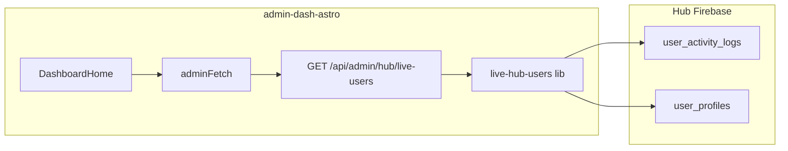

# Technical design: “Live” hub users card (admin dashboard)

## Purpose

Add a **Live** summary card to the admin app home ([`DashboardHome.tsx`](../src/components/react/admin/DashboardHome.tsx)) that lists **hub users who appear active in the product right now** (or within a defined recency window), with **display names** and a small set of **context fields**. Existing dashboard copy stays **below** the new card row (do not remove or replace it).

**Product:** [`apps/aiworkoutgenerator-hub`](../../aiworkoutgenerator-hub) (Next.js).  
**Admin:** [`apps/admin-dash-astro`](../) (Astro + React island [`AdminDashboard`](../src/components/react/AdminDashboard.tsx)).

---

## Problem statement

The hub does **not** currently implement Firebase **Presence** (RTDB) or a dedicated **`presence/{uid}`** heartbeat collection. “Online” cannot be read as a boolean from Firestore without either:

1. **Inferring activity** from recent rows in **`user_activity_logs`**, or  
2. **Adding hub instrumentation** (heartbeat writes, optional RTDB presence).

This TDD scopes **v1** to (1) with clear UX labeling, and describes **v2** for true presence if product requires it.

---

## Definitions

| Term | Meaning (v1) |
| ---- | -------------- |
| **Live** | User has **at least one** `user_activity_logs` row with `timestamp` within **`LIVE_WINDOW_MINUTES`** (default **15**), on the **same Firebase project** the admin service account uses for Hub analytics. |
| **Not live** | No qualifying log in the window (user may still have a tab open but idle—see Non-goals). |

**UX copy (recommended):** Title **Live** with subtitle **Active in the last 15 minutes** (or configurable) so admins do not interpret the list as exact concurrent sockets.

---

## Data sources (existing)

| Source | Path / usage | Fields useful for the card |
| ------ | ------------- | --------------------------- |
| Activity logs | `user_activity_logs` (env: `FIREBASE_USER_ACTIVITY_COLLECTION`) | `user_id`, `timestamp`, `action`, `session_id`, `resource_id`, `details` |
| Profiles | `user_profiles/{uid}` (env: `FIREBASE_USER_PROFILES_COLLECTION`) | `display_name`, `first_name`, `last_name` (same resolution as [`user-profile-display-names.ts`](../src/lib/firebase/user-profile-display-names.ts)) |
| Hub users | `users/{uid}` (optional enrich) | `email`, `display_name`, `last_login` — useful if profile missing |

Hub already emits session-scoped events (`app:open`, `app:session_start`, `app:session_end`, workout actions) per [`ACTIVITY_LOGGING.md`](../../aiworkoutgenerator-hub/docs/admin/ACTIVITY_LOGGING.md). **`session_id`** is client-generated per browser session ([`session-tracker.tsx`](../../aiworkoutgenerator-hub/src/lib/session-tracker.tsx)).

---

## Functional requirements

1. **Dashboard layout:** New top section: one or more cards/containers; **existing** welcome + “Suggested order” content remains **underneath** unchanged.  
2. **Live card content:**  
   - Count of **distinct** `user_id` in window (or “—” if Firebase unavailable).  
   - List (capped, e.g. **25**) of rows: **name** (profile-resolved), **user id** (short), **last action**, **last seen** (relative or UTC), optional **session_id** short.  
3. **Auth:** Same as other admin APIs: [`verifyAdminRequest`](../../src/lib/supabase/admin/auth.ts).  
4. **No secrets on client:** Card loads data via **`adminFetch`** (or `fetch` to same-origin `/api/admin/...` with cookies), not embedded env.  
5. **Configurable window:** Query param or server constant `LIVE_WINDOW_MINUTES` (max cap e.g. 60).

---

## Non-goals (v1)

- Exact **concurrent** user count (requires presence or heartbeat).  
- Real-time **push** updates (optional **v1.1** polling; **v2** SSE/WebSocket).  
- Listing users with **only** `users.last_login` and no recent logs (misleading for “live”).  
- Cross-project Hub if admin Firebase key points at a different project (operational, not code).

---

## Architecture



---

## Firestore access strategy

### Query

1. **`fromTs`** = `now - LIVE_WINDOW_MINUTES`.  
2. Query **`user_activity_logs`**:
   - `where('timestamp', '>=', fromTs)`
   - `orderBy('timestamp', 'desc')`
   - `limit(L)` where `L` is large enough to cover deduplication (e.g. **500**; tune with metrics).

3. **Server-side dedupe:** Walk results in order; for each `user_id`, keep **first** (most recent) row; stop when **distinct count** reaches display cap **N** (e.g. 25) or scan exhausted.

**Note:** If logs are sparse, distinct users may be &lt; N; if burst-y, increase `L` or accept truncation.

### Indexes

Confirm a composite exists for **`timestamp` range + `orderBy timestamp desc`** on `user_activity_logs`. If missing, add to hub [`firestore.indexes.json`](../../aiworkoutgenerator-hub/firestore.indexes.json) and document in [`FIRESTORE_INDEXES_RETENTION.md`](./FIRESTORE_INDEXES_RETENTION.md) (same pattern as engagement / journey indexes).

### Name resolution

- Collect unique `user_id` from deduped rows.  
- Reuse **`fetchDisplayNamesByUid(db, uids)`** from [`user-profile-display-names.ts`](../src/lib/firebase/user-profile-display-names.ts).  
- Optional fallback: read `users/{uid}` for `display_name` / `email` when profile has no name (small extra batch read—product choice).

---

## API design

**Route:** `GET /api/admin/hub/live-users` (or `GET /api/admin/analytics/hub-live-users` if you prefer analytics grouping).

**Query params (suggested):**

| Param | Default | Max | Purpose |
| ----- | ------- | --- | -------- |
| `minutes` | 15 | 60 | Recency window |
| `limit` | 25 | 50 | Max distinct users returned |

**Response (200):**

```json
{
  "configured": true,
  "windowMinutes": 15,
  "generatedAt": "2026-04-04T12:00:00.000Z",
  "distinctUserCount": 12,
  "users": [
    {
      "user_id": "…",
      "display_name": "Alex Trainer",
      "last_seen": "2026-04-04T11:58:30.000Z",
      "last_action": "workout:start",
      "session_id": "…",
      "log_id": "…"
    }
  ]
}
```

**Errors:** `401` unauthenticated; `503` Firebase not configured; `503` with existing Firestore index hint pattern ([`firestore-query-errors.ts`](../src/lib/firebase/firestore-query-errors.ts)) on `FAILED_PRECONDITION`.

**Caching:** Optional `Cache-Control: private, max-age=15` or short server memoization (10–30s) to limit Firestore reads if the home page polls.

---

## UI design ([`DashboardHome.tsx`](../src/components/react/admin/DashboardHome.tsx))

1. **Layout:** Top wrapper, e.g. `grid` of cards (`gap-4`), first card **Live**.  
2. **States:** Loading skeleton; empty (“No hub activity in the last N minutes”); error with hint if index missing.  
3. **Refresh:** Manual button + optional `useEffect` interval (e.g. 60s) with cleanup.  
4. **Accessibility:** Table or list with headers; relative times with `title` full ISO.

Reuse styling tokens consistent with [`ManageUsers.tsx`](../src/components/react/admin/views/ManageUsers.tsx) / engagement panels (borders `border-white/10`, amber accents).

---

## Security & privacy

- Admin-only; no new public routes.  
- Response contains **PII** (names, ids)—same trust model as `hub-dashboard` and journey APIs.  
- Do not log full response bodies in production.

---

## Observability

- Dev-only `console.error` on failure (match existing API routes).  
- Optional: lightweight counter or log line with `distinctUserCount` (no per-user logs).

---

## Testing

- **Unit:** Dedupe logic given a synthetic array of log rows (pure function in lib).  
- **Integration:** Mock Firestore or skip in CI; manual smoke with staging project.  
- **`npx astro check`** and `npm test` in `admin-dash-astro`.

---

## Phased delivery

| Phase | Scope |
| ----- | ------ |
| **v1** | Query + dedupe + profile names + API + `DashboardHome` card + index doc |
| **v1.1** | Polling, optional `users` fallback for name, cache headers |
| **v2** | Hub **heartbeat** (`POST /api/analytics/presence` throttled) writing `last_seen_at` on `users` or `user_presence/{uid}`; admin reads that for stricter “live” |
| **v2.1** | Firebase RTDB presence (only if product needs sub-minute accuracy) |

---

## Open questions (product / eng)

1. Is **15 minutes** the right default, or should **5** / **30** be the marketing promise?  **Answer** 5
2. Should the card show **last action only** or **top 3 recent actions** per user (more reads)? **Answer** Top 3 recent actions
3. Link row to **Manage Users** (filter by uid) or **activity journey** (session timeline)—deep links?  **Answer** Manage Users
4. Should **anonymous** or **missing** `user_id` logs be excluded (recommended: yes)? yes

---

## References

- Hub activity contract: [`ACTIVITY_LOGGING.md`](../../aiworkoutgenerator-hub/docs/admin/ACTIVITY_LOGGING.md)  
- Admin engagement scans: [`engagement-hub.ts`](../src/lib/firebase/engagement-hub.ts), [`workout-journey.ts`](../src/lib/firebase/workout-journey.ts)  
- Existing hub user snapshot: [`hub-dashboard.ts`](../src/pages/api/admin/users/hub-dashboard.ts)  
- Display names helper: [`user-profile-display-names.ts`](../src/lib/firebase/user-profile-display-names.ts)

---

**Implementation status:** Phase **v1** is implemented: `GET /api/admin/hub/live-users`, `LiveHubUsersCard` on dashboard home, Manage Users deep link `?q=` / `?uid=`, aggregation lib + tests, and index notes in [`FIRESTORE_INDEXES_RETENTION.md`](./FIRESTORE_INDEXES_RETENTION.md).

Phase **v2 (heartbeat):** Hub `POST /api/analytics/presence` writes `user_presence/{uid}` (throttled); optional client `PresenceHeartbeat` when `NEXT_PUBLIC_HUB_PRESENCE_HEARTBEAT=true` (see [`ACTIVITY_LOGGING.md`](../../aiworkoutgenerator-hub/docs/admin/ACTIVITY_LOGGING.md)). Admin `GET /api/admin/hub/live-users?source=presence` reads heartbeats; the Live card can switch **Activity** vs **Heartbeat**; default source can be set with `PUBLIC_ADMIN_LIVE_USERS_SOURCE=presence`.
