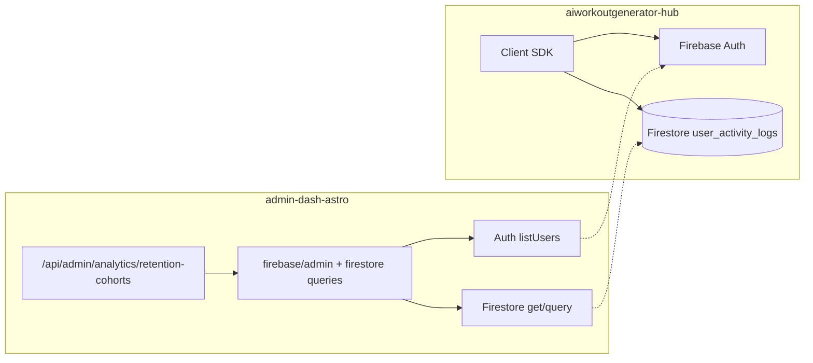

# Design: Retention & Cohorts (Firebase) — Admin Analytics

**Status:** P0–P2 implemented (weekly/daily cohorts, API, heatmap, KPI row, index docs, activeDefinition, CSV export). Rollups documented in [RETENTION_COHORTS_ROLLUPS.md](./RETENTION_COHORTS_ROLLUPS.md) — not implemented in admin.  
**Date:** 2025-03-18  
**Replaces placeholder:** `AnalyticsView` → “Retention & cohorts” (`PlaceholderSection`)

---

**Implementation (P0–P2):**
- `src/lib/firebase/admin.ts` — `getFirebaseFirestore()`
- `src/lib/firebase/retention-cohorts.ts` — Auth cohorts + Firestore activity + matrix; weekly & daily; pooled KPIs (W1/W4/W8 or D1/D7/D30); `activeDefinition` (session vs workout)
- `src/pages/api/admin/analytics/retention-cohorts.ts` — GET API route; `granularity`, `cohortDays`, `activeDefinition` params
- `src/components/react/admin/views/AnalyticsView.tsx` — Retention section with heatmap, Week/Day toggle, Active definition (Session/Workout), KPI row, CSV export
- [docs/FIRESTORE_INDEXES_RETENTION.md](./FIRESTORE_INDEXES_RETENTION.md) — Firestore index and Console link guidance

**KPI aggregation:** Pooled retention (size-weighted): `rate = sum(retained[k]) / sum(size)` over cohorts. See design §4.3.

---

## 1. Goals

| Goal | Detail |
|------|--------|
| Measure **in-app** retention | Users who **engage in the hub** (`aiworkoutgenerator-hub`), not the marketing site. |
| Use **Firebase** as source of truth | Align with Handoff roadmap: hub identity and activity live in Firebase (Auth + Firestore). |
| Support **cohort analysis** | Group users by signup period; show return / activity in subsequent periods. |
| Complement existing **Engagement** section | Current Engagement metrics are **Supabase**-based (e.g. `web_events`, marketing/anonymous sessions). Retention & Cohorts answers: “After they land in the app, do they come back?” |

---

## 2. Problem statement

- **Marketing analytics** (Acquisition, Supabase Engagement tied to `web_events`) describe the **website** funnel.
- **Product retention** must reflect **authenticated hub usage**. The hub already writes **`user_activity_logs`** to Firestore and uses **Firebase Auth** for `uid` and `metadata.creationTime` / `lastSignInTime`.
- `AnalyticsView` currently shows a **“Retention & cohorts”** placeholder; this doc specifies how to fill it with Firebase-backed metrics.

---

## 3. Data sources

### 3.1 Firebase Auth (existing Admin pattern)

| Field | Use |
|-------|-----|
| `uid` | User key for joining to activity |
| `metadata.creationTime` | **Cohort anchor** — signup timestamp (UTC) |
| `metadata.lastSignInTime` | Coarse **return signal** (updated on sign-in); cheap but not granular for “active on Tuesday” |

**Pros:** Already integrated in admin-dash-astro (`listUsersForDateRange`, Handoff).  
**Cons:** `lastSignInTime` alone is insufficient for daily/weekly activity cohorts without listing all users repeatedly.

### 3.2 Firestore `user_activity_logs` (hub — intended source of truth for engagement)

Documented in [apps/aiworkoutgenerator-hub/docs/admin/ACTIVITY_LOGGING.md](../../aiworkoutgenerator-hub/docs/admin/ACTIVITY_LOGGING.md). Implemented in [user-activity-logger.ts](../../aiworkoutgenerator-hub/src/lib/user-activity-logger.ts).

| Field | Use |
|-------|-----|
| `user_id` | Firebase Auth UID |
| `action` | e.g. `app:open`, `workout:complete`, `app:session_start` |
| `timestamp` | Server timestamp — **activity time** for retention windows |
| `session_id` | Optional session grouping |

**Recommended “active” definition (v1):** user has ≥1 log with `action in ('app:open', 'app:session_start')` in a period (day or week), to align with DAU-style thinking and existing hub instrumentation (`SessionTracker`).

**Optional v2:** weighted retention (e.g. any `workout:*` or `profile:onboarding_complete`) as secondary charts or filters.

### 3.3 What we do **not** use for this section (by default)

| Source | Reason |
|--------|--------|
| Supabase `web_events` | Marketing site traffic, not hub product usage |
| Supabase Engagement RPC | Same — unless you explicitly add a “compare marketing vs app” mode later |

---

## 4. Metrics definitions

### 4.1 Cohort

- **Cohort key:** calendar **week** or **month** of `UserRecord.metadata.creationTime` (configurable in UI; default **week**).
- **Cohort size:** count of users with `creationTime` in that bucket within the selected global date range (e.g. last 12 weeks).

### 4.2 Retention (period N)

For cohort week `C` and period offset `N` (0 = signup week, 1 = next week, …):

- **Retained(N)** = users in cohort `C` who have **at least one qualifying activity** in the calendar week (or day) corresponding to offset `N` from cohort start.
- **Retention rate(N)** = `Retained(N) / cohort_size` (handle `cohort_size === 0`).

**Period granularity:**

| Mode | Cohort bucket | Activity bucket | Typical N |
|------|---------------|-----------------|-----------|
| Weekly (recommended v1) | ISO week or “week starting Monday” | Same | 0–12 |
| Daily (optional) | Signup day | Subsequent days | 0–30 (heavier queries) |

### 4.3 Summary KPIs (header row)

- **D1 / D7 / D30** style metrics if using **daily** activity bucketing; or **W1 / W4 / W8** for weekly.
- Computed from the same rules as the matrix, aggregated across cohorts in range (e.g. weighted by cohort size or simple average — document choice in implementation).

---

## 5. Architecture



- **Server-only:** All reads via Firebase Admin (same service account as Handoff).
- **Extend** `src/lib/firebase/admin.ts` (or add `src/lib/firebase/firestore-retention.ts`) to initialize **Firestore** with the same credentials as Auth (already available from `firebase-admin` app).

---

## 6. IAM & environment

| Requirement | Notes |
|-------------|--------|
| Service account | Same JSON as `FIREBASE_SERVICE_ACCOUNT_KEY` (hub project). |
| Firestore | Role **Cloud Datastore User** or **Firebase Admin** / custom role with `datastore.entities.list` on `user_activity_logs`. |
| Optional env | `FIREBASE_USER_ACTIVITY_COLLECTION=user_activity_logs` if collection name ever varies. |

If Firestore is not enabled or rules deny the service account, the API should return a clear error and the UI should show “Firestore activity not available” (not a blank chart).

---

## 7. Query strategy (performance)

`user_activity_logs` can grow large. Avoid full collection scans on every dashboard load.

| Approach | When |
|----------|------|
| **Time-bounded query** | `where('timestamp', '>=', start)` and `where('timestamp', '<=', end)` with composite index on `(timestamp)` or `(timestamp, user_id)` as needed. |
| **Pre-aggregation (future)** | Scheduled Cloud Function → `retention_cohort_rollups/{week}` documents; admin reads rollups only. |
| **Caching** | Short TTL (e.g. 5–15 min) in memory or Vercel KV for expensive ranges; document cache headers or ETag in API. |

**Auth side:** For each user in cohort, you need `creationTime`. Options:

1. **Paginate `listUsers`** (current Handoff pattern) — filter in memory by `creationTime` in range; acceptable for moderate user counts.
2. **Store signup week on user profile / custom claims** — reduces Auth scans; optional enhancement.

For **activity**, query Firestore for the **union of calendar periods** covering all cohort offsets in the view (single or batched queries), then join in memory: `Set<uid>` per period.

---

## 8. API shape (proposal)

**Route:** `GET /api/admin/analytics/retention-cohorts`  
**Query params (examples):**

| Param | Default | Description |
|-------|---------|-------------|
| `granularity` | `week` | `week` \| `day` |
| `periods` | `12` | Number of retention columns (N = 0..periods-1) |
| `cohortWeeks` | `12` | How many signup cohorts back from “now” |
| `activeDefinition` | `session` | `session` = app:open \| app:session_start |

**Response (JSON):**

```ts
interface RetentionCohortsResponse {
  granularity: 'week' | 'day';
  cohorts: {
    label: string;        // e.g. "2025-W11"
    start: string;        // ISO date
    end: string;
    size: number;
    retained: number[];   // length = periods; retained[i] = count active in period i
    rates: number[];      // retained[i] / size, 0..1
  }[];
  kpis?: {
    label: string;
    rate: number;
  }[];
  source: 'firebase';
  warnings?: string[];    // e.g. "Firestore index missing"
}
```

Admin gate: same pattern as `auth-funnel.ts` / `engagement.ts` (session + `admin_users`).

---

## 9. UI (AnalyticsView)

Replace `PlaceholderSection` for **Retention & cohorts** with:

1. **Controls:** granularity toggle (Week / Day), period count, date range (if not implied).
2. **Cohort matrix (heatmap):** rows = cohorts (newest at top), columns = period 0, 1, … N; cell = retention % (color scale) or raw count on hover.
3. **Optional line chart:** select one or more cohorts; plot `rates[]` over period index.
4. **Empty / disabled states:** Firebase not configured → same as Handoff (“Set `FIREBASE_SERVICE_ACCOUNT_KEY`”). Firestore empty → “No activity logs in range; ensure hub logging is enabled.”

Reuse existing **Recharts** + **Tailwind** patterns from Auth & Engagement sections.

---

## 10. Implementation phases

| Phase | Scope |
|-------|--------|
| **P0** | Firestore Admin init; read `user_activity_logs` with time bounds; join with Auth `creationTime` for weekly cohorts + matrix; API + basic heatmap. |
| **P1** | Daily granularity; KPI row (W1/W4/W8 or D1/D7/D30); loading/error states; composite index docs in Firebase console. |
| **P2** | `activeDefinition` filter (workout vs session); export CSV; optional rollups via Cloud Function if query cost is high. |

---

## 11. Testing & validation

- **Local:** Hub + admin with same project; generate test users and `user_activity_logs` via hub dev session.
- **Staging:** Compare cohort sizes to Firebase Auth user count for the same signup window (sanity check).
- **Privacy:** Do not expose raw `user_id` in chart tooltips in v1; aggregate only.

---

## 12. Related documents

| Doc | Relevance |
|-----|-----------|
| [ONBOARDING_DROPOFF_FIREBASE_HANDOFF_ROADMAP.md](../../../docs/roadmaps/ONBOARDING_DROPOFF_FIREBASE_HANDOFF_ROADMAP.md) | Firebase Admin + Auth in admin-dash-astro |
| [ACTIVITY_LOGGING.md](../../aiworkoutgenerator-hub/docs/admin/ACTIVITY_LOGGING.md) | Firestore schema and hub actions |
| [ANALYTICS_FILE_MIGRATION_LIST.md](./ANALYTICS_FILE_MIGRATION_LIST.md) | Analytics file layout when migrating |
| [MONETIZATION_CANDIDATES.md](./MONETIZATION_CANDIDATES.md) | Operational bridge: high-intent UIDs for monetization outreach |
| [ANALYTICS_PRODUCTION_ANALYSIS.md](../../../docs/analytics/ANALYTICS_PRODUCTION_ANALYSIS.md) | Supabase vs production traffic (marketing) |

---

## 13. Open questions

1. **Cohort timezone:** UTC vs `America/Los_Angeles` for week boundaries — product decision.
2. **Users with no Firestore logs:** Treat as “not retained” after period 0, or exclude from cohort size — recommend **include in cohort size** for honest funnel drop-off.
3. **BigQuery export:** If Firebase → BigQuery is enabled later, consider switching admin to BigQuery for heavy cohort queries (out of scope for v1).
