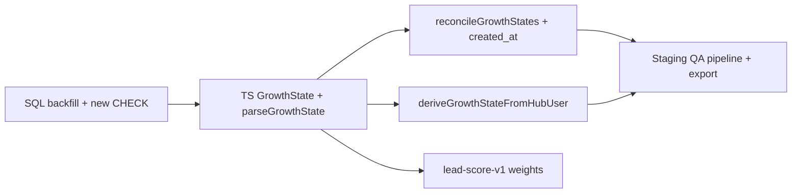

# Reverse trial — product & implementation roadmap

**One-liner:** Ship a **loss-aversion** trial (full Pro first, then reclaim) while making **`growth_state`** the single source of truth so **Active Growth Engine** and lifecycle messaging can operate on real segments.

**Last updated:** 2026-03-28 (Phase 3 Hub UX: capabilities payload, paywall pivot, proactive AI locks)  
**Companion docs:** [`ACTIVE_GROWTH_ENGINE_ROADMAP.md`](./ACTIVE_GROWTH_ENGINE_ROADMAP.md) (command center, pipeline, prerequisites)

**Format note:** Versioned Markdown in-repo. This doc is written for **planning phases**; it does not replace tickets—each phase should spawn concrete tasks (migrations, Hub routes, analytics events).

---

## 1. Context & product definition

### 1.1 Current reality

- Users present in **Hub Firestore** are treated as on a **free / trial-capable** footing.
- **Trial caps (v1 hard limits, 7-day window):**
  - **5** workout generations.
  - **10** AI-assisted edits (e.g. swap exercise, add exercise, coach explain)—treat as one **AI ops** bucket unless product later splits caps per feature.
- **Observed behavior:** These ceilings are not being hit within 7 days yet, so they are acceptable as **initial** guardrails without complicating UX.

### 1.2 What happens when the 7-day window ends

| Still allowed | Restricted |
|---------------|------------|
| Access **workouts already generated** during the trial (read / complete / basic log use as defined by product) | **Analytics** (advanced / Pro analytics surfaces) |
| | **All new AI generation** (workout generation + AI edit flows) |

After expiry, the product should **pivot** to paywall / downgrade / Basic path—not a hard “lock the app” moment, but a **clear downgrade** of Pro capabilities (see §4.1).

### 1.3 Why this is “reverse trial”

- **Standard trial:** Opt-in to value; user hasn’t felt the full product.
- **Reverse trial:** User gets the **full Pro experience** (Workout Generation, Advanced Analytics, Coach Review/Certification, AI tools) up front, then must **choose not to lose it**—**loss aversion** as a retention lever.

The **`growth_state`** semantic layer is **shipped** in code (reconcile, pipeline, Hub alignment per this doc). The Growth Engine **Marketing** card still treats segmentation as **unverified** until ops sets **`GROWTH_STATE_READY`** on the batch/cron host after production checks (see [`batch-job.ts`](../src/lib/admin/growth-engine/batch-job.ts) + [`rule-pack-v1.ts`](../src/lib/admin/growth-engine/rule-pack-v1.ts)).

---

## 2. Growth state machine (target taxonomy)

**Goal:** One enumerated **`growth_state`** on the canonical user record (today: `public.profiles.growth_state` in Supabase, reconciled by [`growth-state.ts`](../src/lib/admin/growth-engine/growth-state.ts)), with **Hub** enforcement aligned to the same definitions.

### 2.1 Product-facing phases → engine actions

| Trial phase | Target `growth_state` ID | Marketing engine “signal” intent |
|-------------|--------------------------|----------------------------------|
| Days 1–3 | `reverse_trial_active` | Explore all features—high value, low pressure. |
| Days 4–6 | `reverse_trial_expiring` | Urgency hook: usage + “don’t lose history / streak / data.” |
| Day 7+ (no paid conversion) | `reverse_trial_expired` | Downsell: Pro ended—Basic vs re-activate. |
| Converted (paid active) | `premium_subscriber` | LTV: longevity, hypertrophy, habit depth (future messaging). |

### 2.2 Alignment with existing codebase (important)

**Shipped (Option A):** The database **CHECK** and TypeScript `GrowthState` union now use only `reverse_trial_*`, `premium_subscriber`, and `churned` (see migration `supabase/migrations/20260327200000_growth_state_reverse_trial_enum.sql` and [`types.ts`](../src/lib/admin/growth-engine/types.ts)). Legacy literals existed only in the historical Phase D migration (`20260326170000_growth_engine_phase_d_tables.sql`) until superseded.

**Reconciliation precedence** (authoritative spec in code comments): [`growth-state-derive.ts`](../src/lib/admin/growth-engine/growth-state-derive.ts) — paid via `purchased_index`, sticky `churned`, past `trial_ends_at` → expired, future `trial_ends_at` with last-24h and `created_at` day buckets (UTC, 1-based day since signup), else `created_at`-only buckets for non-purchasers.

**Related modules:** [`growth-state.ts`](../src/lib/admin/growth-engine/growth-state.ts) (Supabase upsert), [`growth-state-constants.ts`](../src/lib/admin/growth-engine/growth-state-constants.ts) (API `growth_state` filter), [`pipeline-users-firestore.ts`](../src/lib/admin/growth-engine/pipeline-users-firestore.ts) (Hub `users` + `created_at`), **lead score** [`lead-score-v2.ts`](../src/lib/admin/growth-engine/lead-score-v2.ts) (`lead-score-v2` version; v1 row retained in `growth_lead_score_versions` for history).

---

## 3. Strategic recommendation

**Do not treat “reverse trial” as a standalone project.** Implement it as the **authoritative `growth_state` write path** plus **Hub enforcement** + **instrumentation**.

Once users are labeled consistently:

- **Active Growth Engine** can flip `GROWTH_STATE_READY` and show **real** conversion / urgency cohorts.
- **Messaging suggestions** and **pipeline scoring** can use the same field the product uses at runtime (no drift between “what marketing thinks” and “what the app allows”).

---

## 4. Implementation blueprint (three pillars)

These map directly to roadmap **phases** below.

### 4.1 Graceful downgrade (user-facing shell)

- **Not** a full app lock: user keeps **trial-era content**; **Pro surfaces** hide or show locked states with a **“Trial expired”** (or equivalent) banner.
- **Where it lives:** Enforcement belongs on the **Hub** (user-facing app) at **API route** and/or **middleware** boundaries—whatever stack owns authenticated workout + AI + analytics routes. The **admin Astro** app is not the runtime gate for end users; reuse the same `growth_state` (or token claims derived from it) that Supabase/Hub already trust.
- **UX contract:** Distinguish **read-only historical** vs **new AI / Pro analytics**; avoid ambiguous buttons that fail silently.

### 4.2 `growth_state` reconciliation

Extend **`reconcileGrowthStates()`** (and any **Firestore-derived** path used when pipeline source is Firebase) so rules reflect **reverse trial**, not only `trial_ends_at` + `purchased_index`.

**Example rule sketch (to refine against real `created_at` semantics and timezone):**

- If **paid / active subscriber** (per existing billing truth) → `premium_subscriber` (or keep `subscriber_active` if Option B).
- Else if **`purchased_index === 0`** (or equivalent “never purchased”) and **account age &lt; 7 days** from `profiles.created_at` → `reverse_trial_active` or `reverse_trial_expiring` by **day bucket** (1–3 vs 4–6).
- Else if same non-purchaser and **account age ≥ 7 days** → `reverse_trial_expired`.

**Also required:**

- **Usage counters** (workouts generated, AI ops) must live in a **queryable** store (Firestore user doc, Supabase columns, or dedicated table) so reconciliation or **realtime** jobs can mark **de facto** expired when caps hit **before** day 7—if product chooses “whichever comes first” (recommend stating explicitly in Phase 0).

### 4.3 Behavioral tracking (“drop-off audit”)

Principle: *an event without a property is a wasted byte.*

| Event | Purpose |
|-------|---------|
| `trial_expired_viewed` | User was shown the post-trial paywall / downgrade explainer (impression). |
| `feature_lock_click` | User attempted a **Pro** or **AI** action after expiry—**high-intent** funnel signal for Growth Engine and CRM. |

Include useful properties (examples): `growth_state`, `days_since_signup`, `workouts_used`, `ai_ops_used`, `surface` (screen or feature key). Keep names aligned with existing analytics conventions (e.g. `analytics_funnel_events` if that’s the sink).

---

## 5. Phased implementation outline

Each phase should end with **verifiable outcomes** (migrations applied, events in QA project, feature flag off by default, etc.).

### Phase 0 — Decision, schema, and single source of truth

**Outcomes**

- Written product rules: **7-day vs cap-first** expiry (or hybrid).
- Chosen **Option A or B** from §2.2; if A, migration updates `profiles_growth_state_check` and `GrowthState` in TS.
- Documented mapping from **Firestore subscription fields** → same enum as Supabase reconciliation (no duplicate ad-hoc definitions).

**Workstreams**

- Product + eng review of **exact** definitions for “analytics” and “AI generation” surfaces.
- Data model for **counters** (5 / 10) and optional `reverse_trial_ends_at` if you want an explicit timestamp column instead of inferring only from `created_at`.

#### Phase 0 — Option A implementation plan (expand / rename enum)

This is the **execution checklist** for Option A from §2.2: one vocabulary in Postgres, TypeScript, reconciliation, Firestore-derived pipeline, and lead scoring.

**0A — Lock the canonical enum**

Target literals (plus existing **churn** semantics):

| Value | Meaning (contract) |
|-------|---------------------|
| `reverse_trial_active` | In reverse trial, days 1–3 (or “early window” per §2.1). |
| `reverse_trial_expiring` | In reverse trial, days 4–6 (urgency window). |
| `reverse_trial_expired` | Trial over, not paying (still on free / locked Pro). |
| `premium_subscriber` | Active paid entitlement. |
| `churned` | Was a paying subscriber; subscription canceled / past_due / unpaid per billing rules. |

**Decision to record before migration:** Do you **remove** legacy literals (`trial_active`, `trial_expiring_24h`, `downgraded_free`, `subscriber_active`) from the CHECK after data backfill? **Recommended:** yes—single vocabulary—after `UPDATE` steps below. If any external system still writes old values, add a short **compat window** (dual CHECK or trigger rewrite) before dropping old literals.

**0B — SQL migration (ordering matters)**

1. **Backfill rows** (run before dropping the old CHECK), mapping legacy → new:

   | From (current) | To (Option A) | Notes |
   |----------------|---------------|--------|
   | `subscriber_active` | `premium_subscriber` | Straight rename. |
   | `trial_active` | `reverse_trial_active` *or* `reverse_trial_expiring` | Use `profiles.created_at` + “now” at migration time to split day 1–3 vs 4–6; users outside trial window → `reverse_trial_expired` (see below). |
   | `trial_expiring_24h` | `reverse_trial_expiring` | Aligns with urgency bucket; refine in Phase 1 with real clock rules. |
   | `downgraded_free` | `reverse_trial_expired` if never purchased; else consider `churned` if billing says canceled | **Product call:** `downgraded_free` today mixes “trial ended” and “free tier”; split using `purchased_index` / Stripe mirror if available. |
   | `NULL` | leave NULL *or* compute first reconciliation run | Prefer leaving NULL until `reconcileGrowthStates` fills (avoids wrong guesses). |

2. **Drop** `profiles_growth_state_check`.

3. **Add** a new `CHECK` allowing only: `reverse_trial_active`, `reverse_trial_expiring`, `reverse_trial_expired`, `premium_subscriber`, `churned`, and optionally `NULL`.

4. **Deploy admin** code that only emits the new literals **in the same release** as the migration (or use compat rewrite in DB first).

**0C — TypeScript**

- Update `GrowthState` in [`types.ts`](../src/lib/admin/growth-engine/types.ts) to the new union; grep the monorepo for string literals that embed old enum values.

**0D — API query-param allowlists**

- [`pipeline.ts`](../src/pages/api/admin/growth-engine/pipeline.ts) and [`pipeline/export.ts`](../src/pages/api/admin/growth-engine/pipeline/export.ts): extend/replace `parseGrowthState()` so `growth_state=` filter accepts only the new literals (keep 400 or ignore unknown—pick one and document).

**0E — `reconcileGrowthStates()`** ([`growth-state.ts`](../src/lib/admin/growth-engine/growth-state.ts))

- Extend `ProfileStateRow` select to include **`created_at`** (required for day 1–3 vs 4–6 vs 7+ buckets).
- Replace `deriveGrowthState()` logic:
  - **Paid / purchased** path → `premium_subscriber` (today uses `purchased_index >= 0`; confirm this still matches billing).
  - **Not purchased:** if age from `created_at` &lt; 7d → `reverse_trial_active` or `reverse_trial_expiring` by day bucket; if ≥ 7d → `reverse_trial_expired`.
  - **Churned:** if reconciliation has access to cancel signals on `profiles`; otherwise defer to Hub webhook sync or a later column—**do not** overload `reverse_trial_expired` for ex-subscribers.
- **Legacy `trial_ends_at`:** Either drop from derivation once reverse-trial clock is canonical, or use as override when Hub sets an explicit end timestamp before `created_at`-based rules (document precedence: e.g. explicit `trial_ends_at` wins for “expiring” last 24h).

**0F — Firestore-derived helper** ([`pipeline-users-firestore.ts`](../src/lib/admin/growth-engine/pipeline-users-firestore.ts))

- Extend `deriveGrowthStateFromHubUser` inputs: at minimum **`createdAt`** (Firestore user doc) alongside tier/status/trial end.
- Map Hub subscription signals to the **same** enum as Supabase:
  - Paid + active → `premium_subscriber`.
  - Canceled / past_due / unpaid → `churned` (same as today).
  - Free / none / inactive + in first 7 days from `createdAt` → `reverse_trial_active` / `reverse_trial_expiring` by day bucket.
  - Free + trial elapsed → `reverse_trial_expired`.
- Fix **`purchasedIndex`:** today `purchasedIndex: growthState === 'subscriber_active' ? 0 : null` is suspicious (likely placeholder); align with real monetization fields when available, or remove until defined.

**0G — Lead scoring** ([`lead-score-v1.ts`](../src/lib/admin/growth-engine/lead-score-v1.ts))

- Replace `growthStateDelta` branches for old states with weights for:
  - `reverse_trial_expiring` (highest urgency),
  - `reverse_trial_active`,
  - `reverse_trial_expired`,
  - `premium_subscriber` (negative / deprioritize for *conversion* outreach),
  - `churned` (win-back—tune separately from expired trial).
- If you ship **lead-score-v2**, insert a row in `growth_lead_score_versions` (see Phase D migration) so exports and audits show the new weights; otherwise update v1 with a documented breaking note.

**0H — Tests**

- Update [`growth-engine-pipeline-users-firestore.test.ts`](../tests/lib/growth-engine-pipeline-users-firestore.test.ts) for new return values and fixtures (`createdAt` for day buckets).
- Add unit tests for `deriveGrowthState` in `growth-state.ts` (pure function extraction recommended so tests do not need Supabase).

**0I — Docs & admin UI**

- Update [`ACTIVE_GROWTH_ENGINE_ROADMAP.md`](./ACTIVE_GROWTH_ENGINE_ROADMAP.md) §9 / state tables if they still list `trial_active`.
- If any React admin control offers a **growth_state** filter dropdown, refresh options to the new enum.

**0J — Rollout**

- Run migration on **staging** first; run `reconcileGrowthStates` job; spot-check pipeline API + CSV export.
- **Production:** migration → deploy admin → enable Hub writes (Phase 2) → only then set `GROWTH_STATE_READY` for the batch job (see Phase 4).

**Dependency graph (summary)**



---

### Phase 1 — Write path: reconciliation + batch integration

**Scope boundary:** Phase 1 covers **Supabase `profiles.growth_state`**, the growth-state **reconcile** job, **batch** metrics, and **ops/verification**. It does **not** include Hub enforcement (Phase 2) or `GROWTH_STATE_READY` / Marketing card un-gate (Phase 4).

#### Completed (Option A + follow-up)

- Day-bucket derivation in [`growth-state-derive.ts`](../src/lib/admin/growth-engine/growth-state-derive.ts) with tests in [`growth-state-derive.test.ts`](../tests/lib/growth-state-derive.test.ts).
- `reconcileGrowthStates()` uses `created_at` + same derive logic; Firestore pipeline uses `deriveGrowthStateFromHubUser` in [`pipeline-users-firestore.ts`](../src/lib/admin/growth-engine/pipeline-users-firestore.ts).
- Batch logs `growth_state_rows_updated`, `growth_state_rows_scanned`, `growth_state_source`, and `growth_state_profile_reconcile_ran` (whether Supabase reconcile ran this batch) in [`batch-job.ts`](../src/lib/admin/growth-engine/batch-job.ts) → `daily_brief.metrics`.
- Standalone job: `POST /api/admin/growth-engine/jobs/growth-state` (same auth pattern as batch).

#### Product policy — legacy / pre-launch users

**v1 rule (documented):** Users who signed up **before** reverse-trial launch are **not** given a separate “grandfather” enum. `growth_state` is derived from **calendar `created_at`** (and subscription flags) the same as new users. If `created_at` is missing or invalid, derivation maps conservatively to `reverse_trial_expired` (see derive module).

**Optional later:** If product requires a **cutover timestamp** (e.g. force `reverse_trial_expired` for all non-payers before date X), add a small conditional in derive (and mirror in Hub derive) or a one-time SQL `UPDATE`—not required for Phase 1 closure.

#### Batch vs Supabase reconcile when pipeline reads Firestore

When `GROWTH_PIPELINE_USER_SOURCE=firebase`, the **batch** job **does not** call `reconcileGrowthStates` by default (pipeline cards use Firestore-derived states; avoids extra Supabase load). **`profiles.growth_state`** still updates via:

- **Recommended (Strategy A):** Schedule a **second cron**: `POST /api/admin/growth-engine/jobs/growth-state` (same frequency or nightly), with the same auth as batch (`x-growth-engine-cron-key` or admin session).

- **Alternative (Strategy B):** Set `GROWTH_RECONCILE_PROFILES_ON_BATCH=true` so **every** batch run also reconciles up to 5000 rows in Supabase—**single cron** only, at the cost of more DB work per batch.

#### Cron / runbook (production)

| Job | Method + path | Auth |
|-----|----------------|------|
| Growth Engine batch | `POST /api/admin/growth-engine/jobs/batch` | `x-growth-engine-cron-key: <GROWTH_ENGINE_CRON_KEY>` (or admin cookie in browser) |
| Growth state reconcile | `POST /api/admin/growth-engine/jobs/growth-state` | Same |

Use HTTPS to your deployed admin-dash host. **Hub profile mirror** is not a second HTTP call: on the **same** host as batch, set **`HUB_PROFILE_SYNC_ON_BATCH=true`** (and usually **`GROWTH_RECONCILE_PROFILES_ON_BATCH=true`** when `GROWTH_PIPELINE_USER_SOURCE=firebase`) so each batch run mirrors Firestore `users` into `profiles` then reconciles `growth_state` (see **Strategy B** above). Frequency: batch as today (e.g. daily); if you use **Strategy A** only, run growth-state **at least daily** when pipeline source is Firebase so `profiles` stays aligned.

#### Reconciliation coverage (limit / cursor)

`reconcileGrowthStates(limit)` processes rows ordered by **`created_at` descending** and caps at **`limit`** (batch: 5000; standalone job may allow higher). **Older** profiles may not be touched in one run. **Full backfill** requires repeated runs over days or a future **paginated / cursor-based** reconcile job (optional ticket).

#### Phase 1 verification (staging / production)

**Supabase SQL**

```sql
-- Distribution
SELECT growth_state, COUNT(*) AS n
FROM public.profiles
GROUP BY growth_state
ORDER BY n DESC;

-- Nulls (should trend to zero after reconcile + backfill)
SELECT COUNT(*) AS null_growth_state FROM public.profiles WHERE growth_state IS NULL;

-- Legacy enum strings (should return 0 rows after migration)
SELECT id, growth_state FROM public.profiles
WHERE growth_state::text IN ('trial', 'trial_expired', 'subscribed', 'free');
```

**API / admin:** Run growth pipeline and CSV export; filter or spot-check `growth_state` values match [`parseGrowthState`](../src/lib/admin/growth-engine/growth-state-constants.ts) literals (`reverse_trial_*`, `premium_subscriber`, `churned`).

**Batch:** After a batch run, confirm latest `daily_brief.metrics` JSON includes `growth_state_rows_updated`, `growth_state_rows_scanned`, `growth_state_source`, and `growth_state_profile_reconcile_ran`.

---

### Phase 2 — Hub enforcement: limits + post-expiry behavior

**Scope boundary:** Runtime enforcement lives in **Hub** (`aiworkoutgenerator-hub`). Phase 4 analytics events (`trial_expired_viewed`, `feature_lock_click`) remain **out of scope** here unless explicitly bundled later.

**Outcomes (shipped)**

- **Shared derive:** [`packages/growth-state`](../../../packages/growth-state/src/index.ts) exports `GrowthState`, `deriveGrowthStateFromHubUser`, `deriveGrowthStateFromProfileRow` — consumed by admin-dash ([`growth-state-derive.ts` re-export](../src/lib/admin/growth-engine/growth-state-derive.ts)) and Hub so labels do not drift.
- **Feature flag:** `REVERSE_TRIAL_ENFORCEMENT=true` | `1` enables calendar-based hard blocks; when unset/false, behavior matches legacy tier-only limits.
- **Hard blocks (flag on):** `reverse_trial_expired` and `churned` → **403** with `code: reverse_trial_ai_blocked` on generative/AI routes and `code: reverse_trial_analytics_blocked` on Pro analytics API. **5** workouts + **10** AI ops during trial remain enforced by existing free-tier counters ([`subscription-constants.ts`](../../aiworkoutgenerator-hub/src/lib/subscription-constants.ts), [`ai-action-limiter.ts`](../../aiworkoutgenerator-hub/src/lib/ai-action-limiter.ts)).
- **Gated analytics:** [`GET /api/summaries/analytics`](../../aiworkoutgenerator-hub/src/app/api/summaries/analytics/route.ts) (Admin SDK aggregates) replaces client-only reads for the summaries page so post-expiry users cannot bypass via Firestore rules alone.
- **Capabilities for UI:** [`GET /api/users/capabilities`](../../aiworkoutgenerator-hub/src/app/api/users/capabilities/route.ts) drives [`ReverseTrialBanner`](../../aiworkoutgenerator-hub/src/components/reverse-trial/ReverseTrialBanner.tsx) (expiring vs ended).
- **Stable errors:** Workout generation client ([`TrainerService.generateWorkout`](../../aiworkoutgenerator-hub/src/services/trainer/TrainerService.ts)) maps `reverse_trial_ai_blocked` to a clear thrown message.

**AI / generative routes gated (POST/GET as applicable)**

- [`/api/workouts/generate`](../../aiworkoutgenerator-hub/src/app/api/workouts/generate/route.ts)
- AI exercise: `ai-exercise-edit`, `ai-exercise-add`, `ai-exercise-apply`, `ai-exercise-apply-add`, `ai-exercise-swap`, `ai-exercise-order-check`, `ai-interval-timer`, `coach-explain`
- Images: `workouts/generate-images` (POST), `image/generate` (POST)
- [`/api/exercises/biomechanical-analysis`](../../aiworkoutgenerator-hub/src/app/api/exercises/biomechanical-analysis/route.ts) (GET)

**Not gated (non-LLM / trial-era content)**

- Saved workout reads under `/api/users/workouts` and related non-AI mutations (e.g. reorder, timers without Genkit).

**Deferred**

- Firebase **callable** [`functions/.../generateWorkout`](../../aiworkoutgenerator-hub/functions/src/flows/generateWorkout.ts) is still a stub; wire the same checks if it becomes a live path.

**Verification**

- With `REVERSE_TRIAL_ENFORCEMENT=true`, user in `reverse_trial_expired`: `POST /api/workouts/generate` → 403 + `reverse_trial_ai_blocked`; `GET /api/summaries/analytics` → 403 + `reverse_trial_analytics_blocked`.
- Paid active user: unchanged.

---

### Phase 3 — Graceful downgrade UX & paywall pivot

**Outcomes (shipped)**

- **`GET /api/users/capabilities`** exposes `can_use_ai`, `ended_reason` (`reverse_trial_expired` | `churned` | null), **`trial_day`** (calendar day since signup, UTC — aligns with `growth_state` derivation), plus existing banner flags — single contract for client UX ([`capabilities.ts`](../../aiworkoutgenerator-hub/src/lib/reverse-trial/capabilities.ts), [`user-capabilities-types.ts`](../../aiworkoutgenerator-hub/src/lib/reverse-trial/user-capabilities-types.ts)).
- **`ReverseTrialCapabilitiesProvider`** + **`useReverseTrialCapabilities`** — one fetch per session for layout descendants ([`ReverseTrialCapabilitiesContext.tsx`](../../aiworkoutgenerator-hub/src/components/reverse-trial/ReverseTrialCapabilitiesContext.tsx)).
- **Global banner:** distinct copy for **churned** vs **trial ended**; “View plans” → `/pricing?from=trial_ended`; **What you keep vs Premium** explainer ([`ReverseTrialBanner.tsx`](../../aiworkoutgenerator-hub/src/components/reverse-trial/ReverseTrialBanner.tsx), [`TrialEndedExplainer.tsx`](../../aiworkoutgenerator-hub/src/components/reverse-trial/TrialEndedExplainer.tsx)).
- **Upgrade modal:** triggers `reverse_trial_ai`, `reverse_trial_analytics`, `churned_winback` with **Premium entry** display ($11.99) + checkout still uses Stripe tier routing ([`UpgradeModal.tsx`](../../aiworkoutgenerator-hub/src/components/upgrade/UpgradeModal.tsx)).
- **Generate:** inline alert when `can_use_ai` is false; primary CTA routes to upgrade (no API call); **TrainerService** sets `reverseTrialAiBlocked` on error; catch opens modal ([`generate/page.tsx`](../../aiworkoutgenerator-hub/src/app/generate/page.tsx), [`TrainerService.ts`](../../aiworkoutgenerator-hub/src/services/trainer/TrainerService.ts)).
- **Summaries:** analytics block → **Restore analytics** modal + explainer ([`summaries/page.tsx`](../../aiworkoutgenerator-hub/src/app/summaries/page.tsx)).
- **AI editor panels:** banner + **`useReverseTrialAiLock`** guard before API calls ([`EditModePanel.tsx`](../../aiworkoutgenerator-hub/src/components/workout/ai-editor/EditModePanel.tsx), [`SwapModePanel.tsx`](../../aiworkoutgenerator-hub/src/components/workout/ai-editor/SwapModePanel.tsx), [`AddModePanel.tsx`](../../aiworkoutgenerator-hub/src/components/workout/ai-editor/AddModePanel.tsx)).
- **Pricing:** contextual strip when `from=trial_ended` or capabilities show expired/churned; **Pro** card ring + “Restores AI & analytics” ([`pricing/page.tsx`](../../aiworkoutgenerator-hub/src/app/pricing/page.tsx)).

**Instrumentation (Phase 4)** — implemented in [`reverse-trial-funnel-analytics.ts`](../../aiworkoutgenerator-hub/src/lib/reverse-trial-funnel-analytics.ts); see Phase 4 below for schema and QA.

**Verification (QA)**

| Case | Expected |
|------|-----------|
| `REVERSE_TRIAL_ENFORCEMENT` off | No proactive locks; capabilities `enforcement_enabled: false`; banner hidden. |
| Expired trial, enforcement on | Banner “Trial ended”; generate shows alert; primary CTA opens upgrade without hitting generate API; modal triggers use `reverse_trial_*` copy. |
| Churned, enforcement on | Banner “Subscription ended”; modals prefer `churned_winback` where wired. |
| `/pricing?from=trial_ended` | Pivot strip visible (even before capabilities load); Pro card emphasized. |
| Summaries analytics 403 | Blocked alert + Restore analytics + explainer. |
| Premium subscriber | No pivot strip (unless query param); full AI/analytics. |

**Deferred**

- **Email/push** still consume **`growth_state` / capabilities** in Phase 5; no new server fields required for Phase 3.

---

### Phase 4 — Instrumentation & Growth Engine readiness

**Outcomes (shipped)**

- Hub POSTs **`trial_expired_viewed`** and **`feature_lock_click`** to the marketing site **`POST /api/analytics/track-event`** (allowlist in [`astro-site/src/pages/api/analytics/track-event.ts`](../../../astro-site/src/pages/api/analytics/track-event.ts)) → **`analytics_funnel_events`** with `app_id: hub`, `user_id: null`, `session_id` = per-tab reverse-trial correlation id ([`reverse-trial-funnel-analytics.ts`](../../aiworkoutgenerator-hub/src/lib/reverse-trial-funnel-analytics.ts)).
- **`GET /api/users/capabilities`** includes **`trial_day`** for cohort-aligned properties (from `@workout-generator/growth-state` **`calendarTrialDayNumberSinceSignupUtc`**).
- Marketing batch **rule pack** copy references **`reverse_trial_expiring` / `reverse_trial_expired`** when `GROWTH_STATE_READY` is on ([`rule-pack-v1.ts`](../src/lib/admin/growth-engine/rule-pack-v1.ts)).

**Event property schema** (`properties` JSONB)

| Field | When | Notes |
|-------|------|--------|
| `surface` | Always | `pricing_pivot_strip`, `trial_ended_explainer`, `banner`, `generate_page`, `summaries_analytics`, `ai_edit_panel`, `ai_swap_panel`, `ai_add_panel` |
| `firebase_uid` | When signed in | Same pattern as purchase funnel; no email |
| `growth_state` | When known | From capabilities API |
| `trial_day` | When known | From capabilities |
| `ended_reason` | When relevant | `reverse_trial_expired` \| `churned` |

**Impression rules**

- **`pricing_pivot_strip`:** once per browser tab session when `enforcement_enabled` and `growth_state` is `reverse_trial_expired` or `churned` and the pivot strip is shown.
- **`trial_ended_explainer`:** on each dialog open (when `enforcement_enabled`).

**Lock click rules**

- Fired only when **`enforcement_enabled`** is true. Surfaces: generate primary / View Premium, summaries **Restore analytics**, AI panel **`useReverseTrialAiLock`** actions (`banner`, `ai_*_panel`).

**Example Supabase SQL** (service role / SQL editor; filter `app_id = 'hub'`)

```sql
-- Lock clicks by growth_state (last 14 days)
SELECT properties->>'growth_state' AS growth_state, COUNT(*) AS n
FROM analytics_funnel_events
WHERE event_name = 'feature_lock_click'
  AND app_id = 'hub'
  AND "timestamp" > now() - interval '14 days'
GROUP BY 1
ORDER BY n DESC;
```

```sql
-- Weekly ratio: lock clicks / trial impressions
SELECT date_trunc('week', "timestamp") AS w,
  COUNT(*) FILTER (WHERE event_name = 'feature_lock_click') AS lock_clicks,
  COUNT(*) FILTER (WHERE event_name = 'trial_expired_viewed') AS impressions
FROM analytics_funnel_events
WHERE app_id = 'hub'
  AND event_name IN ('feature_lock_click', 'trial_expired_viewed')
  AND "timestamp" > now() - interval '90 days'
GROUP BY 1
ORDER BY 1;
```

**Ops: `GROWTH_STATE_READY`**

- Set **`GROWTH_STATE_READY=true`** (or `1`) **only** on the environment that runs the Growth Engine **batch job / cron** (see [`batch-job.ts`](../src/lib/admin/growth-engine/batch-job.ts)), **after** Phase 1–2 are verified in production (`profiles.growth_state` / Firestore pipeline accurate). Do **not** set on local dev unless intentionally testing the unblocked Marketing card.
- **Marketing card:** while unset, [`rule-pack-v1.ts`](../src/lib/admin/growth-engine/rule-pack-v1.ts) keeps the “Top conversion opportunity” card in a **blocked** state with copy that reminds ops to verify data then enable this flag; when set, the same card shows **reverse_trial_*** / churned lifecycle guidance with retention signal.
- Documented in [apps/admin-dash-astro/.env.example](../.env.example).

**Verification (QA)**

| Case | Expected |
|------|-----------|
| `REVERSE_TRIAL_ENFORCEMENT` off | No `trial_expired_viewed` / `feature_lock_click` rows (handlers no-op when `enforcement_enabled` is false). |
| Enforcement on, expired/churned | Rows in `analytics_funnel_events` for impressions and lock interactions; `properties.surface` set. |
| Marketing site local | Hub dev POSTs to `http://localhost:4321/api/analytics/track-event` when marketing site is running. |

**Deferred**

- **PostHog** dual-write for the same events (optional; funnel table remains source for admin SQL).
- **`messaging-suggestions.ts`:** no change unless funnel-driven suggestions are added later.

---

### Phase 5 — Lifecycle automation (optional, post-MVP)

**Outcomes**

- CRM or in-app campaigns keyed off `reverse_trial_expiring` / `reverse_trial_expired` / `churned` (win-back).
- A/B tests on urgency copy (days 4–6) using `feature_lock_click` as a secondary metric (`properties.urgency_copy_variant`).

**Product decisions (v1 defaults implemented in-repo)**

| Topic | Decision |
| --- | --- |
| **Primary path** | **Hybrid:** (1) **CRM / CDP sync** via documented SQL + admin JSON export `GET /api/admin/growth-engine/lifecycle/segments` (authenticated admin). (2) **In-repo batch job** `POST /api/admin/growth-engine/jobs/lifecycle` (cron key or admin session) that writes **`lifecycle_send_log`** and optionally **`intervention_logs`** — no transactional email API is wired yet; non–dry-run rows use `skipped_no_provider` until Resend/SendGrid (or similar) is implemented. |
| **Identity** | **`profiles.id`** is the Supabase **auth user UUID**. The Hub’s primary key is **Firebase UID** (`properties.firebase_uid` on funnel events; Firestore `users/{uid}`). For CRM, **link** the two in the CDP (e.g. import both Hub user export and `profiles` export, or add a future nullable `profiles.firebase_uid` when product signs off). |
| **Timezone** | **UTC** for calendar trial day and batch eligibility, aligned with `calendarTrialDayNumberSinceSignupUtc` in [`packages/growth-state`](../../../../packages/growth-state/src/index.ts). |

**Segment definitions (Supabase / CDP)**

Cohorts follow reconciled `profiles.growth_state` (see `reconcileGrowthStates`). Exclude subscribers with `purchased_index >= 0`. Respect `profiles.lifecycle_email_opt_out` when present.

```sql
-- reverse_trial_expiring (profiles as source of truth for batch CRM)
SELECT id, email, growth_state, trial_ends_at, created_at
FROM public.profiles
WHERE growth_state = 'reverse_trial_expiring'
  AND (purchased_index IS NULL OR purchased_index < 0)
  AND COALESCE(lifecycle_email_opt_out, false) = false;
```

```sql
-- reverse_trial_expired (post-trial free; not premium)
SELECT id, email, growth_state, trial_ends_at, created_at
FROM public.profiles
WHERE growth_state = 'reverse_trial_expired'
  AND (purchased_index IS NULL OR purchased_index < 0)
  AND COALESCE(lifecycle_email_opt_out, false) = false;
```

```sql
-- churned (win-back; separate copy from expired trial in Hub / Phase 3 UX)
SELECT id, email, growth_state, trial_ends_at, created_at
FROM public.profiles
WHERE growth_state = 'churned'
  AND (purchased_index IS NULL OR purchased_index < 0)
  AND COALESCE(lifecycle_email_opt_out, false) = false;
```

**MVP implementation (this repo)**

| Piece | Location |
| --- | --- |
| DB: `lifecycle_send_log`, `profiles.lifecycle_*_opt_out` | `supabase/migrations/20260327204000_lifecycle_automation_phase5.sql` |
| Job: caps, idempotency, dry-run / provider gate | [`lifecycle-job.ts`](../src/lib/admin/growth-engine/lifecycle-job.ts) |
| Cron / admin POST | [`jobs/lifecycle.ts`](../src/pages/api/admin/growth-engine/jobs/lifecycle.ts) (header `x-growth-engine-cron-key` same as batch) |
| Segment JSON export | [`lifecycle/segments.ts`](../src/pages/api/admin/growth-engine/lifecycle/segments.ts) |
| Optional: run after daily batch | `LIFECYCLE_JOB_ON_BATCH=true` → [`batch-job.ts`](../src/lib/admin/growth-engine/batch-job.ts) |

**Guardrails**

- **Idempotency:** `idempotency_key` = `campaignId:profile_id:YYYY-MM-DD` (UTC); unique index on `lifecycle_send_log`.
- **Frequency cap:** max **`LIFECYCLE_MAX_TOUCHES_PER_USER_PER_WEEK`** (default 3) counting rows with `status` in (`dry_run`, `sent`) in the rolling 7 days.
- **Unsubscribe / push:** `profiles.lifecycle_email_opt_out` / `lifecycle_push_opt_out` (defaults false). Email provider must still honor list-unsubscribe when sends go live.
- **Premium:** skip when `purchased_index >= 0`.
- **Staging vs prod:** `LIFECYCLE_AUTOMATION_DRY_RUN=true` keeps **`dry_run`** rows only. **`LIFECYCLE_SENDS_ENABLED=true`** is required for non–dry-run paths; until a sender is implemented, logged status remains **`skipped_no_provider`**.
- **Intervention audit:** optional `LIFECYCLE_INTERVENTION_ACTOR_ID` (UUID of an admin user) inserts one **`intervention_logs`** row per successful batch with summary metadata.

Env reference: [`apps/admin-dash-astro/.env.example`](../.env.example).

**A/B: urgency copy (days 4–6)**

- **Assignment:** PostHog multivariate feature flag **`reverse_trial_urgency_copy`** (Hub client). Variants are arbitrary strings (e.g. `control`, `urgent_a`).
- **Instrumentation:** When `growth_state === 'reverse_trial_expiring'` and `trial_day` is 4–6, Hub funnel events attach **`urgency_copy_variant`** (see [`reverse-trial-funnel-analytics.ts`](../../../../apps/aiworkoutgenerator-hub/src/lib/reverse-trial-funnel-analytics.ts)).
- **Primary metric:** Existing purchase funnel events (checkout / subscribe) — see [`purchase-funnel-analytics.ts`](../../../../apps/aiworkoutgenerator-hub/src/lib/purchase-funnel-analytics.ts).
- **Secondary metric (SQL):** `feature_lock_click` rate by variant.

```sql
SELECT properties->>'urgency_copy_variant' AS variant,
       COUNT(*) AS lock_clicks
FROM analytics_funnel_events
WHERE event_name = 'feature_lock_click'
  AND app_id = 'hub'
  AND "timestamp" > now() - interval '14 days'
GROUP BY 1
ORDER BY lock_clicks DESC;
```

**Acceptance (Phase 5 shipped in-repo)**

1. Migration applied: `lifecycle_send_log` exists; opt-out columns on `profiles`.
2. With **`LIFECYCLE_AUTOMATION_ENABLED=true`** and **`LIFECYCLE_AUTOMATION_DRY_RUN=true`**, `POST .../jobs/lifecycle` returns `ok: true` and inserts **`dry_run`** rows without duplicate keys for the same profile/campaign/UTC day.
3. **`GET .../lifecycle/segments`** returns JSON rows for default lifecycle states (admin auth).
4. Hub funnel events in the urgency window include **`urgency_copy_variant`** when PostHog returns a flag value.

**Ops runbook**

1. **Pause automation:** unset `LIFECYCLE_AUTOMATION_ENABLED` or remove cron; optional `LIFECYCLE_JOB_ON_BATCH=false`.
2. **Pause batch-chained runs only:** unset `LIFECYCLE_JOB_ON_BATCH`; keep standalone cron if needed.
3. **User opted out:** set `profiles.lifecycle_email_opt_out = true` (and mirror in CRM suppression list when integrated).
4. **Inspect last run:** query `lifecycle_send_log` order by `created_at` desc; check `daily_brief.metrics.lifecycle_automation` when batch chaining is on.
5. **False sends / incidents:** keep `LIFECYCLE_SENDS_ENABLED` off until a provider + templates are reviewed; prefer dry-run in staging.

---

## 6. Success metrics (suggested)

- **Activation:** % of new users hitting ≥1 workout generation in days 1–3.
- **Urgency window:** uplift in **checkout started** or **subscribe** in days 4–7 vs holdout (if you run tests).
- **Post-expiry:** `feature_lock_click` / `trial_expired_viewed` ratio (intent vs passive churn).
- **Engine health:** pipeline rows with **non-null `growth_state`**, segment counts stable day-over-day, Marketing card **unblocked** with accurate retention copy.

---

## 7. References (code)

| Area | Location |
|------|----------|
| Batch `GROWTH_STATE_READY` + reconciliation trigger | `apps/admin-dash-astro/src/lib/admin/growth-engine/batch-job.ts` |
| Reverse trial funnel POST (Hub → marketing) | `apps/aiworkoutgenerator-hub/src/lib/reverse-trial-funnel-analytics.ts` |
| Funnel allowlist (includes `trial_expired_viewed`, `feature_lock_click`) | `astro-site/src/pages/api/analytics/track-event.ts` |
| Shared growth_state derive (Hub + profiles) | `packages/growth-state/src/index.ts` (re-exported from `growth-state-derive.ts` in admin-dash) |
| Hub reverse-trial gate + capabilities | `apps/aiworkoutgenerator-hub/src/lib/reverse-trial/capabilities.ts` |
| Hub summaries analytics API | `apps/aiworkoutgenerator-hub/src/app/api/summaries/analytics/route.ts` |
| Supabase `reconcileGrowthStates` | `apps/admin-dash-astro/src/lib/admin/growth-engine/growth-state.ts` |
| API `growth_state` query allowlist | `apps/admin-dash-astro/src/lib/admin/growth-engine/growth-state-constants.ts` |
| Marketing card gating | `apps/admin-dash-astro/src/lib/admin/growth-engine/rule-pack-v1.ts` |
| `GrowthState` type | `apps/admin-dash-astro/src/lib/admin/growth-engine/types.ts` |
| Firestore-derived growth state (Hub users) | `apps/admin-dash-astro/src/lib/admin/growth-engine/pipeline-users-firestore.ts` |
| Lead score v2 (pipeline) | `apps/admin-dash-astro/src/lib/admin/growth-engine/lead-score-v2.ts` |
| DB enum migration (Option A) | `supabase/migrations/20260327200000_growth_state_reverse_trial_enum.sql` |
| Phase 5 lifecycle_send_log + opt-outs | `supabase/migrations/20260327204000_lifecycle_automation_phase5.sql` |
| Lifecycle batch job + segment export | `apps/admin-dash-astro/src/lib/admin/growth-engine/lifecycle-job.ts`, `.../pages/api/admin/growth-engine/jobs/lifecycle.ts`, `.../lifecycle/segments.ts` |
| PostHog urgency variant + funnel | `apps/aiworkoutgenerator-hub/src/lib/reverse-trial-urgency-variant.ts`, `.../reverse-trial-funnel-analytics.ts` |
| Original Phase D columns + prior CHECK | `supabase/migrations/20260326170000_growth_engine_phase_d_tables.sql` |

---

## 8. Open questions (resolve in Phase 0)

1. **Expiry trigger:** Calendar **7 days from `created_at`** only, or **also** expire when 5/10 caps hit—whichever is first?
2. **Timezone:** Trial boundaries in **user local**, **UTC**, or **account default**?
3. ~~**`premium_subscriber` vs `subscriber_active`:**~~ **Resolved:** Option A uses `premium_subscriber` in DB and TS; legacy value removed after backfill migration.
4. **Churned vs expired trial:** Should `reverse_trial_expired` users who later subscribe move to `premium_subscriber` only, or do you need a **resubscribe** sub-state for campaigns?
5. **Hub vs Supabase lag:** If Firestore is authoritative for usage counts, how often do counters sync to Supabase for **admin pipeline** and **reconcileGrowthStates**?
