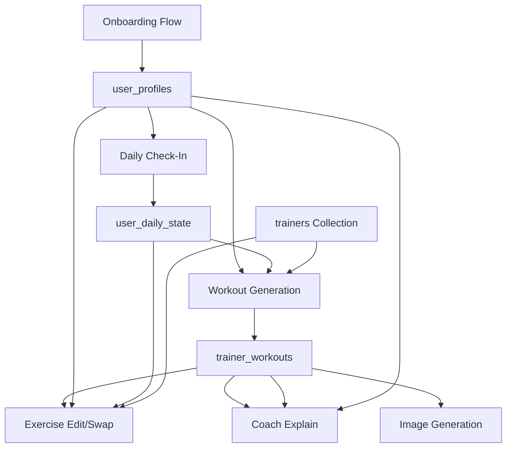

# AI Prompts and User Data Flow Documentation

This document describes the current prompt system, how user data flows into prompts, and the structure of system prompts for each AI trainer and workflow.

## Overview

The app uses **hardcoded prompts** that are built dynamically based on:

- **Trainer persona** (name, philosophy, personality, specialties)
- **User profile data** (onboarding + profile collections)
- **Daily check-in data** (energy, sleep, stress, soreness)
- **Workout context** (focus, difficulty, equipment, injuries)

**Note:** This system is being migrated to Firestore-managed prompts (see `docs/admin/ADMIN_AI_TRAINER_MANAGER_IMPLEMENTATION.md`). The current hardcoded prompts serve as fallbacks when Firestore prompts are not available.

---

## Data Flow: User Data → Prompts

### Data Sources

1. **Onboarding Data** (`user_profiles` collection)
   - Basic info: name, age, gender, body stats
   - Fitness level: beginner, intermediate, advanced, athlete
   - Equipment access: none, minimal, home, full_gym
   - Available equipment: array of equipment item IDs
   - Injuries: array of injury descriptions
   - Fitness goals: array of goal IDs

2. **Profile Data** (`user_profiles` collection - Phase 2+ fields)
   - Training experience, sports background
   - Preferred workout duration, frequency
   - Favorite/disliked exercises
   - Exercise restrictions
   - Current PRs (bench, squat, deadlift, etc.)
   - Target weight, body fat percentage

3. **Daily Check-In** (`user_daily_state` collection)
   - Energy level: 1-10
   - Sleep quality: 1-10
   - Sleep hours: number
   - Stress level: 1-10
   - Motivation level: 1-10
   - Soreness areas: `[{ area: string, level: 1-10 }]`
   - Overall soreness: 1-10 (average)
   - Current location, time of day, weather
   - Days since last workout
   - Workouts this week count

### Data Flow Diagram



### Data Mapping to Prompt Context

When generating prompts, user data is mapped as follows:

| User Data Source                      | Prompt Variable                       | Used In                 |
| ------------------------------------- | ------------------------------------- | ----------------------- |
| `user_profiles.fitness_level`         | `fitness_level`, `user_fitness_level` | All flows               |
| `user_profiles.injuries[]`            | `injuries`, `user_injuries`           | All flows               |
| `user_profiles.equipment_access`      | `equipment_access`                    | Workout gen, Edit, Swap |
| `user_profiles.available_equipment[]` | `available_equipment`, `equipment`    | All flows               |
| `user_profiles.fitness_goals[]`       | (injected in system prompt)           | Workout gen             |
| `user_daily_state.energy_level`       | (injected in user prompt)             | Workout gen             |
| `user_daily_state.sleep_quality`      | (injected in user prompt)             | Workout gen             |
| `user_daily_state.stress_level`       | (injected in user prompt)             | Workout gen             |
| `user_daily_state.soreness_areas[]`   | (injected in user prompt)             | Workout gen             |
| `trainer.name`                        | `trainer_name`                        | Workout gen             |
| `trainer.nickname`                    | `trainer_nickname`                    | Workout gen             |
| `trainer.philosophy`                  | `trainer_philosophy`                  | Workout gen             |
| `trainer.personality`                 | `trainer_personality`                 | Workout gen             |
| `trainer.focuses[].name`              | `trainer_focuses`                     | Workout gen             |

---

## Prompt Types and Flows

### 1. Workout Generation (`generate-workout.ts`)

**Flow:** User selects trainer → chooses focus → generates workout

**System Prompt Structure:**

- **With Trainer Persona:** Uses `buildTrainerPersonaPrompt()` - includes trainer name, philosophy, personality, specialties
- **Without Trainer:** Falls back to generic prompt for the focus type (strength, cardio, HIIT, flexibility, yoga)

**User Prompt Includes:**

- Workout request (duration, focus, difficulty)
- Equipment available
- Daily context (energy, sleep, stress, soreness)
- Injuries (critical safety warnings)
- Fitness goals
- User notes (optional)
- Warmup requirements (safety-critical)

**Key Data Injected:**

```typescript
{
  focus: "strength" | "cardio" | "hiit" | "flexibility" | "yoga",
  duration_minutes: number,
  difficulty: "beginner" | "intermediate" | "advanced",
  equipment_access: "none" | "minimal" | "home" | "full_gym",
  available_equipment: string[],
  injuries: string[],
  fitness_goals: string[],
  energy_level?: number (1-10),
  sleep_quality?: number (1-10),
  stress_level?: number (1-10),
  soreness_areas?: [{ area: string, level: number }],
  user_notes?: string,
  // Trainer context
  trainer_name: string,
  trainer_nickname: string,
  trainer_philosophy: string,
  trainer_personality: string,
  trainer_focuses: string[],
  specific_focus: string | null
}
```

**System Prompt Example (Trainer Persona):**

```
You are Marcus Chen, known as "The Foundation".

YOUR COACHING PHILOSOPHY:
"Compound movements, progressive overload, consistency over intensity"

YOUR PERSONALITY:
Calm, methodical, encouraging. Loves deadlifts, progressive overload, and meal prep Sundays.

YOUR SPECIALTIES:
1. Strength Training
2. Powerlifting
3. Functional Fitness
4. Core & Abs

Today's workout focus: Strength Training

---

CRITICAL INSTRUCTIONS:

1. VOICE & TONE:
   - Write the trainerNotes field IN YOUR VOICE - motivational, personal, aligned with your philosophy
   - The workout title should reflect your personality and the session's focus
   - Be encouraging but authentic to your coaching style

2. EXERCISE SELECTION:
   - Choose exercises that align with your specialty and training philosophy
   - Focus primarily on Strength Training exercises
   - If you're a strength specialist, favor compound movements

[... rest of instructions ...]
```

**User Prompt Example:**

```
Marcus Chen, please create a 45-minute workout for a intermediate level client.

The client has requested a focus on: Strength Training

⚠️ IMPORTANT: The 45-minute duration refers to Main Workout + Cooldown/Finisher ONLY. Warmup is a separate safety component (8-12 minutes) and does NOT count toward the requested workout time.

EQUIPMENT AVAILABLE:
dumbbells, resistance bands, mat

DAILY CONTEXT (Use this to adapt today's workout):
- Energy Level: 7/10
  → HIGH ENERGY: Can push harder, add intensity techniques
- Sleep Quality: 8/10
- Stress Level: 3/10

MUSCLE SORENESS:
- Shoulders: 2/10
- Lower back: 1/10

⚠️ INJURIES (DO NOT stress these areas):
Right knee (patellar tendinitis)

FITNESS GOALS: build_muscle, gain_strength

WARMUP REQUIREMENTS (SAFETY-CRITICAL):
- Warmup is a separate safety component (8-12 minutes) and does NOT count toward the 45-minute workout duration
- MUST include 5-8 exercises with variety, targeting all muscle groups that will be used in the main workout
- MUST always include lower back warmup exercises (cat-cow, hip circles, gentle twists, etc.)
- MUST include warmup exercises targeting these muscle groups: shoulders, core, hips, chest, back, arms, quadriceps, hamstrings, glutes
- Progress from general movement → dynamic stretching → muscle activation → movement prep
- Make warmup specific to this workout's movements and exercises

Generate the workout now with all sections and detailed exercises.
```

---

### 2. Exercise Edit (`edit-exercise.ts`)

**Flow:** User edits an exercise within a workout (add detail, adjust difficulty, modify for injury, etc.)

**System Prompt:**

```
You are an expert Personal Trainer editing an exercise within a workout program.
Your goal is to modify exercises according to user requests while maintaining safety, effectiveness, and workout flow.

TONE AND STYLE:
- Be clear and instructional in your explanations
- Maintain the exercise's core purpose while adapting it
- Ensure all modifications are safe for the user's fitness level and injury status
- Be precise with exercise prescriptions (sets, reps, rest, tempo)

CONSTRAINTS:
- [Dynamic based on options: preserve sets/reps, maintain muscle target]

OUTPUT FORMAT:
- Return valid JSON conforming to the provided schema
- The exercise object must include all required fields
- Provide a clear explanation (2-3 sentences) of what was changed and why
- No markdown formatting outside the JSON structure

[Injury warning if user has injuries]
```

**User Prompt Includes:**

- Edit mode (add_detail, adjust_difficulty, modify_for_injury, etc.)
- User's custom prompt text
- Current exercise details (name, sets, muscle target, equipment, cues, instructions)
- Workout context (section type, focus, difficulty)
- User profile (fitness level, injuries, available equipment)
- Mode-specific guidance
- Constraints (preserve sets/reps, maintain muscle target)
- Safety reminders for injuries

**Key Data Injected:**

```typescript
{
  mode: "add_detail" | "adjust_difficulty" | "modify_for_injury" | ...,
  user_prompt: string,
  context: {
    exercise: TrainerWorkoutExercise,
    section_type: "Warmup" | "Main Workout" | "Cooldown" | "Finisher",
    workout_focus: string | null,
    workout_difficulty: "beginner" | "intermediate" | "advanced",
    user_fitness_level: "beginner" | "intermediate" | "advanced" | "athlete",
    user_injuries: string[],
    available_equipment: string[]
  },
  options: {
    preserve_sets_reps: boolean,
    maintain_muscle_target: boolean,
    regenerate_image: boolean
  }
}
```

**Edit Modes and Guidance:**

- `add_detail`: Expand detailedInstructions with step-by-step guidance, safety considerations, progression tips
- `adjust_difficulty`: Adjust intensity (weight/RPE), rest periods, movement complexity
- `modify_for_injury`: CRITICAL - Provide safe alternative targeting similar muscles without stressing injured areas
- `change_intensity`: Adjust load, reps, tempo, rest periods
- `create_complex`: Combine exercises into single complex pattern
- `simplify`: Break down complex movements into simpler steps
- `adjust_equipment`: Modify to use available equipment
- `rewrite_cues`: Rewrite technique cues for user's fitness level
- `custom`: Follow user's custom prompt while maintaining safety

---

### 3. Exercise Swap (`swap-exercise.ts`)

**Flow:** User requests alternative exercises to replace an existing one

**System Prompt:**

```
You are an expert Personal Trainer replacing an exercise in a workout program.
Your goal is to suggest alternative exercises that meet the user's needs and constraints.

OUTPUT FORMAT:
- Return exactly 3 suggestions ranked by best fit (rank 1 = best match)
- Each suggestion must include a complete exercise object with all required fields
- Provide a clear explanation (2-3 sentences) for each suggestion
- Assign a match score (0-100) based on how well it meets constraints and addresses the swap reason
- No markdown formatting outside the JSON structure

[Injury warning if user has injuries]
```

**User Prompt Includes:**

- Exercise to replace (name, muscle target, equipment, sets, difficulty)
- Reason for swap (user-provided)
- Constraints (same muscle group, same equipment, same difficulty, similar movement pattern)
- Workout context (section type, focus, adjacent exercises)
- User profile (fitness level, injuries, available equipment)
- Safety warnings for injuries

**Key Data Injected:**

```typescript
{
  reason: string,
  constraints: {
    same_muscle_group: boolean,
    same_equipment: boolean,
    same_difficulty: boolean,
    similar_movement_pattern: boolean
  },
  context: {
    exercise: TrainerWorkoutExercise,
    section_type: "Warmup" | "Main Workout" | "Cooldown" | "Finisher",
    workout_focus: string | null,
    workout_difficulty: "beginner" | "intermediate" | "advanced",
    user_fitness_level: "beginner" | "intermediate" | "advanced" | "athlete",
    user_injuries: string[],
    available_equipment: string[],
    adjacent_exercises?: string[]
  }
}
```

---

### 4. Coach Explain (`coach-explain.ts`)

**Flow:** User requests personalized exercise explanation based on biomechanical analysis and fitness level

**System Prompt:** Varies by user fitness level (5 different prompts)

**User Levels:**

- `beginner`: 5th-grade reading level, simple language, high focus on safety
- `intermediate`: Bridge layman and technical terms, focus on mind-muscle connection
- `advanced`: Technical anatomical terms, focus on optimization
- `elite`: Biomechanical physics terminology, focus on micro-optimizations
- `athlete`: Sports science terms, focus on performance transfer

**System Prompt Example (Beginner):**

```
You are an expert Personal Trainer explaining an exercise to a Beginner trainee.

TONE: Encouraging, patient, and authoritative but friendly. Use a warm, supportive coaching voice.

VOCABULARY: 5th-grade reading level. Avoid Latin anatomical terms. Use simple, relatable language:
- Use "front of the thigh" instead of "Quadriceps Femoris"
- Use "back of the upper arm" instead of "Triceps Brachii"
- Use "shoulder blade" instead of "Scapula"
- Use analogies and everyday comparisons

DETAIL FOCUS:
- High focus on "starting position" and "safety"
- Emphasize common mistakes to avoid
- Provide clear, simple step-by-step instructions
- Include encouragement and reassurance

THE WHY: Focus on general health, posture, feeling good, and building confidence. Explain benefits in terms of daily life improvements.
```

**User Prompt Includes:**

- Exercise name
- User fitness level
- Biomechanical analysis points (from certified exercise images)
- Instructions for output format (Exercise Guide, Anatomy Breakdown, The Why)

**Key Data Injected:**

```typescript
{
  exerciseName: string,
  biomechanicalPoints: string[],
  userLevel: "beginner" | "intermediate" | "advanced" | "elite" | "athlete"
}
```

**Output Sections:**

1. **Exercise Guide**: Step-by-step instructions tailored to fitness level
2. **Anatomy Breakdown**: Which muscles are working (primary vs secondary) and biomechanical insights
3. **The Why**: Why this exercise is beneficial for the user's goals and fitness level
4. **detailedInstructions**: Combined formatted content with all three sections

---

### 5. Image Generation (`image-generation-config.ts`)

**Flow:** Generate exercise demonstration images using Vertex AI Imagen

**Prompt Template:**

```
Professional fitness photography of a fit adult performing "{exerciseName}".

Exercise details:
- Target muscle: {muscleTarget}
- Equipment: {equipment}

Image requirements:
- Clean gym or studio background with professional lighting
- Show proper form at the peak contraction point of the movement
- 45-degree angle view preferred for clear form visibility
- Athletic wear (fitted tank top, shorts)
- Realistic human proportions and natural skin tones
- No text, watermarks, or logos
- High resolution, sharp focus on the subject

Style: Professional fitness demonstration photo, educational and motivational.
```

**Template Variables:**

- `{exerciseName}` or `{{exerciseName}}`: Exercise name
- `{muscleTarget}` or `{{muscleTarget}}`: Primary muscle target
- `{equipment}` or `{{equipment}}`: Equipment list (comma-separated) or "bodyweight only"

**Negative Prompts:**

- blurry, distorted limbs, extra limbs, deformed hands, unrealistic proportions
- cartoon, anime, illustration
- text, watermark, logo
- low quality, oversaturated

**Key Data Injected:**

```typescript
{
  exerciseName: string,
  muscleTarget: string,
  equipment: string[] // Converted to comma-separated string
}
```

---

## Trainer Personas and Their Prompts

### Marcus Chen - "The Foundation"

- **Philosophy:** "Compound movements, progressive overload, consistency over intensity"
- **Personality:** "Calm, methodical, encouraging. Loves deadlifts, progressive overload, and meal prep Sundays."
- **Specialties:** Strength Training (primary), Powerlifting, Functional Fitness, Core & Abs
- **Recommended For:** build_muscle, gain_strength
- **System Prompt Style:** Emphasizes compound movements, progressive overload, form over speed

### Rivera Santos - "The Engine"

- **Philosophy:** "Your heart is your most important muscle—train it smart"
- **Personality:** "Dynamic, high-energy, motivating. Runs 50+ miles/week, believes rest days are sacred."
- **Specialties:** Cardio (primary), HIIT, Circuit Training, Sports-Specific Training
- **Recommended For:** lose_weight, improve_cardio
- **System Prompt Style:** High-intensity intervals, cardiovascular focus, mental toughness

### Alex Kim - "The Flow"

- **Philosophy:** "Flexibility isn't just physical—it's mental resilience"
- **Personality:** "Serene, mindful, patient. Breathwork enthusiast, former stress case turned zen warrior."
- **Specialties:** Yoga (primary), Flexibility & Mobility, Pilates, Stretching & Recovery
- **Recommended For:** increase_flexibility, reduce_stress
- **System Prompt Style:** Emphasizes mobility, breathwork, stress-relieving benefits

### Jordan Williams - "The Nomad"

- **Philosophy:** "Your body is the only gym you'll ever need"
- **Personality:** "Adventurous, resourceful, practical. Has trained in 47 countries with just a backpack."
- **Specialties:** Bodyweight Training (primary), Calisthenics, HIIT (Bodyweight), Functional Fitness
- **Recommended For:** general_fitness, stay_active
- **System Prompt Style:** Bodyweight-focused, adaptable, practical movements

### Elena Popov - "The Sculptor"

- **Philosophy:** "Control and form create sustainable transformation"
- **Personality:** "Precise, elegant, detail-oriented. Believes every rep counts, precision over speed."
- **Specialties:** Pilates (primary), Core & Abs, Flexibility & Mobility, Circuit Training (Fusion)
- **Recommended For:** tone_body, improve_posture
- **System Prompt Style:** Precision movements, form cues, control-focused

### Ryder Cross - "The Maverick"

- **Philosophy:** "Comfortable is the enemy of growth—embrace the grind"
- **Personality:** "Intense, competitive, bold. Thinks burpees are gifts from the fitness gods."
- **Specialties:** CrossFit-Style (primary), HIIT, Circuit Training, Functional Fitness
- **Recommended For:** athletic_performance, build_endurance
- **System Prompt Style:** High-intensity, competitive, challenging workouts

---

## Prompt Injection Points

### Workout Generation

1. **System Prompt:** Trainer persona (if available) or generic focus-based prompt
2. **User Prompt:** Workout request + daily context + injuries + goals + equipment
3. **Injection Sources:**
   - User profile: fitness_level, injuries, equipment_access, available_equipment, fitness_goals
   - Daily state: energy_level, sleep_quality, stress_level, soreness_areas
   - Trainer: name, philosophy, personality, focuses, specific_focus
   - Workout params: duration_minutes, focus, difficulty

### Exercise Edit/Swap

1. **System Prompt:** Generic trainer role + injury warnings
2. **User Prompt:** Exercise context + edit mode + user profile + workout context
3. **Injection Sources:**
   - Workout generation_context: profile_snapshot (fitness_level, injuries, equipment)
   - Current exercise: name, sets, muscle target, equipment, cues, instructions
   - Workout context: section_type, workout_focus, workout_difficulty
   - User request: mode, user_prompt, constraints (for swap)

### Coach Explain

1. **System Prompt:** Level-specific (beginner/intermediate/advanced/elite/athlete)
2. **User Prompt:** Exercise name + biomechanical points + level
3. **Injection Sources:**
   - Workout generation_context: profile_snapshot (fitness_level, injuries, equipment)
   - Exercise: name
   - Biomechanical analysis: points from certified images
   - User level: from profile or workout context

### Image Generation

1. **Prompt Template:** Static template with variable substitution
2. **Variables:** exerciseName, muscleTarget, equipment
3. **Injection Sources:**
   - Exercise: name, muscleTarget, equipment_needed

---

## Data Snapshot Strategy

The app uses **snapshot-based context** to ensure consistency:

1. **Workout Generation:**
   - Captures `generation_context.profile_snapshot` at generation time
   - Captures `generation_context.daily_state_snapshot` at generation time
   - Stores in `trainer_workouts` document

2. **Exercise Edit/Swap:**
   - Reads from `workout.generation_context.profile_snapshot`
   - Uses snapshot data (not live profile) to ensure workout consistency
   - This means edits use the same profile data that was used to generate the workout

3. **Coach Explain:**
   - Reads from `workout.generation_context.profile_snapshot`
   - Uses snapshot fitness level and injuries

**Rationale:** This ensures that if a user updates their profile after generating a workout, the workout and its exercises remain consistent with the original generation context.

---

## Prompt Customization (Future: Firestore)

Currently, prompts are hardcoded in:

- `src/lib/genkit/flows/generate-workout.ts` - `buildSystemPrompt()`, `buildTrainerPersonaPrompt()`, `buildUserPrompt()`
- `src/lib/genkit/flows/edit-exercise.ts` - `buildSystemPrompt()`, `buildUserPrompt()`, `getModeGuidance()`
- `src/lib/genkit/flows/swap-exercise.ts` - `buildSystemPrompt()`, `buildUserPrompt()`
- `src/lib/genkit/flows/coach-explain.ts` - `buildSystemPrompt()`, `buildUserPrompt()`
- `src/lib/image-generation-config.ts` - `DEFAULT_IMAGE_PROMPT_TEMPLATE`

**Migration Path:**
The app now supports Firestore-managed prompts via:

- `src/lib/ai-prompts.ts` - Prompt resolver with template rendering and injection support
- API routes check for Firestore prompts first, fall back to hardcoded prompts
- See `docs/admin/ADMIN_AI_TRAINER_MANAGER_IMPLEMENTATION.md` for admin setup

---

## Safety and Personalization Features

### Injury Handling

- **System Prompt Injection:** Critical safety warnings when injuries are present
- **User Prompt Injection:** Explicit list of injuries with "DO NOT stress these areas" warnings
- **Mode-Specific:** `modify_for_injury` mode provides safe alternatives

### Daily State Adaptation

- **Energy Level:**
  - ≤4: Reduce intensity, prioritize movement quality
  - ≥8: Can push harder, add intensity techniques
- **Sleep Quality:**
  - ≤4: Reduce training volume, avoid CNS-intensive exercises
- **Stress Level:**
  - ≥7: Include breathing cues, emphasize stress-relieving benefits
- **Soreness:**
  - Level ≥7: Explicit "AVOID THIS AREA" warnings
  - Included in warmup and exercise selection

### Equipment Constraints

- Equipment access level (none, minimal, home, full_gym)
- Available equipment list (array of equipment item IDs)
- Equipment override support (per-workout equipment selection)
- Equipment mismatch detection in QA

### Fitness Level Adaptation

- **Beginner:** Simplified movements, high safety focus, encouragement
- **Intermediate:** Balanced complexity, progression tips
- **Advanced:** Complex movements, optimization strategies
- **Athlete:** Performance-focused, sport-specific applications

---

## Prompt Metadata Logging

When prompts are resolved from Firestore (future), the app logs:

- `prompt_set_id`: Which prompt set was used
- `prompt_ids[]`: Which specific prompts were used
- `prompt_versions{}`: Version numbers of prompts used
- `injection_ids[]`: Which prompt injections were applied
- `resolved_at`: Timestamp when prompt was resolved

This metadata is stored in:

- `trainer_workouts.prompt_metadata` (for workout generation)
- `ai_usage_logs.prompt_metadata` (for all AI operations)

---

## Example: Complete Data Flow

### Scenario: User generates a workout

1. **User selects:** Marcus Chen, Strength Training focus, 45 minutes
2. **System fetches:**
   - Trainer from `trainers/marcus_chen`
   - Profile from `user_profiles/{uid}`
   - Daily state from `user_daily_state/{uid}_{today}`
3. **Prompt building:**
   - System prompt: Uses `buildTrainerPersonaPrompt()` with Marcus's philosophy, personality, specialties
   - User prompt: Includes workout request, equipment, daily context (energy 7/10, sleep 8/10), injuries (right knee), goals (build_muscle)
4. **AI generation:**
   - Gemini 2.0 Flash generates workout JSON
   - Includes warmup (8-12 min, separate from duration)
   - Main workout (45 min target)
   - Cooldown/Finisher
   - Personalization array explaining adaptations
5. **Storage:**
   - Workout saved to `trainer_workouts/{workoutId}`
   - `generation_context` includes profile and daily state snapshots
   - `prompt_metadata` includes prompt set/version info (if Firestore prompts used)

---

## Notes for Admin Implementation

When implementing Firestore-managed prompts:

1. **Preserve current behavior:** The hardcoded prompts serve as fallbacks
2. **Template variables:** Support all variables listed in this document
3. **Injection conditions:** Support fitness_level, has_injuries, equipment_access filtering
4. **Versioning:** Track prompt versions for audit/debugging
5. **Trainer-specific prompts:** Each trainer can have their own prompt set
6. **Default prompts:** One prompt set should be marked `is_default` for fallback

See `docs/admin/ADMIN_AI_TRAINER_MANAGER_IMPLEMENTATION.md` for implementation details.
