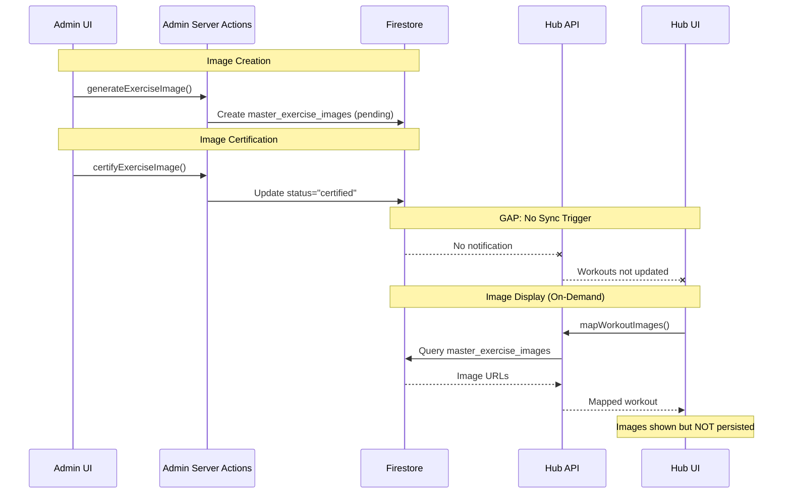
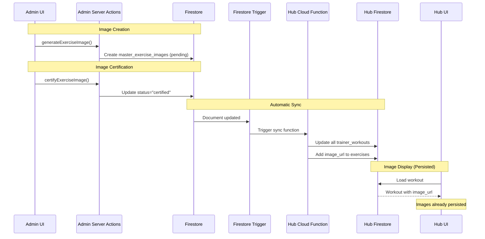

# Admin Exercise Image Workflow - Design Document

## Overview

This document describes the **Admin-side exercise image workflow** and how it coordinates with the **Hub-side image mapping workflow**. The Admin repository handles image creation, certification, and management, while the Hub repository handles image retrieval and display in user workouts.

**Key Principle**: Admin UI and admin CRUD live in a separate repository. This repository must not implement admin pages or admin CRUD APIs. All admin interactions occur via direct Firestore writes using the Admin SDK.

---

## 1. Architecture Overview

### System Components

```
┌─────────────────────────────────────────────────────────────┐
│                    ADMIN REPOSITORY                          │
│  (Separate Next.js app with Server Actions)                  │
├─────────────────────────────────────────────────────────────┤
│                                                               │
│  Image Generation                                            │
│  └─> ExerciseImageGenerator.tsx                              │
│      └─> generateExerciseImage() Server Action                │
│          └─> Uploads to Firebase Storage                      │
│          └─> Creates master_exercise_images doc (pending)     │
│                                                               │
│  Image Certification                                         │
│  └─> ExerciseImageManager.tsx                                │
│      └─> certifyExerciseImage() Server Action                 │
│          └─> Updates master_exercise_images doc              │
│          └─> Sets status="certified", position, exercise_name│
│                                                               │
│  Image Display                                                │
│  └─> ExerciseImageDisplay.tsx                                │
│      └─> getPrimaryExerciseImage() Server Action             │
│          └─> Queries master_exercise_images on-demand        │
│                                                               │
└─────────────────────────────────────────────────────────────┘
                            │
                            │ Firestore Writes/Reads
                            ▼
┌─────────────────────────────────────────────────────────────┐
│              SHARED FIRESTORE DATABASE                       │
│                                                               │
│  master_exercise_images (collection)                         │
│  ├─ exercise_name: string (trimmed)                          │
│  ├─ status: "pending" | "certified" | "rejected"             │
│  ├─ position: number (1 = primary)                           │
│  ├─ image_url: string (Firebase Storage signed URL)          │
│  ├─ storage_path: string                                     │
│  ├─ certified_at: Timestamp                                  │
│  └─ certified_by: string (user_id)                           │
│                                                               │
└─────────────────────────────────────────────────────────────┘
                            │
                            │ Firestore Reads
                            ▼
┌─────────────────────────────────────────────────────────────┐
│                     HUB REPOSITORY                           │
│  (This repository - User-facing app)                         │
├─────────────────────────────────────────────────────────────┤
│                                                               │
│  Image Mapping (Client-side)                                 │
│  └─> ImageMappingService.client.ts                           │
│      └─> Calls /api/workouts/map-images                     │
│          └─> Queries master_exercise_images                  │
│          └─> Maps to workout exercises                       │
│                                                               │
│  Image Mapping (Server-side)                                 │
│  └─> image-mapping-admin.ts                                  │
│      └─> Used in API routes                                  │
│      └─> Queries production Firestore                        │
│                                                               │
│  Workout Display                                             │
│  └─> useTrainerWorkout hook                                  │
│      └─> Loads workout from Firestore                        │
│      └─> Maps images client-side                             │
│                                                               │
└─────────────────────────────────────────────────────────────┘
```

### Key Differences: Admin vs Hub

| Aspect            | Admin Repository                | Hub Repository                      |
| ----------------- | ------------------------------- | ----------------------------------- |
| **Architecture**  | Server Actions (`"use server"`) | API Routes + Client Services        |
| **Query Pattern** | On-demand queries per render    | Pre-mapped to workout documents     |
| **Persistence**   | No workout updates              | Should persist to workout documents |
| **Performance**   | N+1 queries (current issue)     | Batch queries with caching          |
| **Normalization** | `.trim()` only                  | `.trim()` only (must match)         |

---

## 2. Current Workflow

### 2.1 Image Creation & Storage

**Location**: `app/actions/exercise-images.ts` (Admin repo)

**Process**:

1. User triggers image generation via `ExerciseImageGenerator.tsx`
2. Server Action `generateExerciseImage()` called
3. Image generated (via Vertex AI Imagen or uploaded)
4. Image uploaded to Firebase Storage: `exercises/{normalized-name}/{timestamp}-{id}.jpg`
5. Document created in `master_exercise_images`:
   ```typescript
   {
     exercise_name: normalizeExerciseName(request.exerciseName), // .trim() only
     status: "pending",
     image_url: signedUrl,
     storage_path: "exercises/arm-circles/1768279694622-tdq4iah.jpg",
     generated_at: Timestamp,
     generated_by: userId,
     // position not set yet (set during certification)
   }
   ```

**Normalization Function** (Admin repo, line 85-87):

```typescript
function normalizeExerciseName(exerciseName: string): string {
  return exerciseName.trim(); // Only trims whitespace
}
```

**Critical Coordination Point**:

- Admin uses `.trim()` only
- Hub must use identical normalization: `trimExerciseName()` in `src/lib/image-generation-config.ts`
- **Case-sensitive matching** - "Push-up" ≠ "Push-Up"

### 2.2 Image Certification

**Location**: `app/actions/exercise-images.ts` (Admin repo, lines 297-362)

**Process**:

1. Admin reviews pending images in `ExerciseImageManager.tsx`
2. Server Action `certifyExerciseImage()` called with:
   - `imageId`: Document ID in `master_exercise_images`
   - `position`: Number (1 = primary, lower = higher priority)
3. Document updated:
   ```typescript
   {
     status: "certified",
     position: position, // e.g., 1 for primary
     certified_at: Timestamp,
     certified_by: userId,
     // exercise_name remains unchanged (from creation)
   }
   ```

**Critical Gap**:

- **No automatic sync to hub workouts**
- When image is certified, existing workouts in hub don't get updated
- New workouts will get images on next client-side mapping, but existing workouts remain stale

**Current Behavior**:

- Certification only updates `master_exercise_images` document
- No trigger to update `trainer_workouts` in hub
- Hub must manually call sync endpoint or wait for client-side mapping

### 2.3 Image Retrieval

**Location**: `components/exercise-image-display.tsx` (Admin repo)

**Pattern**: On-demand queries on every render

**Current Implementation**:

```typescript
// Server Component - queries on every render
async function ExerciseImageDisplay({ exerciseName }: Props) {
  const image = await getPrimaryExerciseImage(exerciseName);
  // Queries Firestore: where("exercise_name", "==", trimmedName)
  //                    where("status", "==", "certified")
  // Sorts by position in memory
  return ;
}
```

**Performance Issue**:

- N+1 query problem
- Workout with 20 exercises = 20 Firestore reads per page load
- No caching between renders
- No persistence to workout documents

**Alternative Pattern** (some components):

- Some components use `getExerciseImages()` then filter client-side
- Inconsistent query patterns across codebase

### 2.4 Image Display

**Location**: `app/dashboard/workouts/[id]/page.tsx` (Admin repo)

**Current Flow**:

1. Workout page loads
2. For each exercise, `ExerciseImageDisplay` component renders
3. Each component queries Firestore independently
4. Images displayed (but not persisted to workout document)

**No Persistence**:

- Images always queried fresh from `master_exercise_images`
- Workout documents never updated with `image_url` fields
- Different from hub approach (hub should persist)

---

## 3. Critical Gaps & Issues

### P0 - CRITICAL Issues

#### Issue 3.1: No Automatic Sync to Hub Workouts

**Severity**: CRITICAL  
**Impact**: Certified images don't appear in existing hub workouts  
**Location**: `app/actions/exercise-images.ts` (certifyExerciseImage)

**Problem**:

- When image is certified, only `master_exercise_images` is updated
- No mechanism to notify hub or trigger sync
- Existing workouts in hub remain without images until manually synced

**Evidence**:

- "Arm Circles" example: Image certified but workouts don't get it
- User must manually call `/api/admin/sync-exercise-images` in hub

**Coordination Required**:

- Admin certification should trigger hub sync (webhook, Firestore trigger, or Cloud Function)
- Or hub should poll for new certifications periodically
- Or hub should have Firestore trigger on `master_exercise_images` document updates

#### Issue 3.2: Images Can Disappear from Master List

**Severity**: CRITICAL  
**Impact**: Images removed from `master_exercise_images` break hub workouts  
**Location**: Admin deletion workflow (not documented, but user reported)

**Problem**:

- Admin can delete images from `master_exercise_images`
- Hub workouts retain stale `image_url` values
- Broken image URLs shown to users

**Coordination Required**:

- Hub needs stale image detection
- Hub should clear `image_url` when master image deleted
- Or admin should trigger cleanup in hub when deleting

### P1 - HIGH Issues

#### Issue 3.3: N+1 Query Problem

**Severity**: HIGH  
**Impact**: Poor performance, excessive Firestore reads  
**Location**: `components/exercise-image-display.tsx`

**Problem**:

- Each exercise queries Firestore individually
- Workout with 20 exercises = 20 separate queries
- No batching or caching

**Current Code Pattern**:

```typescript
// BAD: N+1 queries
{exercises.map(exercise => (
  <ExerciseImageDisplay exerciseName={exercise.name} />
  // Each component queries Firestore independently
))}
```

**Recommended Fix**:

```typescript
// GOOD: Single batch query
const imageMap = await getExerciseImagesBatch(exerciseNames);
{exercises.map(exercise => (
  
))}
```

#### Issue 3.4: No Batch Operations

**Severity**: HIGH  
**Impact**: Cannot efficiently retrieve images for multiple exercises  
**Location**: `app/actions/exercise-images.ts`

**Problem**:

- Only `getPrimaryExerciseImage(exerciseName)` exists (single exercise)
- No `getExerciseImagesBatch(exerciseNames[])` function
- Components must query individually

**Recommendation**:

- Add batch query function to server actions
- Use Firestore `getAll()` for known document IDs
- Or use `whereIn()` for exercise names (limited to 10 items)

#### Issue 3.5: No Stale Image Handling

**Severity**: HIGH  
**Impact**: Broken image URLs when master images deleted  
**Location**: `components/exercise-image-display.tsx`

**Problem**:

- If `master_exercise_images` document deleted, components show broken URLs
- No validation that `image_url` is still valid
- No handling for deleted storage files

**Recommendation**:

- Validate image URLs before display
- Handle 404 errors gracefully
- Clear broken URLs from workout documents (hub side)

### P2 - MEDIUM Issues

#### Issue 3.6: Inconsistent Query Patterns

**Severity**: MEDIUM  
**Impact**: Code duplication, maintenance burden  
**Location**: Multiple components

**Problem**:

- Some components use `getPrimaryExerciseImage()` (optimized)
- Others use `getExerciseImages()` then filter client-side
- Inconsistent error handling

**Recommendation**:

- Standardize on single query pattern
- Create shared utility component
- Document preferred approach

#### Issue 3.7: No Image URL Validation

**Severity**: MEDIUM  
**Impact**: Broken images shown to users  
**Location**: Display components

**Problem**:

- No check if `image_url` in Firestore is still valid
- No handling for expired signed URLs
- No validation of storage file existence

**Recommendation**:

- Add URL validation before display
- Handle expired signed URLs (regenerate)
- Check storage file existence

#### Issue 3.8: Case Sensitivity Risk

**Severity**: MEDIUM  
**Impact**: Images not found due to case mismatch  
**Location**: Normalization functions

**Problem**:

- Only `.trim()` normalization
- "Push-up" ≠ "Push-Up" ≠ "push-up"
- Workout generation may produce different casing than admin

**Coordination Required**:

- Admin and hub must use identical normalization
- Consider case-insensitive matching (requires data migration)
- Or enforce consistent casing in workout generation

---

## 4. Data Flow Diagrams

### Current Flow (With Gaps)



### Target Flow (With Fixes)



---

## 5. Coordination Points

### 5.1 Shared Normalization Requirements

**Critical**: Admin and Hub must use **identical** normalization

**Admin Side** (app/actions/exercise-images.ts):

```typescript
function normalizeExerciseName(exerciseName: string): string {
  return exerciseName.trim(); // Only trims whitespace
}
```

**Hub Side** (src/lib/image-generation-config.ts):

```typescript
export function trimExerciseName(name: string): string {
  return name.trim(); // Must match admin exactly
}
```

**Coordination Rule**:

- ✅ Both use `.trim()` only
- ⚠️ Case-sensitive matching (must be consistent)
- ❌ No additional normalization (lowercase, special chars, etc.)

### 5.2 Sync Mechanisms Needed

**Option 1: Firestore Trigger (Recommended)**

- Firestore trigger on `master_exercise_images` document updates
- Cloud Function in hub repository
- Automatically syncs when images certified

**Option 2: Webhook from Admin**

- Admin calls hub webhook after certification
- Hub syncs affected workouts
- Requires admin to know hub endpoint

**Option 3: Scheduled Sync**

- Hub Cloud Function runs periodically (e.g., every 5 minutes)
- Queries for recently certified images
- Syncs workouts that need updates
- Less real-time but simpler

**Option 4: Client-Side Polling**

- Hub UI polls for new certifications
- Triggers sync when detected
- Not recommended (inefficient)

### 5.3 Data Consistency Rules

**Master Data** (Admin-controlled):

- `master_exercise_images` collection
- Only admin can create/update/delete
- Hub is read-only for this collection

**Derived Data** (Hub-controlled):

- `trainer_workouts[].sections[].exercises[].image_url`
- Hub should keep in sync with master
- Hub should clear when master deleted

**Sync Strategy**:

1. **On Certification**: Update all workouts with matching exercise names
2. **On Deletion**: Clear `image_url` from all affected workouts
3. **On Position Change**: Update workouts to use new primary image

---

## 6. API/Function Contracts

### 6.1 Admin Server Actions

#### `generateExerciseImage(exerciseName: string, ...)`

**Input**:

- `exerciseName`: string (will be normalized with `.trim()`)

**Output**:

- `{ success: boolean, imageId: string, imageUrl: string }`

**Side Effects**:

- Creates document in `master_exercise_images` with `status="pending"`
- Uploads image to Firebase Storage
- Sets `exercise_name` to `normalizeExerciseName(exerciseName)`

#### `certifyExerciseImage(imageId: string, position: number)`

**Input**:

- `imageId`: Document ID in `master_exercise_images`
- `position`: Number (1 = primary, lower = higher priority)

**Output**:

- `{ success: boolean }`

**Side Effects**:

- Updates document: `status="certified"`, `position`, `certified_at`, `certified_by`
- **GAP**: Does not trigger hub sync

**Coordination Required**:

- Should trigger hub sync mechanism
- Or hub should have Firestore trigger

#### `getPrimaryExerciseImage(exerciseName: string)`

**Input**:

- `exerciseName`: string (will be normalized with `.trim()`)

**Output**:

- `{ url: string | null, position: number }` or `null`

**Query Pattern**:

```typescript
where("exercise_name", "==", normalizeExerciseName(exerciseName));
where("status", "==", "certified");
// Then sort by position in memory (position 1 = primary)
```

**Performance**:

- Single Firestore query
- In-memory sorting (avoids composite index)

### 6.2 Hub API Endpoints

#### `POST /api/workouts/map-images`

**Input**:

- `workout`: TrainerWorkout object

**Output**:

- `{ success: boolean, workout: TrainerWorkout }`

**Behavior**:

- Queries `master_exercise_images` for each exercise
- Maps `image_url` to exercises
- **GAP**: Does not persist to database (client-side only)

**Coordination Point**:

- Should persist images to workout document
- Should be called during workout generation

#### `POST /api/admin/sync-exercise-images?workoutId=...`

**Input**:

- Optional `workoutId` query parameter
- Optional `useProduction=true` query parameter

**Output**:

- `{ success: boolean, stats: { totalWorkouts, updatedWorkouts, ... } }`

**Behavior**:

- Updates workout documents in Firestore
- Persists `image_url` and `image_source="master"` to exercises
- Can sync single workout or batch

**Coordination Point**:

- Should be triggered automatically when images certified
- Currently requires manual invocation

### 6.3 Query Patterns and Performance

**Current Pattern** (Admin):

```typescript
// N+1 queries (BAD)
exercises.map((ex) => getPrimaryExerciseImage(ex.name));
// 20 exercises = 20 Firestore reads
```

**Recommended Pattern** (Admin):

```typescript
// Batch query (GOOD)
const imageMap = await getExerciseImagesBatch(exercises.map((ex) => ex.name));
// 20 exercises = 1 Firestore query (with whereIn, max 10 per query)
```

**Current Pattern** (Hub):

```typescript
// Parallel queries (OK)
await Promise.all(exercises.map((ex) => getImageForExercise(ex.name)));
// 20 exercises = 20 parallel Firestore reads
```

**Recommended Pattern** (Hub):

```typescript
// Batch query with caching (BEST)
const imageMap = await mapImagesToWorkout(workout);
// Uses caching, batch processing, persisted to database
```

---

## 7. Recommendations

### P0 - Critical Fixes

#### 7.1 Implement Automatic Sync

**Priority**: CRITICAL  
**Effort**: Medium  
**Impact**: High

**Option A: Firestore Trigger (Recommended)**

```typescript
// Hub: Cloud Function
export const onMasterImageCertified = functions.firestore
  .document("master_exercise_images/{imageId}")
  .onUpdate(async (change, context) => {
    const newData = change.after.data();
    if (
      newData.status === "certified" &&
      change.before.data().status !== "certified"
    ) {
      // Trigger sync for this exercise
      await syncWorkoutsForExercise(newData.exercise_name);
    }
  });
```

**Option B: Admin Webhook**

```typescript
// Admin: After certification
await fetch(HUB_WEBHOOK_URL, {
  method: "POST",
  body: JSON.stringify({
    exerciseName: normalizedName,
    action: "certified",
  }),
});
```

#### 7.2 Persist Images in Hub Workouts

**Priority**: CRITICAL  
**Effort**: Low  
**Impact**: High

**Fix in Hub**:

- Update `useTrainerWorkout` to save images after mapping
- Update workout generation to map images before saving
- Add `updateDoc()` call after successful mapping

#### 7.3 Add Stale Image Detection

**Priority**: CRITICAL  
**Effort**: Medium  
**Impact**: Medium

**Fix in Hub**:

- Validate `image_url` exists in `master_exercise_images`
- Clear broken URLs when master image deleted
- Add Firestore trigger on `master_exercise_images` deletion

### P1 - High Priority Fixes

#### 7.4 Implement Batch Queries (Admin)

**Priority**: HIGH  
**Effort**: Low  
**Impact**: High

**Add to Admin**:

```typescript
// app/actions/exercise-images.ts
export async function getExerciseImagesBatch(
  exerciseNames: string[]
): Promise<Map<string, string>> {
  // Use whereIn() for batches of 10
  // Or getAll() if document IDs known
  // Returns Map<exerciseName, imageUrl>
}
```

#### 7.5 Add Caching (Admin)

**Priority**: HIGH  
**Effort**: Medium  
**Impact**: Medium

**Add to Admin**:

- In-memory cache for certified images (5-minute TTL)
- Cache key: `exerciseName:status:certified`
- Similar to hub's caching strategy

### P2 - Medium Priority Fixes

#### 7.6 Standardize Query Patterns

**Priority**: MEDIUM  
**Effort**: Low  
**Impact**: Low

**Fix in Admin**:

- Create shared `useExerciseImage()` hook
- Standardize on `getPrimaryExerciseImage()`
- Deprecate inconsistent patterns

#### 7.7 Add Image URL Validation

**Priority**: MEDIUM  
**Effort**: Low  
**Impact**: Medium

**Fix in Both**:

- Validate URLs before display
- Handle 404 errors gracefully
- Regenerate expired signed URLs

---

## 8. Production Readiness Checklist

### Must Fix (Blockers)

- [ ] **Automatic sync mechanism** when images certified
- [ ] **Image persistence** in hub workout documents
- [ ] **Stale image detection** and cleanup
- [ ] **Workout generation integration** (map images before saving)

### Should Fix (High Priority)

- [ ] **Batch query functions** in admin
- [ ] **Caching strategy** in admin
- [ ] **Performance optimization** (reduce N+1 queries)
- [ ] **Error handling consistency**

### Nice to Have (Medium Priority)

- [ ] **Case-insensitive matching** (requires data migration)
- [ ] **Image URL validation** before display
- [ ] **Comprehensive documentation** for both repos
- [ ] **Monitoring and metrics** for sync operations

---

## 9. Metrics to Document

### Current Performance (Baseline)

**Admin Side**:

- Query count per workout page load: **N queries** (N = number of exercises)
- Latency of image retrieval: **~50-100ms per query**
- Cache hit rate: **0%** (no caching)

**Hub Side**:

- Query count per workout load: **N parallel queries**
- Latency of image mapping: **~200-500ms total** (parallel)
- Cache hit rate: **~60-80%** (5-minute TTL)
- Persistence rate: **0%** (not persisted)

### Target Performance (After Fixes)

**Admin Side**:

- Query count per workout page load: **1-2 batch queries**
- Latency of image retrieval: **~100-200ms total**
- Cache hit rate: **~70-90%** (with caching)

**Hub Side**:

- Query count per workout load: **0 queries** (images persisted)
- Latency of image display: **~0ms** (from document)
- Cache hit rate: **N/A** (not needed if persisted)
- Persistence rate: **100%** (all images persisted)

### Sync Metrics (After Implementation)

- Sync latency: **<5 seconds** from certification to workout update
- Sync success rate: **>99%**
- Affected workouts per certification: **Variable** (depends on exercise popularity)

---

## 10. File References

### Admin Repository Files (Not in this repo)

**Primary Files**:

- `app/actions/exercise-images.ts` - Core image management server actions
- `components/exercise-image-display.tsx` - Image display component
- `components/ai-exercise-editor/ExerciseImageManager.tsx` - Image management UI
- `components/ai-exercise-editor/ExerciseImageGenerator.tsx` - Image generation UI
- `types/exercise-images.ts` - Type definitions

**Supporting Files**:

- `lib/exercise-image-storage.ts` - Storage utilities
- `app/dashboard/workouts/[id]/page.tsx` - Workout display page
- `app/actions/certification.ts` - Workout certification (may check if images mapped)

### Hub Repository Files (This repo)

**Related Files**:

- `src/lib/image-mapping-admin.ts` - Server-side image mapping
- `src/services/image/ImageMappingService.client.ts` - Client-side API calls
- `src/services/image/ImageMappingService.ts` - Client-side Firestore queries
- `src/app/api/workouts/map-images/route.ts` - Image mapping API endpoint
- `src/app/api/admin/sync-exercise-images/route.ts` - Manual sync endpoint
- `src/hooks/useTrainerWorkout.ts` - Workout loading hook
- `src/hooks/useWorkoutHistory.ts` - Workout history hook
- `src/lib/image-generation-config.ts` - Normalization utilities

**Related Documentation**:

- `docs/design/image-mapping-workflow-technical-audit.md` - Hub workflow audit (to be created)

---

## 11. Coordination Checklist

### Normalization Alignment

- [x] Admin uses `.trim()` only
- [x] Hub uses `.trim()` only
- [ ] Both documented and enforced
- [ ] Case sensitivity policy documented

### Sync Mechanism

- [ ] Firestore trigger implemented
- [ ] Or webhook mechanism implemented
- [ ] Or scheduled sync implemented
- [ ] Error handling and retry logic

### Data Consistency

- [ ] Stale image detection implemented
- [ ] Cleanup on master image deletion
- [ ] Validation of persisted image URLs

### Performance

- [ ] Batch queries implemented (admin)
- [ ] Caching implemented (admin)
- [ ] Persistence implemented (hub)
- [ ] Metrics and monitoring

---

## 12. Next Steps

1. **Review this document** with admin repository team
2. **Confirm normalization** approach (case sensitivity)
3. **Choose sync mechanism** (Firestore trigger recommended)
4. **Implement critical fixes** (P0 items)
5. **Test coordination** between admin and hub
6. **Monitor metrics** after deployment
7. **Iterate on performance** optimizations

---

**Document Version**: 1.0  
**Last Updated**: January 2026  
**Maintained By**: Hub Repository Team  
**Coordination Contact**: Admin Repository Team
