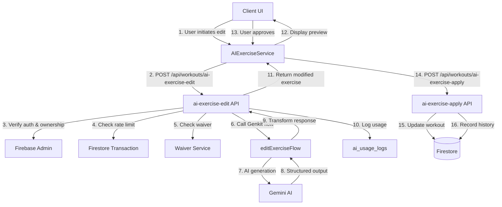

# AI Exercise Editor - Blueprint

## Overview

The AI Exercise Editor is a feature that enables users to modify exercises within workouts using natural language prompts powered by Google's Gemini AI via Genkit. Users can edit existing exercises or swap them with alternatives, with all changes tracked in an audit trail for quality assurance and cost monitoring.

### Key Capabilities

- **Edit Mode**: Modify existing exercises using natural language (e.g., "make this easier", "add more detail", "adapt for knee injury")
- **Swap Mode**: Replace exercises with AI-suggested alternatives based on constraints (equipment, muscle groups, difficulty)
- **Context-Aware Intelligence**: AI understands workout context, athlete fitness level, injuries, and equipment availability
- **Subscription-Based Access**: Rate-limited by subscription tier (free: 0, basic: 5/mo, pro: 20/mo, elite: 50/mo, coach: unlimited)
- **Audit Trail**: Complete history of all AI modifications with cost tracking and metadata

---

## Implementation Status

### Phase 1: Infrastructure & Types ✅ **COMPLETE**

**Files Implemented:**

- [`src/types/ai-exercise-editor.ts`](src/types/ai-exercise-editor.ts) - Type definitions for requests, responses, and history
- [`src/lib/genkit/flows/edit-exercise.ts`](src/lib/genkit/flows/edit-exercise.ts) - Genkit flow for exercise editing
- [`src/lib/genkit/flows/swap-exercise.ts`](src/lib/genkit/flows/swap-exercise.ts) - Genkit flow for exercise swapping
- [`src/lib/genkit/utils/ai-context-helpers.ts`](src/lib/genkit/utils/ai-context-helpers.ts) - Shared utility functions for context building and field detection

**Key Components:**

- Type definitions for `AIEditRequest`, `AISwapRequest`, `AIEditResponse`, `AISwapResponse`, `ExerciseAIEditHistory`
- Genkit flows using `ai.defineFlow()` pattern with Zod schema validation
- Helper functions: `buildAIEditContext()`, `detectModifiedFields()`, `deepEqual()` for reliable comparisons
- Token usage estimation and cost calculation utilities

### Phase 2: API Routes & Services ✅ **COMPLETE**

**Files Implemented:**

- [`src/app/api/workouts/ai-exercise-edit/route.ts`](src/app/api/workouts/ai-exercise-edit/route.ts) - API endpoint for editing exercises
- [`src/app/api/workouts/ai-exercise-swap/route.ts`](src/app/api/workouts/ai-exercise-swap/route.ts) - API endpoint for swapping exercises
- [`src/app/api/workouts/ai-exercise-apply/route.ts`](src/app/api/workouts/ai-exercise-apply/route.ts) - API endpoint for applying edits to workouts
- [`src/services/ai-exercise-service.ts`](src/services/ai-exercise-service.ts) - Client-side service for API interactions
- [`src/lib/subscription-constants.ts`](src/lib/subscription-constants.ts) - Added `AI_EDIT_LIMITS` and `AI_SWAP_LIMITS`

**Key Features:**

- Authentication via Firebase ID token verification
- Authorization checks (user must own workout)
- Waiver agreement verification (required for all AI operations)
- Rate limiting using Firestore transactions with atomic counter documents (`ai_usage_counters`)
- Cost tracking and logging to `ai_usage_logs` collection
- Deep equality comparison for field change detection
- History preservation (prevents data loss on apply operations)

**Security Fixes Applied:**

- Race condition fixes using Firestore transactions
- Waiver check consistency across all AI routes
- Data loss prevention when applying edits (reads from original exercise before modification)

### Phase 3: UI Components ✅ **COMPLETE**

**Files Implemented:**

- `src/components/workout/ai-editor/AIExerciseEditor.tsx` - Main dialog component
- `src/components/workout/ai-editor/EditModePanel.tsx` - Edit mode UI with quick actions
- `src/components/workout/ai-editor/SwapModePanel.tsx` - Swap mode UI with constraints
- `src/components/workout/ai-editor/ExercisePreview.tsx` - Before/after comparison view
- `src/components/workout/ai-editor/AIProcessingState.tsx` - Loading and streaming UI

**Integration Completed:**

- ✅ Modified [`src/components/workout/ExerciseCard.tsx`](src/components/workout/ExerciseCard.tsx) to add AI Edit trigger button
- ✅ Modified [`src/components/workout/WorkoutDisplay.tsx`](src/components/workout/WorkoutDisplay.tsx) to manage AI editor state

### Phase 4: Enhancements & Polish ✅ **COMPLETE**

**Files Implemented:**

- [`src/components/workout/ai-editor/EditHistoryView.tsx`](src/components/workout/ai-editor/EditHistoryView.tsx) - Component to display edit history with chronological sorting and metadata
- [`src/components/workout/ai-editor/FeedbackCollection.tsx`](src/components/workout/ai-editor/FeedbackCollection.tsx) - User feedback collection UI with rating (thumbs up/down or 1-5 stars) and optional text feedback
- [`src/components/workout/ai-editor/ImageRegenerationPrompt.tsx`](src/components/workout/ai-editor/ImageRegenerationPrompt.tsx) - Component to prompt and handle image regeneration after AI edits
- [`src/app/api/workouts/ai-exercise-apply-rating/route.ts`](src/app/api/workouts/ai-exercise-apply-rating/route.ts) - API endpoint for submitting user ratings and feedback

**Key Features:**

- **Edit History UI**: New "History" tab in AIExerciseEditor dialog displaying all AI edits in reverse chronological order with metadata (timestamp, cost, tokens, user prompt, fields modified)
- **User Feedback Collection**: Integrated into post-edit flow - users can rate edits (1-5 stars or thumbs up/down) and provide optional text feedback. Feedback is stored in `user_rating` and `user_feedback` fields of `ExerciseAIEditHistory`
- **Image Regeneration Integration**: Automatically prompts users to regenerate exercise images after edits/swaps when relevant fields change (name, muscleTarget, equipment_needed, muscle_groups, image_url). Integrates with existing ImageGenerationService
- **Performance Optimizations**:
  - `ExercisePreview` wrapped with `React.memo` to prevent unnecessary re-renders
  - Auto-scroll optimized using `requestAnimationFrame` for smoother animations
  - Viewport detection before scrolling to avoid unnecessary scroll operations
- **Enhanced Error Handling**:
  - Improved emulator connection error handling in `useSubscription` hook
  - Better error messages for Stripe checkout failures with mode mismatch detection
  - Added Stripe test mode detection and development warnings
- **Post-Edit User Flow**: Sequential flow after applying edits - Image Regeneration (if applicable) → Feedback Collection → Reset

**Integration Updates:**

- ✅ Modified `AIExerciseEditor.tsx` to add History tab with edit count badge
- ✅ Modified `EditModePanel.tsx` to integrate image regeneration and feedback collection flows
- ✅ Modified `SwapModePanel.tsx` to integrate image regeneration and feedback collection flows
- ✅ Modified `ExercisePreview.tsx` with React.memo optimization
- ✅ Modified `src/services/ai-exercise-service.ts` to add `submitEditRating()` method
- ✅ Modified `src/lib/stripe.ts` and `src/lib/stripe-client.ts` for test mode detection
- ✅ Modified `src/hooks/useSubscription.ts` for improved emulator error handling

---

## Architecture

### Component Hierarchy

```
AIExerciseEditor (Dialog)
├── ModeSelector (Edit | Swap | History tabs)
├── EditModePanel
│   ├── QuickActionsGrid (pre-configured actions)
│   ├── CustomPromptInput
│   ├── OptionsCheckboxes
│   ├── ExercisePreview (before/after)
│   ├── ImageRegenerationPrompt (post-apply)
│   └── FeedbackCollection (post-apply)
├── SwapModePanel
│   ├── SwapReasonTextarea
│   ├── ConstraintsChecklist
│   ├── SuggestedSwaps (3 suggestions)
│   ├── ImageRegenerationPrompt (post-apply)
│   └── FeedbackCollection (post-apply)
├── EditHistoryView (History tab)
│   └── EditHistoryEntry (chronological list)
└── AIProcessingState
    ├── LoadingIndicator
    └── ApplyChangesButton
```

### Data Flow



### API Endpoints

#### `POST /api/workouts/ai-exercise-edit`

**Request:**

```typescript
{
  workout_id: string;
  section_index: number;
  exercise_index: number;
  edit_request: {
    mode: EditMode;
    user_prompt: string;
    context: AIEditContext;
    options: {
      regenerate_image: boolean;
      preserve_sets_reps: boolean;
      maintain_muscle_target: boolean;
    }
  }
}
```

**Response:**

```typescript
{
  success: boolean;
  modified_exercise: TrainerWorkoutExercise;
  explanation: string;
  fields_modified: string[];
  metadata: {
    ai_model: string;
    generation_tokens: number;
    generation_cost_usd: number;
    genkit_trace_id: string | null;
  };
  usage: {
    remaining: number | null;
    tier: SubscriptionTier;
  };
}
```

#### `POST /api/workouts/ai-exercise-swap`

Similar structure to edit, but returns array of 3 swap suggestions with ranking and match scores.

#### `POST /api/workouts/ai-exercise-apply`

**Request:**

```typescript
{
  workout_id: string;
  section_index: number;
  exercise_index: number;
  modified_exercise: TrainerWorkoutExercise;
  edit_history: ExerciseAIEditHistory;
}
```

**Response:**

```typescript
{
  success: boolean;
  message: string;
}
```

#### `POST /api/workouts/ai-exercise-apply-rating`

**Request:**

```typescript
{
  workout_id: string;
  section_index: number;
  exercise_index: number;
  edit_id: string;
  user_rating: number; // 1-5
  user_feedback: string | null; // Optional text feedback
}
```

**Response:**

```typescript
{
  success: boolean;
  message: string;
}
```

---

## Data Structures

### Exercise AI Edit History

Stored on `TrainerWorkoutExercise` document (optional fields for Phase 6):

```typescript
interface ExerciseAIEditHistory {
  edit_id: string; // UUID
  edit_type: "ai_edit" | "ai_swap";
  edit_mode: EditMode;
  user_prompt: string;
  applied_at: Timestamp;
  previous_exercise: Partial<TrainerWorkoutExercise>; // Snapshot before edit
  ai_model: string;
  generation_tokens: number;
  generation_cost_usd: number;
  genkit_trace_id: string | null;
  fields_modified: string[]; // e.g., ["detailedInstructions", "cues", "image_url"]
  user_rating: number | null; // 1-5 stars (future)
  user_feedback: string | null; // Future
}

interface TrainerWorkoutExercise {
  // ... existing fields ...
  ai_edit_history?: ExerciseAIEditHistory[]; // Phase 6
  last_ai_edited_at?: Timestamp; // Phase 6
  ai_edit_count?: number; // Phase 6
}
```

### Usage Logs Collection (`ai_usage_logs`)

For admin repo analytics:

```typescript
{
  id: string;
  user_id: string;
  workout_id: string;
  section_index: number;
  exercise_index: number;
  edit_type: "ai_edit" | "ai_swap";
  edit_mode?: EditMode; // Only for ai_edit
  user_prompt: string; // Truncated to 500 chars
  ai_model: string;
  generation_tokens: number;
  generation_cost_usd: number;
  genkit_trace_id: string | null;
  created_at: Timestamp;
}
```

### Rate Limiting: Atomic Counter Documents (`ai_usage_counters`)

Prevents race conditions using Firestore transactions:

```typescript
{
  user_id: string;
  month_key: string; // "2026-01"
  edit_count: number; // Atomic increment
  swap_count: number; // Atomic increment
  last_reset: Timestamp;
}
```

---

## Subscription Tiers & Rate Limiting

### Limits by Tier

| Feature            | Free | Basic   | Pro      | Elite    | Coach        |
| ------------------ | ---- | ------- | -------- | -------- | ------------ |
| AI Edit Exercise   | ❌ 0 | ✅ 5/mo | ✅ 20/mo | ✅ 50/mo | ✅ Unlimited |
| AI Swap Exercise   | ❌ 0 | ✅ 5/mo | ✅ 20/mo | ✅ 50/mo | ✅ Unlimited |
| Image Regeneration | ❌   | ❌      | ✅       | ✅       | ✅           |

### Rate Limiting Implementation

- Uses Firestore transactions with atomic counter documents
- Monthly limits reset on the 1st of each month
- Client-side checks before API calls (user experience)
- Server-side enforcement (security)
- Returns remaining quota in API responses

---

## Security & Authorization

### Authentication

- All API routes require valid Firebase ID token
- Token extracted from `Authorization: Bearer <token>` header
- Verified using `verifyIdToken()` from Firebase Admin SDK

### Authorization

- User must own the workout (`workout.user_id === uid`)
- Subscription tier verified via custom claims
- Active waiver agreement required for all AI operations

### Input Validation

- Zod schemas for all request bodies
- Prompt sanitization (500 char limit for logs)
- Array index bounds checking
- Exercise existence verification

### Rate Limiting

- Server-side enforcement using Firestore transactions
- Atomic operations prevent race conditions
- Monthly quotas per subscription tier

---

## Cost Tracking

### Per-Edit Cost Estimation

**Gemini 2.0 Flash pricing:**

- Input: ~800 tokens × $0.075 / 1M = $0.00006
- Output: ~500 tokens × $0.30 / 1M = $0.00015
- **Total per edit: ~$0.00021** (text only)

**With image regeneration (Imagen 3 Fast):**

- Image: $0.04 per image
- **Total with image: ~$0.04021**

### Cost Monitoring

- All costs logged to `ai_usage_logs` collection
- Admin repo consumes logs for analytics
- Token usage estimated before and after AI calls
- Cost included in API response metadata

---

## Key Implementation Patterns

### API Route Pattern

```typescript
export const dynamic = "force-dynamic"; // Required for Firebase Admin

export async function POST(request: NextRequest) {
  try {
    // 1. Authentication
    const token = extractBearerToken(request);
    const decodedToken = await verifyIdToken(token);
    const uid = decodedToken.uid;

    // 2. Authorization (workout ownership)
    // 3. Waiver check
    // 4. Rate limiting (Firestore transaction)
    // 5. Input validation (Zod)
    // 6. Extract context from workout
    // 7. Call Genkit flow
    // 8. Transform response
    // 9. Log usage
    // 10. Return response
  } catch (error) {
    // Error handling
  }
}
```

### Genkit Flow Pattern

```typescript
export const editExerciseFlow = ai.defineFlow(
  {
    name: "editExercise",
    inputSchema: AIEditRequestSchema,
    outputSchema: AIEditResponseSchema,
  },
  async (input) => {
    const prompt = buildEditPrompt(input);
    const { output } = await ai.generate({
      model: "googleai/gemini-2.0-flash",
      prompt,
      output: { schema: ExerciseSchema },
    });
    return transformOutput(output);
  }
);
```

### Rate Limiting with Transactions

```typescript
async function checkAIEditRateLimit(uid: string): Promise<RateLimitResult> {
  return adminDb.runTransaction(async (transaction) => {
    const counterRef = adminDb
      .collection("ai_usage_counters")
      .doc(`${uid}_${monthKey}`);
    const counterDoc = await transaction.get(counterRef);

    const tier = await getUserTier(uid);
    const limit = getAIEditLimit(tier);

    if (limit === null) return { allowed: true, remaining: null };
    if (limit === 0) return { allowed: false, remaining: 0 };

    const currentCount = counterDoc.data()?.edit_count || 0;
    const allowed = currentCount < limit;

    if (allowed) {
      transaction.update(counterRef, {
        edit_count: FieldValue.increment(1),
        last_reset: Timestamp.now(),
      });
    }

    return {
      allowed,
      remaining: Math.max(0, limit - currentCount - 1),
    };
  });
}
```

### Deep Equality Comparison

Custom `deepEqual()` function replaces `JSON.stringify()` for reliable object/array comparison:

```typescript
function deepEqual(a: unknown, b: unknown): boolean {
  // Handles primitives, arrays, and objects correctly
  // Order matters for arrays, order doesn't matter for objects
}
```

---

## Integration Points

### Existing Services

- **Firebase Admin SDK**: Authentication, Firestore operations
- **Genkit Flows**: AI generation with structured output
- **Waiver Service**: `getActiveWaiver()` for waiver verification
- **Subscription Constants**: Tier limits and helper functions

### Existing Components

- **ExerciseCard.tsx**: Will add AI Edit trigger button
- **WorkoutDisplay.tsx**: Will manage AI editor state
- **UI Components**: Uses shadcn/ui Dialog, Tabs, Button, etc.

### Existing Patterns

- **API Routes**: Follow pattern from [`src/app/api/workouts/generate/route.ts`](src/app/api/workouts/generate/route.ts)
- **Client Services**: Follow pattern from [`src/services/workout-service.ts`](src/services/workout-service.ts)
- **Type Safety**: Zod schemas for validation, TypeScript for compile-time safety

---

## Error Handling

### Common Error Scenarios

1. **Authentication Failures**: 401 Unauthorized
2. **Authorization Failures**: 403 Forbidden (wrong user or no waiver)
3. **Rate Limit Exceeded**: 429 Too Many Requests (with remaining count)
4. **Validation Errors**: 400 Bad Request (Zod validation failures)
5. **AI Generation Failures**: 500 Internal Server Error (with retry logic)
6. **Workout Not Found**: 404 Not Found
7. **Invalid Indices**: 400 Bad Request (array bounds)

### Error Response Format

```typescript
{
  error: string; // Error type
  message?: string; // User-friendly message
  details?: object; // Additional error details
  waiver_url?: string; // If waiver required
  usage?: {
    remaining: number | null;
    tier: SubscriptionTier;
  };
}
```

---

## Testing Strategy

### Unit Tests

- Rate limiting logic with mocked Firestore
- Field detection (`detectModifiedFields`)
- Deep equality comparison
- Token estimation and cost calculation

### Integration Tests

- API routes with Firebase emulator
- Genkit flow mocking
- Firestore transaction behavior
- Waiver check integration

### E2E Tests

- Complete edit flow from UI to database
- Swap flow with multiple suggestions
- Rate limiting enforcement
- Error scenarios

---

## Future Enhancements

### Phase 5: Advanced Features (PLANNED)

**Recommended Next Steps:**

1. **Undo/Redo Functionality** - Allow users to revert AI edits using edit history data
2. **Batch Edit Operations** - Edit multiple exercises at once with a single prompt
3. **Edit Templates** - Save and reuse common edit patterns
4. **Enhanced Analytics** - User-level analytics dashboard showing edit patterns and satisfaction trends

### Phase 6: Mobile & Accessibility (PLANNED)

1. **Voice Input Support** - Speech-to-text for mobile users to provide prompts
2. **Mobile-Optimized UI** - Improved mobile experience for AI editor dialog
3. **Keyboard Shortcuts** - Power user shortcuts for common operations
4. **Accessibility Improvements** - Enhanced ARIA labels and screen reader support

### Phase 7: AI Improvements (PLANNED)

1. **Smart Suggestions** - AI-powered suggestions based on user profile and workout history
2. **Collaborative Editing** - Multi-user editing capabilities (future)
3. **A/B Testing Framework** - Test different AI prompts and models
4. **Custom AI Models** - Fine-tuned models for specific exercise types or user segments

---

## Success Metrics

### User Engagement

- **AI Edit Usage Rate**: % of workouts with ≥1 AI edit
  - Target: >30% of Pro+ users
- **Edits per Workout**: Average AI edits per workout
  - Target: 1.5 edits/workout
- **Acceptance Rate**: % of AI edits that are applied
  - Target: >80%

### Quality Metrics

- **User Satisfaction**: Average star rating
  - Target: >4.0 / 5.0
- **Edit Success Rate**: % of edits without errors
  - Target: >95%
- **Time to Edit**: Average time from open to apply
  - Target: <60 seconds

### Business Impact

- **Conversion Rate**: % who upgrade for AI editing
  - Target: +5% conversion lift
- **Monthly Retention**: % using AI editing monthly
  - Target: >60%
- **Cost per Edit**: Average AI cost
  - Target: <$0.001 (text), <$0.05 (with image)

---

## Documentation References

- **Design Document**: [`docs/design/ai-exercise-editor/AI_EXERCISE_EDITOR_DESIGN.md`](docs/design/ai-exercise-editor/AI_EXERCISE_EDITOR_DESIGN.md)
- **Implementation Strategy**: [`docs/design/ai-exercise-editor/AI_EXERCISE_EDITOR_IMPLEMENTATION_STRATEGY_HUB.md`](docs/design/ai-exercise-editor/AI_EXERCISE_EDITOR_IMPLEMENTATION_STRATEGY_HUB.md)
- **Phase 1 Plan**: [`docs/design/ai-exercise-editor/PHASE_1_EXECUTION_PLAN.md`](docs/design/ai-exercise-editor/PHASE_1_EXECUTION_PLAN.md)
- **Phase 2 Instructions**: [`docs/design/ai-exercise-editor/PHASE_2_START_INSTRUCTIONS.md`](docs/design/ai-exercise-editor/PHASE_2_START_INSTRUCTIONS.md)

---

**Last Updated**: 2026-01-09

**Status**: Phase 1-4 Complete

**Repository**: AI Workout Generator Hub

**Recent Updates:**

- ✅ Phase 4 completed: Edit History UI, User Feedback Collection, Image Regeneration Integration, Performance Optimizations
- ✅ All Phase 4 features integrated into EditModePanel and SwapModePanel
- ✅ New API endpoint for feedback submission: `/api/workouts/ai-exercise-apply-rating`
- ✅ Enhanced error handling for emulator connections and Stripe checkout
