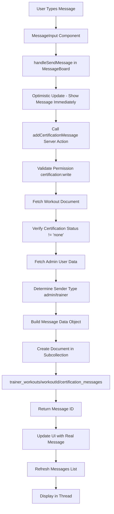

# Certification Message Flow - How Messages Are Sent and Stored

## Overview

The certification message system allows coaches/trainers and users to communicate about workout certification. Messages are stored in a Firestore subcollection under each workout document, creating a threaded conversation that persists throughout the certification process.

## Architecture Flow



## Detailed Flow

### 1. **Client-Side: Message Composition**

**Location:** `app/dashboard/workouts/[id]/components/MessageInput.tsx`

The user types a message in the textarea component. When they click "Send":

- Message text is validated (not empty, trimmed)
- Calls `onSend(message)` callback prop

### 2. **Client-Side: Message Board Handler**

**Location:** `app/dashboard/workouts/[id]/components/MessageBoard.tsx` (lines 100-177)

The `handleSendMessage` function orchestrates the sending process:

```typescript
const handleSendMessage = async (message: string) => {
  // Step 1: Optimistic Update
  // Immediately add message to UI with temporary ID
  const optimisticMessage: SerializedCertificationMessage = {
    id: `temp-${Date.now()}`,
    workout_id: workoutId,
    sender_id: currentUserId,
    sender_type: isAdmin ? "admin" : "trainer",
    sender_name: "You",
    message: message,
    created_at: new Date().toISOString(),
    // ...
  };
  setMessages((prev) => [...prev, optimisticMessage]);

  // Step 2: Call Server Action
  const result = await addCertificationMessage(workoutId, message);

  // Step 3: Handle Response
  if (result.success) {
    // Update optimistic message with real ID
    // Refresh messages from server
    // Show success toast
  } else {
    // Remove optimistic message
    // Show error toast
  }
};
```

**Key Features:**

- **Optimistic Updates:** Message appears immediately in UI for instant feedback
- **Error Handling:** If send fails, optimistic message is removed and error shown
- **Refresh:** After successful send, refreshes message list to get server-side data

### 3. **Server-Side: Message Creation**

**Location:** `app/actions/certification.ts` (lines 998-1086)

The `addCertificationMessage` server action handles the backend logic:

#### Step 1: Permission Check

```typescript
const session = await requirePermission("certification:write");
```

- Verifies user has `certification:write` permission
- Returns authenticated session with user ID and role

#### Step 2: Message Validation

```typescript
// Validate message length (max 5000 characters)
if (messageTrimmed.length > MAX_MESSAGE_LENGTH) {
  return { success: false, error: "Message too long" };
}
```

#### Step 3: Workout Verification

```typescript
const workoutDoc = await workoutRef.get();
const certStatus = workoutData?.certification_status || "none";

// Only allow messages if workout is in certification flow
if (certStatus === "none") {
  return { success: false, error: "Workout is not in certification flow" };
}
```

#### Step 4: Determine Sender Information

```typescript
// Fetch admin user data
const adminDoc = await db.collection("admin_users").doc(session.uid).get();
const adminData = adminDoc.data();

// Determine sender type based on role
let senderType: "admin" | "trainer" = "admin";
if (adminData?.role === "coach") {
  senderType = "trainer";
} else if (adminData?.role === "admin" || adminData?.role === "super_admin") {
  senderType = "admin";
}
```

#### Step 5: Build Message Document

```typescript
const messageData = {
  workout_id: workoutId,
  workout_owner_id: workoutOwnerId, // Required for security rules
  sender_id: session.uid,
  sender_type: senderType, // 'admin' or 'trainer'
  sender_name: adminData?.display_name || session.email || "Unknown",
  message: messageTrimmed,
  created_at: Timestamp.now(),
  // Only include sender_avatar if photo_url exists
  ...(adminData?.photo_url && { sender_avatar: adminData.photo_url }),
};
```

#### Step 6: Store in Firestore

```typescript
const messageRef = await workoutRef
  .collection("certification_messages")
  .add(messageData);

return { success: true, messageId: messageRef.id };
```

### 4. **Firestore Storage Structure**

Messages are stored as a **subcollection** under each workout:

```
trainer_workouts/
  └── {workoutId}/
      ├── [workout document data]
      └── certification_messages/  ← Subcollection
          ├── {messageId1}/
          │   ├── workout_id: string
          │   ├── workout_owner_id: string  ← Required for security
          │   ├── sender_id: string  ← User UID or Admin UID
          │   ├── sender_type: 'user' | 'trainer' | 'admin'
          │   ├── sender_name: string
          │   ├── sender_avatar?: string  ← Optional profile photo
          │   ├── message: string
          │   ├── created_at: Timestamp
          │   └── is_edited?: boolean
          │
          ├── {messageId2}/
          └── {messageId3}/
```

**Why Subcollection?**

- **Isolation:** Messages are scoped to specific workouts
- **Security:** Can enforce rules based on workout ownership
- **Organization:** Clear relationship between workout and messages
- **Scalability:** Easier to paginate and query messages per workout

### 5. **Message Retrieval**

**Location:** `app/actions/certification.ts` (lines 920-981)

The `listCertificationMessages` function retrieves messages:

```typescript
// Query subcollection ordered by creation time
let query = messagesRef.orderBy("created_at", "asc");

// Support pagination with cursor
if (cursor) {
  const cursorDoc = await messagesRef.doc(cursor).get();
  query = query.startAfter(cursorDoc);
}

// Fetch with limit + 1 to detect if more messages exist
query = query.limit(limit + 1);
const snapshot = await query.get();

// Serialize timestamps for client consumption
const serializedMessages = messages.map((msg) => serializeTimestamps(msg));
```

**Features:**

- **Ascending Order:** Oldest messages first (natural conversation flow)
- **Pagination:** Cursor-based pagination for performance
- **Timestamp Serialization:** Converts Firestore Timestamps to ISO strings

### 6. **Message Display**

**Location:** `app/dashboard/workouts/[id]/components/MessageItem.tsx`

Each message is displayed with:

- Sender name and avatar (if available)
- Message content
- Timestamp (formatted relative time)
- Edit/Delete buttons (if user has permissions)

**Initial Load:**

- Messages are fetched server-side when page loads
- Passed as `initialMessages` prop to MessageBoard component
- Stored in component state for UI updates

**Real-time Updates:**

- Manual refresh button available
- After sending, messages are refreshed from server
- Optimistic updates provide instant feedback

## Security Model

### Firestore Security Rules

**Location:** `firestore.rules` (lines 163-193)

```javascript
match /certification_messages/{messageId} {
  // Read: Users can read their own workout messages, trainers/admins read all
  allow read: if isAuthenticated() && (
    resource.data.workout_owner_id == request.auth.uid ||
    isTrainerOrAdmin()
  );

  // Create: Users create messages for own workouts, trainers/admins create any
  allow create: if isAuthenticated() && (
    (request.resource.data.workout_owner_id == request.auth.uid &&
     request.resource.data.sender_id == request.auth.uid &&
     request.resource.data.sender_type == 'user') ||
    isTrainerOrAdmin()
  );
}
```

**Key Security Features:**

- `workout_owner_id` is required and checked against authenticated user
- Users can only create messages for workouts they own
- Trainers/admins can create messages for any workout
- Server actions use Admin SDK (bypasses rules but validates permissions)

### Permission Checks

**Server-Side (Admin Repository):**

- `certification:write` permission required to send messages
- `certification:read` permission required to view messages
- Uses `requirePermission()` helper for validation

**Client-Side (Hub Repository - Expected):**

- Users can send messages for their own workouts
- Messages sent from Hub will have `sender_type: 'user'`
- Same security rules apply via Firestore rules

## Data Flow Summary

### From Admin/Trainer (This Repository):

1. User types message in `MessageBoard` component
2. `handleSendMessage` creates optimistic update
3. Calls `addCertificationMessage(workoutId, message)` server action
4. Server action:
   - Validates permission (`certification:write`)
   - Verifies workout exists and is in certification flow
   - Fetches admin user data from `admin_users` collection
   - Determines `sender_type` (admin/trainer) from role
   - Sets `workout_owner_id` from workout's `user_id`
   - Includes `sender_avatar` only if `photo_url` exists (conditional spread)
   - Creates document in `trainer_workouts/{workoutId}/certification_messages`
5. Returns message ID
6. Client updates UI with real message data
7. Refreshes message list to ensure consistency

### From User (Hub Repository - Expected):

1. User types message in Hub app
2. Calls similar `addCertificationMessage` function
3. Server action:
   - Validates user owns the workout
   - Sets `sender_type: 'user'`
   - Sets `sender_id` to user's UID
   - Sets `workout_owner_id` to user's UID
   - Creates message document
4. Message appears in Admin's MessageBoard (when they refresh)

## Message Thread Structure

Each workout has its own conversation thread stored in the subcollection. Messages are:

- **Ordered:** By `created_at` timestamp (ascending - oldest first)
- **Threaded:** All messages for a workout are in the same subcollection
- **Persistent:** Messages remain even if workout status changes
- **Paginated:** Support for loading older messages via cursor

## Key Design Decisions

### 1. **Subcollection vs Top-Level Collection**

**Chosen:** Subcollection (`trainer_workouts/{id}/certification_messages`)

**Reasons:**

- Security rules can check parent workout ownership
- Clear data organization
- Easier to query messages per workout
- Natural relationship model

### 2. **Optimistic Updates**

**Chosen:** Yes - Show message immediately, update on server response

**Reasons:**

- Instant user feedback
- Better perceived performance
- Error handling removes optimistic message if send fails

### 3. **Conditional `sender_avatar` Field**

**Chosen:** Only include field if `photo_url` exists

**Reason:**

- Firestore rejects `undefined` values
- Optional field should be omitted, not set to undefined
- Uses spread operator: `...(photo_url && { sender_avatar: photo_url })`

### 4. **Required `workout_owner_id` Field**

**Chosen:** Always include in message document

**Reasons:**

- Required by Firestore security rules
- Enables efficient ownership checks
- Prevents enumeration attacks

## Message Lifecycle

1. **Created:** Document added to subcollection with auto-generated ID
2. **Read:** Fetched via `listCertificationMessages` ordered by `created_at`
3. **Edited:** `updated_at` timestamp set, `is_edited` flag set to true (if supported)
4. **Deleted:** Removed from subcollection (admin only, if supported)

## Integration Points

### Admin Repository (This Codebase):

- Sends messages as `admin` or `trainer` type
- Uses Admin SDK (bypasses Firestore rules)
- Validates permissions via `requirePermission()`

### Hub Repository (User-Facing App):

- Sends messages as `user` type
- Uses client SDK (enforces Firestore rules)
- Users can only send messages for their own workouts
- Messages must include `workout_owner_id == user.uid`

## Error Handling

**Client-Side:**

- Optimistic message removed if send fails
- Toast notification shows error message
- UI state maintained correctly

**Server-Side:**

- Validation errors return user-friendly messages
- Permission errors return clear error codes
- Database errors logged server-side, generic message to client

## Performance Considerations

1. **Pagination:** Messages loaded in batches (default: 50)
2. **Indexes:** Firestore index on `workout_id` + `created_at` for efficient queries
3. **Optimistic Updates:** Reduces perceived latency
4. **Selective Refresh:** Only refreshes after send, not on every interaction
