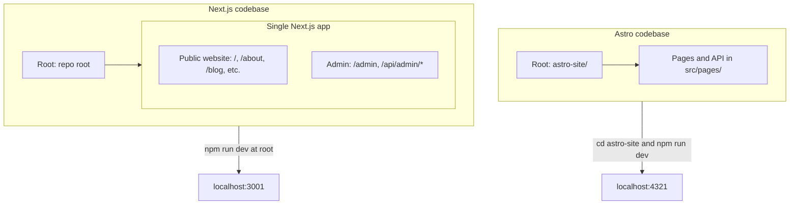

# Three-App Architecture: Audit and Diagram

This document audits the **workout-generator-web** repository: two codebases that expose three logical applications (Astro marketing site, Next.js public website, Next.js admin). It describes how they are separated, their root directories, and how to start each in the terminal.

---

## Two codebases, three logical apps

| Codebase    | Root directory   | Logical apps                         | Purpose                                                                                   |
| ----------- | ---------------- | ------------------------------------ | ----------------------------------------------------------------------------------------- |
| **Astro**   | `astro-site/`    | 1. Astro (marketing) site            | Public marketing: home, blog, FAQ, equipment, reports, onboarding, founder story, videos. |
| **Next.js** | Repo root (`.` ) | 2. Next.js website, 3. Next.js admin | Same app: public routes (/, /about, /blog, …) and admin-only (/admin/_, /api/admin/_).    |

The **Next.js website** and **Next.js admin** share one codebase and one process; they are separated by route path only.

---

## Quick reference: root directory, start command, URL, build

| App                    | Root directory | How to start (terminal)                                       | URL(s)                                      | Build command                       |
| ---------------------- | -------------- | ------------------------------------------------------------- | ------------------------------------------- | ----------------------------------- |
| **1. Astro site**      | `astro-site/`  | From repo root: `cd astro-site && npm install && npm run dev` | http://localhost:4321                       | From `astro-site/`: `npm run build` |
| **2. Next.js website** | Repo root      | From repo root: `npm install && npm run dev`                  | http://localhost:3001 (/, /about, /blog, …) | From repo root: `npm run build`     |
| **3. Next.js admin**   | Repo root      | Same as above                                                 | http://localhost:3001/admin                 | Same as above                       |

---

## Separation

### Astro vs Next.js

- **Different roots:** Astro lives in `astro-site/`; Next.js uses the repository root (`app/`, `components/`, `lib/`, etc.).
- **Different package.json and dependencies:** `astro-site/package.json` has its own `node_modules`; the root `package.json` is for Next.js. Root `tsconfig.json` excludes `astro-site`; Astro has `astro-site/tsconfig.json` with `@/*` → `./src/*`.
- **Different dev servers:** Astro runs on port **4321**, Next.js on **3001**. Run two terminals to have both live.
- **No shared runtime:** Astro does not call Next.js APIs. Each codebase has its own API routes (Astro: `astro-site/src/pages/api/`; Next.js: `app/api/`).

### Next.js website vs Next.js admin

- **Same root, same process:** One Next.js app. Separation is by route:
  - **Admin:** `app/admin/*` (pages) and `app/api/admin/*` (API routes). Served at `/admin` and `/api/admin/*`.
  - **Public website:** All other `app/*` routes and `app/api/*` routes outside `app/api/admin/`.

---

## Architecture diagram

---

## Deployment note

A single Vercel project has one **Root Directory** and one build. To deploy both codebases you need **two Vercel projects** from the same repo:

- **Project A (e.g. main site):** Root Directory = `astro-site` → builds Astro; assign production domain (e.g. aiworkoutgenerator.com).
- **Project B (e.g. admin):** Root Directory = empty → builds Next.js; assign subdomain (e.g. admin.aiworkoutgenerator.com).

### Pointing admin.aiworkoutgenerator.com to the Next.js site

With the Astro site already at **aiworkoutgenerator.com**, point the subdomain to the Next.js deployment as follows:

1. **Vercel (Next.js project)**
   - Open the **Next.js** project in Vercel → **Settings** → **Domains**.
   - Click **Add** and enter `admin.aiworkoutgenerator.com`.
   - Vercel will show the DNS record you need (usually a **CNAME** and target, e.g. `cname.vercel-dns.com` or a project-specific target).

2. **DNS (where aiworkoutgenerator.com is managed)**
   - Add a **CNAME** record:
     - **Name/host:** `admin` (or `admin.aiworkoutgenerator.com`, depending on your DNS UI).
     - **Target/value:** the value Vercel shows (e.g. `cname.vercel-dns.com` or the project’s vercel.app hostname).
   - Save and wait for propagation (often a few minutes; Vercel will show when the domain is verified and SSL is ready).

3. **Result**
   - **aiworkoutgenerator.com** → Astro project (root domain stays on the Astro Vercel project).
   - **admin.aiworkoutgenerator.com** → Next.js project (subdomain points to the Next.js Vercel project).

You can keep **aiworkoutgenerator.com/admin** working via the existing rewrites in `astro-site/vercel.json` (they proxy to the Next.js deployment), or use only **admin.aiworkoutgenerator.com** for admin; both hit the same Next.js app.

For environment variables, local dev setup, and detailed deployment steps, see [ASTRO-NEXTJS-SETUP.md](ASTRO-NEXTJS-SETUP.md).
