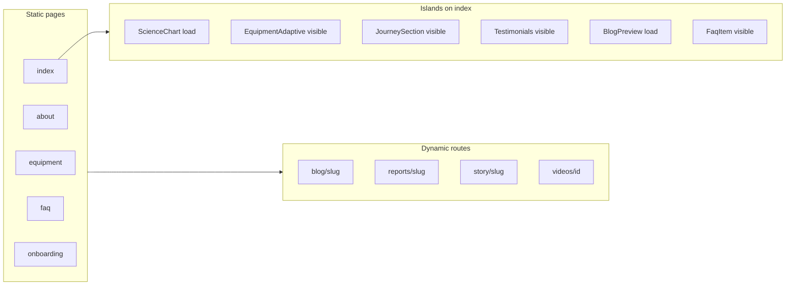

# Astro Migration Technical Audit Report

**Date:** February 2026  
**Scope:** `astro-site/` — file-based routing, Islands architecture, best practices, performance  
**Reference:** Astro Migration Technical Audit Plan

---

## Summary

| Section                             | Pass | Fail | Consider |
| ----------------------------------- | ---- | ---- | -------- |
| 1. File-based routing & structure   | 6    | 0    | 0        |
| 2. Islands architecture & hydration | 5    | 0    | 3        |
| 3. Astro best practices             | 5    | 0    | 2        |
| 4. Performance & output             | 3    | 0    | 1        |

**Overall:** All mandatory checks pass. Several "consider" items are documented for future optimization.

---

## 1. File-based Routing and Structure

### 1.1 Static routes

| Check                                                               | Result   | Notes                                                                                                                                                                                                                                                                                                         |
| ------------------------------------------------------------------- | -------- | ------------------------------------------------------------------------------------------------------------------------------------------------------------------------------------------------------------------------------------------------------------------------------------------------------------- |
| Every public URL intended as a page has a file under `src/pages/`   | **PASS** | Static pages present: `index.astro`, `about.astro`, `equipment.astro`, `exercise-challenge.astro`, `faq.astro`, `founder-story.astro`, `onboard.astro`, `onboarding.astro`, `reports.astro`, `deep-research.astro`, `404.astro`. Endpoints (no HTML): `api/*`, `feed.xml.ts`, `robots.txt.ts`, `sitemap*.ts`. |
| Static pages do not export `prerender = false` unless they need SSR | **PASS** | Only SSR routes set `prerender = false`: `blog/*`, `deep-research.astro`, `deep-research/[slug].astro`, `sitemap.xml.ts`, `feed.xml.ts`, `api/*`. All other pages are pre-rendered.                                                                                                                           |

### 1.2 Dynamic routes

| Check                                                                    | Result   | Notes                                                                                                                                                                                                                                                                                                     |
| ------------------------------------------------------------------------ | -------- | --------------------------------------------------------------------------------------------------------------------------------------------------------------------------------------------------------------------------------------------------------------------------------------------------------- |
| Each dynamic route uses either `getStaticPaths()` or `prerender = false` | **PASS** | `reports/[slug].astro`, `story/[slug].astro`, `videos/[id].astro` use `getStaticPaths()`. `blog/[slug].astro`, `blog/author/[name].astro`, `blog/category/[slug].astro`, `deep-research/[slug].astro` use `prerender = false` and fetch at request time.                                                  |
| `getStaticPaths()` returns full set of slugs/ids                         | **PASS** | Reports: `reports` from `@/types/reports`. Story: `milestones` from `@/data/story-milestones`. Videos: `videos` from `@/data/videos`. Build output confirms all paths generated (e.g. 3 report slugs, 9 story slugs, 5 video ids).                                                                        |
| 404 handling on dynamic routes                                           | **PASS** | `blog/[slug].astro`: `Astro.redirect('/404')` when `!post`. `deep-research/[slug].astro`: redirect when `!slug` or `!item`. `blog/author/[name].astro`: redirect to `/blog` when `!name`, `/404` when `!author`. `blog/category/[slug].astro`: redirect to `/blog` when `!slug`, `/404` when `!category`. |

### 1.3 Separation: components vs pages

| Check                                       | Result   | Notes                                                                                                                  |
| ------------------------------------------- | -------- | ---------------------------------------------------------------------------------------------------------------------- |
| No routing logic in `src/components/`       | **PASS** | Grep for `Astro.params` and `getStaticPaths` in `src/components/` returns no matches.                                  |
| Pages import components and pass props only | **PASS** | Data fetching and routing live in page frontmatter; components receive props. No duplicated route logic in components. |

---

## 2. Islands Architecture and Hydration

### 2.1 Zero-JS default

| Check                                                    | Result   | Notes                                                                                                                                                                                                                                                                             |
| -------------------------------------------------------- | -------- | --------------------------------------------------------------------------------------------------------------------------------------------------------------------------------------------------------------------------------------------------------------------------------- |
| No React/Vue/Svelte usage without a `client:*` directive | **PASS** | Every React component is used with `client:load` or `client:visible`: `ScienceChart`, `BlogPreview`, `WorkoutPlanBuilder`, `OnboardingWizard`, `OnboardingIntroScreen`, `EquipmentAdaptive`, `JourneySection`, `Testimonials`, `FaqItem`, `EquipmentCardGrid`, `ReportV2Content`. |
| Mostly-static pages do not load framework unnecessarily  | **PASS** | Pages like `/about`, `/founder-story` use only Astro components (Hero, Footer, Navbar, etc.); no React islands, so no React bundle on those routes. `/faq` and `/equipment` load only the islands they use (FaqItem, EquipmentCardGrid).                                          |

### 2.2 Directive strategy

| Check                                                                          | Result       | Notes                                                                                                                                                                                                                                                             |
| ------------------------------------------------------------------------------ | ------------ | ----------------------------------------------------------------------------------------------------------------------------------------------------------------------------------------------------------------------------------------------------------------- |
| Correct use of `client:load` vs `client:visible`                               | **PASS**     | Critical/above-the-fold: `client:load` (ScienceChart, BlogPreview, WorkoutPlanBuilder, OnboardingWizard, OnboardingIntroScreen). Below-the-fold: `client:visible` (EquipmentAdaptive, JourneySection, Testimonials, FaqItem, EquipmentCardGrid, ReportV2Content). |
| Consider `client:visible` for below-fold islands currently using `client:load` | **CONSIDER** | `BlogPreview` on index uses `client:load`; if it is below the fold, switching to `client:visible` would defer hydration until in view.                                                                                                                            |
| Consider `client:idle` for low-priority interactivity                          | **CONSIDER** | No `client:idle` in use. Optional or low-priority widgets (e.g. optional toggles) could use `client:idle` to reduce main-thread work.                                                                                                                             |
| No inappropriate `client:only`                                                 | **PASS**     | No `client:only` usage.                                                                                                                                                                                                                                           |

### 2.3 Partial hydration and "heavy island" test

| Check                                                    | Result       | Notes                                                                                                                                                                                                                                                                                                                                                                                 |
| -------------------------------------------------------- | ------------ | ------------------------------------------------------------------------------------------------------------------------------------------------------------------------------------------------------------------------------------------------------------------------------------------------------------------------------------------------------------------------------------- |
| Homepage has no single wrapper island                    | **PASS**     | Multiple small islands: ScienceChart, EquipmentAdaptive, JourneySection, Testimonials, BlogPreview, FaqItem. No "MainApp" wrapping the whole page.                                                                                                                                                                                                                                    |
| Report page island scope                                 | **CONSIDER** | `ReportV2Content` is one large React island (ReportV2Navigation, ReportV2Hero, ReportV2ProgressChart, ReportV2TierSelector, ReportV2LogicSimulation, ReportV2LiveDemo, ReportV2Verdict, ReportV2RetentionChart). Acceptable if the report is intentionally one interactive "app"; for minimal JS, consider splitting (e.g. hero/nav as Astro, only charts/toggles as client islands). |
| No static content unnecessarily inside client components | **PASS**     | Static sections are in .astro (e.g. BaseLayout, Footer, PostContent). Client components are used only where interactivity is needed.                                                                                                                                                                                                                                                  |

---

## 3. Astro Best Practices

### 3.1 Content Collections

| Check                       | Result   | Notes                                                                                                                                                                                                                                                                            |
| --------------------------- | -------- | -------------------------------------------------------------------------------------------------------------------------------------------------------------------------------------------------------------------------------------------------------------------------------- |
| Content strategy documented | **PASS** | No `src/content/`; blog and deep-research use **Supabase** via `lib/blog/queries.ts`, `lib/deep-research/queries.ts`, and `api/blog.ts`. Other content from `src/data/` (story-chapters, videos, faq-data, etc.). Decision: Supabase + fallbacks instead of Content Collections. |
| Types and fallbacks in sync | **PASS** | Types in `src/types/blog.ts`, `src/types/reports.ts`, etc. Fallback data in `src/data/blog/fallback-posts.ts`.                                                                                                                                                                   |

### 3.2 Astro Image vs raw img

| Check              | Result       | Notes                                                                                                                                                                                                                                                                                                                                                                                                                                                                                                            |
| ------------------ | ------------ | ---------------------------------------------------------------------------------------------------------------------------------------------------------------------------------------------------------------------------------------------------------------------------------------------------------------------------------------------------------------------------------------------------------------------------------------------------------------------------------------------------------------- |
| Image optimization | **CONSIDER** | Only `about.astro` uses `import { Image } from 'astro:assets'` and `<Image />`. Raw `` used in: `Hero.astro` (logo), `PostHero.astro` (hero image URL), `BlogCard.astro`, `Bio.astro`, `ReportV2Hero.tsx`, `BlogPreviewCard.tsx`, `founder-story.astro`, `reports.astro`, `videos/[id].astro`, `blog/author/[name].astro`. For static assets under `public/` or `src/`, consider `<Image />` for optimization; for external/Supabase URLs, document why `` is kept (e.g. remote config, dynamic URLs). |

### 3.3 Server-side logic in frontmatter

| Check                               | Result   | Notes                                                                                                                                                                                       |
| ----------------------------------- | -------- | ------------------------------------------------------------------------------------------------------------------------------------------------------------------------------------------- |
| No client hooks in .astro           | **PASS** | Grep for `useState`, `useEffect` in `*.astro` returns no matches.                                                                                                                           |
| Data fetching only in frontmatter   | **PASS** | All data fetching (e.g. `getPostBySlug`, `getStaticPaths`, `getAllPublishedDeepResearch`) runs in frontmatter or libs called from frontmatter; no browser-side fetch for initial page data. |
| Dynamic data fetched in frontmatter | **PASS** | `blog/[slug].astro`, `reports/[slug].astro`, `deep-research/[slug].astro`, etc. perform all fetches and schema building in frontmatter.                                                     |

---

## 4. Performance and Output

### 4.1 Middleware and Actions

| Check          | Result   | Notes                                                                                                                                            |
| -------------- | -------- | ------------------------------------------------------------------------------------------------------------------------------------------------ |
| Middleware     | **PASS** | No `middleware.ts`/`middleware.js` in `astro-site/`. Document as "no middleware by design" unless global redirects or A/B logic are added later. |
| Server actions | **PASS** | No Astro `defineAction` or form actions. Forms use `pages/api/*` (leads, blog, gemini-workout).                                                  |

### 4.2 Hydration mismatches

| Check                                       | Result       | Notes                                                                                                                                                                                                                 |
| ------------------------------------------- | ------------ | --------------------------------------------------------------------------------------------------------------------------------------------------------------------------------------------------------------------- |
| No obvious server/client divergence in code | **PASS**     | Report and blog receive serializable props from server. Date formatting uses server-provided values (e.g. `formatDate(post.date)` in frontmatter). No `window`/`localStorage` in first render in reviewed components. |
| Manual verification                         | **CONSIDER** | Run the site in dev and production; open browser console and check for "Hydration Mismatch" or "Text content does not match". Review any component that formats dates or shows "current" state after mount.           |

### 4.3 Build and output mode

| Check                     | Result   | Notes                                                                                                                                                                |
| ------------------------- | -------- | -------------------------------------------------------------------------------------------------------------------------------------------------------------------- |
| Production build succeeds | **PASS** | `cd astro-site && npm run build` completed successfully. Static routes pre-rendered; SSR routes (blog, deep-research, sitemap, feed, api) built as server functions. |
| Output mode               | **PASS** | `astro.config.mjs`: `output: 'static'` with Vercel adapter. Routes with `prerender = false` are SSR; others are pre-rendered.                                        |

---

## 5. Route and Island Overview (Reference)

---

## 6. Recommended Follow-ups (Optional)

1. **Directive tuning:** If BlogPreview on the homepage is below the fold, switch to `client:visible`.
2. **Image:** Audit static images (e.g. Hero logo, Bio gallery) and convert to `<Image />` where beneficial; document remote/dynamic image choices.
3. **Report island:** If minimizing JS is a goal, consider splitting ReportV2Content into smaller islands (e.g. static hero/nav in Astro, only interactive sections as client islands).
4. **Hydration:** Manually test key pages (blog post, report, deep-research) in browser and confirm no hydration errors in console.

---

**Report generated per Astro Migration Technical Audit Plan. No code or config was changed.**
