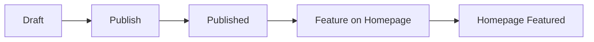

# Challenge Publish Workflow

How to get a challenge from Challenge Factory (admin) onto the marketing homepage and challenges catalog.

## Flow

## Steps

1. **Draft** — Challenge is created in Challenge Factory (admin-dash-astro). `status=draft`. It is not visible on the public site.

2. **Publish** — In the Challenge Library table, admin clicks the Upload icon to publish (or unpublish with EyeOff). This sets `status=published`. The challenge then appears in the programs app catalog at `/challenges` and is viewable at `/challenges/{id}`.

3. **Feature** — To show the challenge in the "Featured Challenges" section on the astro-site homepage (aiworkoutgenerator.com), admin either:
   - In the Challenge Library table: click the Star icon (only enabled when the challenge is published), or
   - In the Challenge Editor: use the "Feature on Homepage" toggle.
   This sets `featured_on_landing=true`.

4. **Homepage** — The challenge appears in Featured Challenges on the homepage. "View Challenge" and card links go to `/challenges/{id}`, which is rewritten to the programs app.

## Constraint

Featuring should only be used for published challenges. The UI disables the Feature on Homepage action for draft challenges and shows a toast to publish first. There is no database constraint today; an optional future improvement is to add `challenges_featured_requires_published` (featured implies status = 'published').

## Verification

- **Migration:** Run the challenges portion of [docs/verify-featured-on-landing-migration.sql](verify-featured-on-landing-migration.sql) in the Supabase SQL Editor (queries 4 and 5) to confirm `challenges.featured_on_landing` column and "Anyone can read published challenges" RLS policy.
- **End-to-end:** Publish a challenge, feature it, visit the marketing homepage, confirm it appears in Featured Challenges and that the challenge detail link works.

## Related

- Roadmap: [docs/roadmaps/ADMIN_CONTENT_TO_MARKETING_ROADMAP.md](roadmaps/ADMIN_CONTENT_TO_MARKETING_ROADMAP.md) — Phase 2: Challenges
- astro-site featured query: `astro-site/src/lib/featured/queries.ts` — `getFeaturedChallenges()`
- Admin API: PATCH `/api/admin/challenges/[challengeId]` with `featured_on_landing` or `status`
