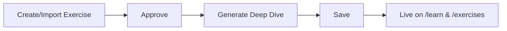

# Exercise Deep Dive Workflow

How to get an exercise from admin (create/import → approve → generate deep dive) to the public Learning Center and exercise catalog.

## Flow

## Steps

1. **Create/Import** — Create or import an exercise in admin (Manage Exercises, Exercise Image Generator, or Content Generation Lab). The exercise exists with `status` (e.g. pending) and no deep dive yet.

2. **Approve** — Set the exercise to `status = 'approved'`. Only approved exercises are public. RLS policy "Anyone can read approved exercises" controls visibility.

3. **Generate Deep Dive** — In admin, use **Generate Deep Dive Page** (calls `generate-page` API) for AI-generated HTML, or **Edit Page** (DeepDiveEditor) to write/edit manually. Save via **update-deep-dive** API. Content is stored in Supabase `generated_exercises.deep_dive_html_content`.

4. **Publish** — Once saved, the deep dive is live: it appears at `/exercises/[slug]/learn`, on the Learn index `/learn`, and the canonical exercise page shows a "Start Learning" button when `deepDiveHtmlContent` exists.

## Entry Points

| Entry | Purpose |
|-------|--------|
| **Manage Exercises** | List, create, approve; open exercise → Generate/Edit deep dive |
| **Exercise Image Generator** | Create exercise + image; then generate deep dive |
| **Content Generation Lab** | Batch or single exercise content; DeepDiveEditor |
| **DeepDiveEditor** | Rich editor for `deepDiveHtmlContent`; wired to update-deep-dive API |
| **generate-page API** | POST `/api/admin/exercises/[id]/generate-page` — AI generates and saves |
| **update-deep-dive API** | POST `/api/admin/exercises/[id]/update-deep-dive` — save HTML |

## Verification

- **Public visibility:** Only exercises with `status = 'approved'` are readable by anonymous users (RLS). Deep dive is optional; exercises without `deep_dive_html_content` do not appear on `/learn` and do not show "Start Learning".
- **Links:** Programs app detail page links to `/exercises/[slug]/learn` when content exists; Learn index links to `/exercises/[slug]/learn` for each exercise with a deep dive. astro-site rewrites `/exercises` and `/learn` to the programs app; nav drawer includes Exercises and Learn.

## Related

- Roadmap: [docs/roadmaps/ADMIN_CONTENT_TO_MARKETING_ROADMAP.md](roadmaps/ADMIN_CONTENT_TO_MARKETING_ROADMAP.md) — Phase 4: Exercises
- Deep dive page design: [apps/programs/docs/features/exercises/deep-dive-page.md](../apps/programs/docs/features/exercises/deep-dive-page.md)
- Data: `getGeneratedExerciseBySlug` in `apps/programs/src/lib/supabase/public/generated-exercise-service.ts`
