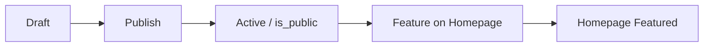

# Program Publish Workflow

How to get a program from Program Factory (admin) onto the marketing homepage and programs catalog.

## Flow

## Steps

1. **Draft** — Program is created in Program Factory (admin-dash-astro). `status=draft`, `is_public=false`. It is not visible on the public site.

2. **Publish** — In the Program Library table, admin clicks the Globe icon to publish. This sets `status=active` and `is_public=true`. The program then appears in the programs app catalog at `/programs` and is viewable at `/programs/{id}`.

3. **Feature** — To show the program in the "Featured Programs" section on the astro-site homepage (aiworkoutgenerator.com), admin either:
   - In the Program Library table: click the Star icon (only enabled when the program is published), or
   - In the Program Editor: use the "Feature on Homepage" toggle.
   This sets `featured_on_landing=true`.

4. **Homepage** — The program appears in Featured Programs on the homepage. "View Program" and card links go to `/programs/{id}`, which is rewritten to the programs app.

## Constraint

`featured_on_landing` cannot be true unless `is_public` is true. This is enforced by the database constraint `programs_featured_requires_public`. If you try to feature an unpublished program, the UI will prompt to publish first (or the API will reject).

## Verification

- **Migration:** Run [docs/verify-featured-on-landing-migration.sql](verify-featured-on-landing-migration.sql) in the Supabase SQL Editor to confirm column, constraint, and RLS policy.
- **End-to-end:** Publish a program, feature it, visit the marketing homepage, confirm it appears in Featured Programs and that the program detail link works.

## Related

- Roadmap: [docs/roadmaps/ADMIN_CONTENT_TO_MARKETING_ROADMAP.md](roadmaps/ADMIN_CONTENT_TO_MARKETING_ROADMAP.md) — Phase 1: Programs
- astro-site featured query: `astro-site/src/lib/featured/queries.ts` — `getFeaturedPrograms()`
- Admin API: PATCH `/api/admin/programs/[programId]` with `featured_on_landing` or `status`
