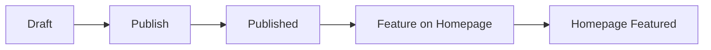

# Workout Publish Workflow

How to get a workout set from Workout Factory (admin) onto the marketing homepage and workouts catalog.

## Flow

## Steps

1. **Draft** — Workout set is created in Workout Factory (admin-dash-astro). `status=draft`. It is not visible on the public site.

2. **Publish** — In the Workout Library table, admin clicks the Upload icon to publish (or unpublish with EyeOff). This sets `status=published`. The workout set then appears in the programs app catalog at `/workouts`.

3. **Feature** — To show the workout set in the "Featured Workouts" section on the astro-site homepage (aiworkoutgenerator.com), admin clicks the Star icon in the Workout Library table (only enabled when the workout is published). This sets `featured_on_landing=true`. Trying to feature a draft shows a toast: "Publish the workout first to feature it on the homepage."

4. **Homepage** — The workout set appears in Featured Workouts on the homepage. "View Workouts" and card links go to `/workouts`, which is rewritten to the programs app catalog.

## Constraint

`featured_on_landing` cannot be true unless `status = 'published'`. This is enforced by the database constraint `workout_sets_featured_requires_published`. The UI also disables the Star for draft workouts.

## Verification

- **Migration:** Run the workout_sets portion of [docs/verify-featured-on-landing-migration.sql](verify-featured-on-landing-migration.sql) in the Supabase SQL Editor (queries 6 and 7) to confirm `workout_sets.featured_on_landing` column and `workout_sets_featured_requires_published` constraint.
- **End-to-end:** Publish a workout set, feature it, visit the marketing homepage, confirm it appears in Featured Workouts and that the "View All Workouts" link resolves to the programs app.

## Related

- Roadmap: [docs/roadmaps/ADMIN_CONTENT_TO_MARKETING_ROADMAP.md](roadmaps/ADMIN_CONTENT_TO_MARKETING_ROADMAP.md) — Phase 3: Workouts
- astro-site featured query: `astro-site/src/lib/featured/queries.ts` — `getFeaturedWorkouts()`
- Admin API: PATCH `/api/admin/workouts/[workoutId]` with `featured_on_landing` or `status`, `workoutSet`, `workoutConfig`
