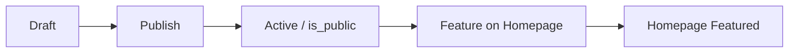
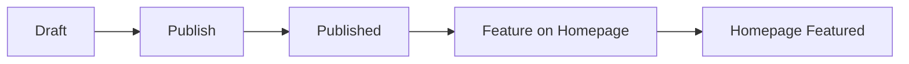
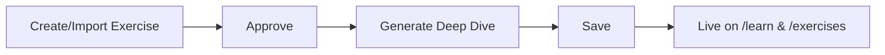

# Phased Roadmap: Admin-Generated Content to Marketing Site

**Goal:** Surface content created in admin-dash-astro (Program Factory, Challenge Factory, Workout Factory, Exercise deep dives) on the astro-site marketing pages and programs app—so admins publish in one place and users discover it at aiworkoutgenerator.com.

**Date:** 2025-03-14  
**Status:** Planning

---

## Executive Summary

| Content Type | Admin Source | Current Surface | Gap |
|-------------|--------------|-----------------|-----|
| **Programs** | Program Factory | Homepage Featured Programs, `/programs` (rewrite) | Partial: featured flag works; programs app hosts full catalog |
| **Challenges** | Challenge Factory | Homepage Featured Challenges, `/challenges` (rewrite) | Partial: featured flag works; programs app hosts catalog |
| **Workouts** | Workout Factory | None | Not surfaced publicly |
| **Exercises** | Manage Exercises | `/exercises`, `/learn` (rewrite) | Programs app hosts; deep dive content from admin |

This roadmap defines phases to fully integrate each content type.

---

## Current Architecture

```
┌─────────────────────┐     rewrites      ┌─────────────────────────┐
│  astro-site         │ ────────────────► │  programs app            │
│  aiworkoutgenerator │  /programs/*      │  programs.aiworkout...   │
│  .com               │  /challenges/*    │                          │
│                     │  /exercises/*     │  - Program catalog       │
│  - Hero, Features   │  /learn/*         │  - Challenge catalog     │
│  - Featured Programs│                   │  - Exercise detail       │
│  - Featured         │                   │  - Deep dive (/learn)    │
│    Challenges       │                   │  - Workouts (WOD, etc.)  │
└──────────┬──────────┘                   └─────────────────────────┘
           │
           │  direct Supabase (SSR)
           ▼
┌─────────────────────┐
│  Supabase           │
│  programs           │  featured_on_landing, is_public
│  challenges         │  featured_on_landing, status=published
│  workout_sets       │  status=published has RLS; no featured_on_landing yet
│  generated_exercises│  (programs app reads)
└─────────────────────┘
```

---

## Phase 1: Programs — Complete Integration

**Objective:** Ensure Programs from Program Factory flow end-to-end with no gaps.

### 1.1 Current State
- **Admin:** Program Factory creates/edits programs; `featured_on_landing` and `is_public` flags.
- **astro-site:** `getFeaturedPrograms()` fetches 3 featured programs; ProgramsPreview renders them; links to `/programs/{id}`.
- **Routing:** `/programs` and `/programs/:path*` rewrite to programs.aiworkoutgenerator.com.
- **Programs app:** Full program catalog and detail pages at `/programs`, `/programs/[id]`.

### 1.2 Tasks

| Task | Owner | Notes |
|------|-------|-------|
| Verify `featured_on_landing` column exists | — | Migration: `add_featured_on_landing` |
| Add "Feature on homepage" toggle in Program editor | admin | ProgramLibraryTable or editor form |
| Confirm RLS allows public read for featured programs | — | "Anyone can read featured programs" policy |
| Add Programs preview to nav drawer (if desired) | astro-site | Link "Programs" → `/programs` |
| Document program publish workflow | — | Draft → Active → is_public → featured_on_landing |

### 1.3 Deliverables
- Clear admin workflow for featuring programs.
- Featured programs reliably appear on astro-site homepage.
- Links resolve correctly via rewrite.

**Dependencies:** None (mostly verification).

### 1.4 Program Publish Workflow



1. **Draft** — Program created in Program Factory; `status=draft`, `is_public=false`.
2. **Publish** — Admin toggles Publish (Globe icon) in Program Library table; `status=active`, `is_public=true`.
3. **Feature** — Admin toggles "Feature on Homepage" (Star) in Program Library table or in Program Editor; `featured_on_landing=true`.
4. **Homepage** — Program appears in Featured Programs on astro-site; links go to `/programs/{id}` (rewritten to programs app).

**Constraint:** `featured_on_landing` cannot be true unless `is_public` is true (enforced by DB constraint `programs_featured_requires_public`).

See [docs/PROGRAM_PUBLISH_WORKFLOW.md](../PROGRAM_PUBLISH_WORKFLOW.md) for the full workflow doc.

---

## Phase 2: Challenges — Complete Integration

**Objective:** Ensure Challenges from Challenge Factory flow end-to-end with no gaps.

### 2.1 Current State
- **Admin:** Challenge Factory creates/edits challenges; `featured_on_landing` and `status`.
- **astro-site:** `getFeaturedChallenges()` fetches 3 featured challenges; ChallengesPreview renders them; links to `/challenges/{id}`.
- **Routing:** `/challenges` and `/challenges/:path*` rewrite to programs.aiworkoutgenerator.com.
- **Programs app:** Challenge catalog and detail at `/challenges`, `/challenges/[id]`.

### 2.2 Tasks

| Task | Owner | Notes |
|------|-------|-------|
| Verify `featured_on_landing` on challenges | — | Add if missing (challenge migrations) |
| Add "Feature on homepage" toggle in Challenge editor | admin | ChallengeLibraryTable or editor |
| Confirm RLS allows public read for published challenges | — | "Anyone can read published challenges" |
| Add Challenges preview to nav drawer | astro-site | Link "Challenges" → `/challenges` |
| Document challenge publish workflow | — | Draft → Published → featured_on_landing |

### 2.3 Deliverables
- Clear admin workflow for featuring challenges.
- Featured challenges reliably appear on astro-site homepage.
- Hero images and metadata flow correctly.

**Dependencies:** None.

### 2.4 Challenge Publish Workflow



1. **Draft** — Challenge created in Challenge Factory; `status=draft`. Not visible on the public site.
2. **Publish** — Admin publishes via Challenge Library table (Upload icon) or editor; `status=published`. Challenge appears in programs app at `/challenges` and `/challenges/[id]`.
3. **Feature** — Admin toggles "Feature on Homepage" (Star) in Challenge Library table or in Challenge Editor; `featured_on_landing=true`. Only published challenges should be featured (UI disables featuring for drafts).
4. **Homepage** — Challenge appears in Featured Challenges on astro-site; links go to `/challenges/{id}` (rewritten to programs app).

**Note:** Featuring should only be used for published challenges. There is no DB constraint today; optional future: add `challenges_featured_requires_published`. The UI prevents featuring drafts.

See [docs/CHALLENGE_PUBLISH_WORKFLOW.md](../CHALLENGE_PUBLISH_WORKFLOW.md) for the full workflow doc.

---

## Phase 3: Workouts — Surface Workout Factory Content

**Objective:** Expose Workout Factory (`workout_sets`) content on the marketing site and programs app.

### 3.1 Current State
- **Admin:** Workout Factory creates workout sets (splits, HIIT, etc.); `workout_sets` table; `status` (draft/published).
- **Public:** No dedicated route; programs app has `/workouts` for static workout library (different concept).
- **Gap:** Workout Factory content is admin-only; not discoverable by users.

### 3.2 Tasks

| Task | Owner | Notes |
|------|-------|-------|
| Add `featured_on_landing` to `workout_sets` | DB | Migration |
| Confirm RLS policy for `status=published` | DB | RUN_WORKOUT_SETS_SCHEMA.sql already has "Anyone can read published workout_sets" |
| Create `getFeaturedWorkouts()` in astro-site | astro-site | Mirror Programs/Challenges pattern |
| Create WorkoutsPreview component | astro-site | Similar to ProgramsPreview, ChallengesPreview |
| Add Featured Workouts section to homepage | astro-site | Below Challenges or configurable order |
| Add `/workouts` or `/workout-sets` route in programs app | programs | Catalog of published workout sets |
| Add rewrite in astro-site vercel.json | astro-site | `/workouts` → programs app (or serve from astro-site) |
| Add "Feature on homepage" toggle in Workout editor | admin | WorkoutLibraryTable or editor |

### 3.3 Deliverables
- Workout Factory content visible on astro-site homepage (optional section).
- Dedicated workout catalog page.
- Admin can feature workout sets for landing.

**Dependencies:** Phase 1–2 patterns; Workout Factory migration complete in admin-dash-astro.

### 3.4 Workout Publish Workflow


1. **Draft** — Workout set created in Workout Factory; `status=draft`. Not visible on the public site.
2. **Publish** — Admin publishes via Workout Library table (Upload icon); `status=published`. Workout set appears in programs app at `/workouts`.
3. **Feature** — Admin toggles "Feature on Homepage" (Star) in Workout Library table; `featured_on_landing=true`. Only published workout sets can be featured (UI disables Star for drafts; DB constraint `workout_sets_featured_requires_published` enforces it).
4. **Homepage** — Workout set appears in Featured Workouts on astro-site; "View All Workouts" and card links go to `/workouts` (rewritten to programs app).

See [docs/WORKOUT_PUBLISH_WORKFLOW.md](../WORKOUT_PUBLISH_WORKFLOW.md) for the full workflow doc.

---

## Phase 4: Exercises — Deep Dive Content Integration

**Objective:** Surface exercise deep dive content generated in admin (Content Generation Lab / Exercise Image Generator) on the programs app and astro-site.

### 4.1 Current State
- **Admin:** Manage Exercises; deep dive HTML generated/edited via DeepDiveEditor or Content Generation Lab.
- **Data:** `generated_exercises` (or equivalent); `deepDiveHtmlContent` field.
- **Programs app:** `/exercises/[slug]`, `/exercises/[slug]/learn` (deep dive).
- **astro-site:** `/exercises` and `/learn` rewrite to programs app.

### 4.2 Tasks

| Task | Owner | Notes |
|------|-------|-------|
| Confirm exercise schema and `deepDiveHtmlContent` source | — | Supabase vs Firestore migration status |
| Verify programs app `/exercises/[slug]/learn` works with Supabase | programs | If migration from Firestore needed |
| Add "Featured exercises" or "Learn" preview to astro-site | astro-site | Optional: 3–6 exercises with deep dives |
| Add Exercises/Learn link to nav drawer | astro-site | Link to `/learn` or `/exercises` |
| Document exercise approval → deep dive → publish flow | — | Admin workflow |
| Ensure sitemap includes exercise and learn URLs | programs | SEO for deep dive pages |

### 4.3 Deliverables
- Exercise deep dive content discoverable from astro-site.
- Clear path: admin generates → approves → content appears on /learn.
- SEO-friendly exercise and learn pages.

**Dependencies:** Exercise data in Supabase; programs app consuming it.

### 4.4 Exercise Deep Dive Workflow



1. **Approve** — Set exercise `status = 'approved'`; only approved exercises are public.
2. **Generate** — Use Generate Deep Dive Page (AI) or DeepDiveEditor (manual); save via generate-page or update-deep-dive API.
3. **Publish** — Content appears at `/exercises/[slug]/learn` and on `/learn`; canonical page shows "Start Learning" when deep dive exists.
4. **Discover** — Nav drawer (Exercises, Learn) and sitemap include exercise and learn URLs.

See [docs/EXERCISE_DEEP_DIVE_WORKFLOW.md](../EXERCISE_DEEP_DIVE_WORKFLOW.md) for full workflow, entry points, and verification.

---

## Phase 5: Unified Content Hub and Discoverability

**Objective:** Improve discoverability across all content types; optional content hub page.

### 5.1 Tasks

| Task | Owner | Notes |
|------|-------|-------|
| Add "Explore" or "Content" hub page to astro-site | astro-site | Single page with sections: Programs, Challenges, Workouts, Exercises/Learn |
| Add structured navigation in nav drawer | astro-site | Programs, Challenges, Workouts, Exercises, Learn |
| Add `featured_on_landing` to any content type missing it | DB | Consistency |
| Create shared `getFeaturedContent()` or config | astro-site | Limit, order, content types configurable |
| Optional: Admin config for homepage section order | admin | Which sections show, in what order |

### 5.2 Deliverables
- Content hub page (optional).
- Consistent featured-content pattern across all types.
- Admin control over what appears on landing.

**Dependencies:** Phases 1–4.

---

## Phase 6: Workflow and Polish

**Objective:** Document workflows, add analytics, ensure resilience.

### 6.1 Tasks

| Task | Owner | Notes |
|------|-------|-------|
| Document "Publish to marketing" workflow | docs | Step-by-step for each content type |
| Add `data-cta` attributes for featured content links | astro-site | Analytics tracking |
| Add fallbacks when Supabase unavailable | astro-site | Graceful degradation; don't break build |
| Add cache headers for featured content | astro-site | Reduce DB load |
| Verify meta tags and Open Graph for content pages | programs | Programs, challenges, exercises, learn |

### 6.2 Deliverables
- Clear documentation for admins.
- Analytics for content engagement.
- Resilient, performant integration.

---

## Summary: Phase Order

| Phase | Focus | Est. Effort |
|-------|-------|-------------|
| **1** | Programs — complete integration | Low (verification) |
| **2** | Challenges — complete integration | Low (verification) |
| **3** | Workouts — surface Workout Factory | Medium (new surface) |
| **4** | Exercises — deep dive integration | Medium (schema/route verification) |
| **5** | Unified content hub | Medium (new page, nav) |
| **6** | Workflow and polish | Low–Medium (docs, analytics) |

---

## File References

| Area | Path |
|------|------|
| astro-site featured queries | `astro-site/src/lib/featured/queries.ts` |
| astro-site rewrites | `astro-site/vercel.json` |
| ProgramsPreview | `astro-site/src/components/react/ProgramsPreview/` |
| ChallengesPreview | `astro-site/src/components/react/ChallengesPreview/` |
| Program Factory | `apps/admin-dash-astro/docs/RUN_PROGRAMS_SCHEMA.sql` |
| Challenge Factory | `apps/admin-dash-astro/docs/CHALLENGE_DATA_MODEL.md` |
| Workout Factory | `apps/admin-dash-astro/docs/WORKOUT_DATA_MODEL.md` |
| Exercise deep dive | `apps/programs/docs/features/exercises/deep-dive-page.md` |
| Existing publish roadmap | `docs/roadmaps/ADMIN_DASH_ASTRO_SITE_PUBLISH_ROADMAP.md` |
